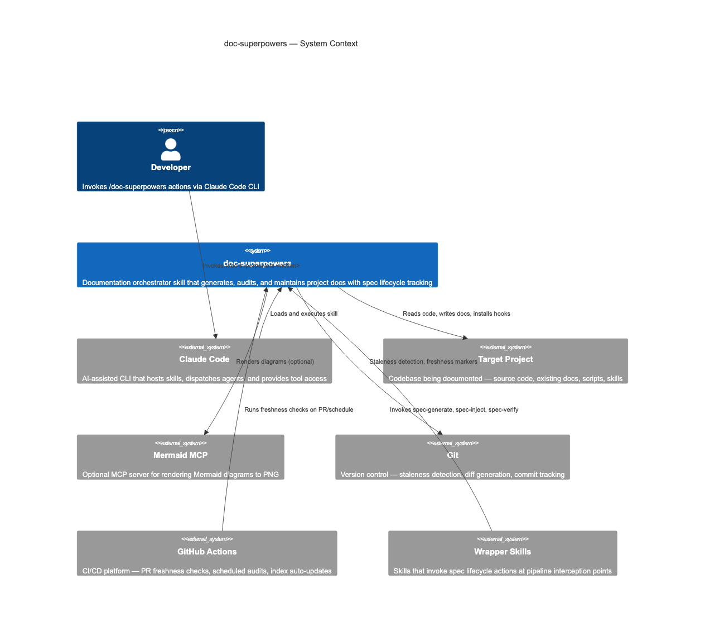
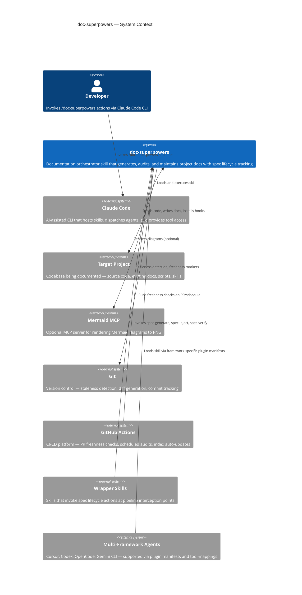
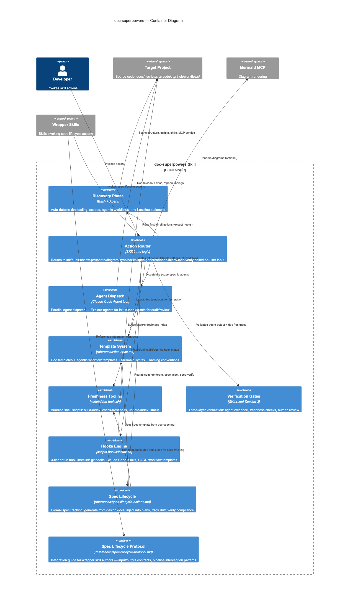
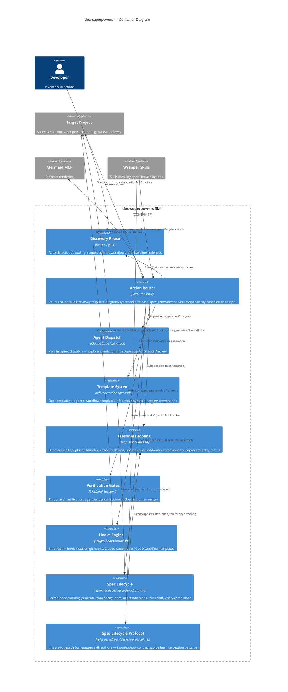

<!-- Generated by doc-superpowers | 2026-03-27 | commit: 97134e0 -->

# Architecture

## Overview

doc-superpowers is a Claude Code skill that orchestrates documentation generation, auditing, and maintenance through parallel agent dispatch, automated discovery, Mermaid diagram generation, and release note drafting. It supports multiple agent frameworks (Claude Code, Cursor, Codex, OpenCode, and Gemini CLI) via framework-specific plugin manifests and cross-framework tool name mappings. It treats documentation as a first-class engineering artifact with verification gates, evidence-based freshness tracking, opt-in workflow hooks, formal spec lifecycle management, and cross-cutting README.md/CLAUDE.md synchronization.

## C4 Context Diagram

The system in its operating environment: users invoke the skill through Claude Code, which dispatches agents and interacts with project files and external tools.

Mermaid source

## C4 Container Diagram

Internal components of the skill showing the discovery phase, action router, agent dispatch, template system, hooks engine, and spec lifecycle protocol.

Mermaid source

## Tech Stack

| Layer | Technology | Purpose |
|-------|-----------|---------|
| Runtime | Claude Code CLI | Hosts the skill, provides Agent/Bash/Read/Write/Grep/Glob tools |
| Skill Format | YAML frontmatter + Markdown | Standard obra/superpowers skill structure |
| Agent Dispatch | Claude Code Agent tool | Parallel Explore and general-purpose agents |
| Diagrams | Mermaid | C4, flowchart, sequence, ERD, state diagram syntax |
| Diagram Rendering | Mermaid MCP (optional) | PNG generation from Mermaid source |
| Discovery | Bash (git, ls), Claude Code Glob tool | Auto-detect project structure and tooling |
| Staleness Detection | `scripts/doc-tools.sh` | Content hashing (SHA-256) for docs, commit SHA comparison for code |
| Hooks Installer | Bash (`scripts/hooks/install.sh`) | 3-tier opt-in installer for git hooks, Claude Code hooks, and CI/CD workflows. Resolves hooks directory via priority chain: `core.hooksPath` > `.githooks/` > `.git/hooks/` |
| CI/CD Templates | GitHub Actions YAML | PR freshness check, weekly scheduled audit, doc-index auto-update. Templates use random heredoc delimiters for secure multiline GitHub Actions outputs and shellcheck-annotated intentional word-splitting |
| Spec Lifecycle Protocol | `references/spec-lifecycle-protocol.md` | Integration guide defining input/output contracts for wrapper skill authors |
| Spec Lifecycle Actions | `references/spec-lifecycle-actions.md` | Detailed procedures for spec-generate, spec-inject, spec-verify |
| Output | Markdown + HTML comments | Generated docs with freshness markers |
| Templates | references/doc-spec.md | Architecture, workflow, spec, ADR, guide, and scope-specific templates |
| Agent Prompt Template | `references/agent-prompt-template.md` | Review agent prompt template with scope-specific focus areas |
| Output Templates | `references/output-templates.md` | Audit report format (including README.md Status and RELEASE-NOTES.md Status sections), plan template, spec compliance report format |
| Integration Patterns | `references/integration-patterns.md` | Code review, commit review, and wrapper skill integration patterns |
| Multi-Framework Support | `references/tool-mappings.md` | Cross-framework tool name translations for Cursor, Codex, OpenCode, and Gemini CLI |
| Test Suites | `scripts/test-doc-tools.sh`, `scripts/test-hooks.sh`, `scripts/test-helpers.sh` | Shell test suites with shared test helpers for bundled freshness tooling and hooks installer |
| Evaluation Suite | `evals/evals.json` | Skill behavior evaluation tests for measuring accuracy and triggering |

## Key Decisions

- **Discovery-first architecture**: Every action runs the discovery phase before doing work. This avoids hardcoding project assumptions and makes the skill work across any project type. Trade-off: slightly slower startup, but significantly more accurate results.

- **Parallel agent dispatch per scope**: Audit and review-pr dispatch one agent per documentation scope in parallel, each with isolated context. This prevents context pollution between unrelated doc reviews and enables concurrent work. Trade-off: more agent invocations, but each is focused and verifiable.

- **In-memory inventory (not persisted)**: The agentic workflow inventory is rebuilt each invocation rather than cached. This ensures freshness at the cost of repeated discovery work. Acceptable because discovery is fast (bash commands) compared to agent review work.

- **Three-layer verification**: Agent evidence → freshness check → human review. No doc update is claimed complete without all three layers passing. This prevents false confidence from partial checks.

- **Template-driven generation**: All doc content follows templates in doc-spec.md rather than freeform generation. This ensures consistency across projects and makes the skill's output predictable and auditable.

- **Graceful degradation**: Missing tools (no Mermaid MCP, no doc-index on first run) trigger fallbacks rather than failures. Freshness tooling is always available (bundled). If doc-index doesn't exist, `check-freshness` tells you to run `init`.

- **Zero skill dependencies**: The skill itself (`SKILL.md` + `references/`) has zero dependencies. The bundled tooling in `scripts/` requires `git`, `jq`, and `sha256sum`/`shasum` — all commonly available. This makes installation trivial (copy or symlink).

- **Bundled shell tooling**: `scripts/doc-tools.sh` provides freshness tracking as portable shell scripts rather than Python or Node. This ensures zero language dependencies, works on any system with bash/git/jq, and complies with the Agent Skills spec that forbids external runtime requirements for the skill itself. The scripts are bundled (not generated per-project) so they stay versioned with the skill.

- **Content hash + commit SHA**: Staleness detection uses SHA-256 content hashes for doc files and git commit SHAs for code references. This is deterministic — the tooling reports facts (hash changed, commit advanced) and the agent decides what the change means. No heuristic "probably stale" guessing.

- **Audit owns discovery**: Discovery is fundamentally an audit operation — it answers "what exists and what state is it in?" All actions (init, update, diagram, sync) consume the same discovery output rather than duplicating scope detection logic. This single-source-of-truth design prevents drift between what init generates and what audit checks. The audit process also checks RELEASE-NOTES.md currency — verifying the latest entry matches the most recent tagged release and that no unreleased changes have accumulated without a version bump.

- **README.md/CLAUDE.md sync as cross-cutting concern**: README.md and CLAUDE.md synchronization is not scoped to a single action — it is a cross-cutting concern triggered during `release` (ensure user-facing docs match the new version), `init` (bootstrap from current codebase state), and `update` (propagate structural changes). Both files are verified during `audit` for consistency with the skill's actual capabilities and directory structure.

- **3-tier opt-in hooks**: The hooks system uses three independent tiers (git, Claude Code, CI/CD) that can be installed separately or together. Each tier is opt-in — `hooks install` requires explicit `--git`, `--claude`, `--ci`, or `--all` flags when invoked programmatically. This avoids surprising developers with unwanted automation. The installer is idempotent (safe to re-run) and auto-integrates into existing hooks via begin/end marker blocks (`# doc-superpowers:begin`/`# doc-superpowers:end`) that source locally-copied hook scripts using `dirname $0` for portability (inserts before `exit 0` if present). Uninstall uses marker-based range deletion for source-integrated blocks and removes local hook copies. Claude uninstall removes hook entries from settings and deletes the `.claude/hooks/doc-superpowers/` directory. Status output shows the resolved hooks directory path and distinguishes between owned hooks and source-integrated hooks. Interactive mode (terminal menu) is reserved for direct CLI invocation only.

- **Claude hooks use local copies**: Claude hook scripts are copied to `.claude/hooks/doc-superpowers/` with relative paths instead of referencing absolute skill installation paths. This ensures portability — hooks survive skill reinstalls, path changes, and work correctly when the project is cloned to a different location.

- **Claude hook settings use nested matcher format**: Hook entries in `.claude/settings.local.json` use the nested `{ matcher, hooks: [{ type, command, timeout }] }` structure required by Claude Code. Events are keyed under `.hooks.PreToolUse` and `.hooks.Stop`. The installer deep-merges entries, filtering existing doc-superpowers entries before appending to preserve non-doc-superpowers hooks. Note: hook source templates contain `__DOC_TOOLS_PATH__` placeholders that are only resolved by the installer at install time — manual hook entries in settings files will contain unresolved placeholders and will not function correctly. The installer is the sole authority for hook registration.

- **Spec lifecycle as composable primitives**: The three spec lifecycle actions (`spec-generate`, `spec-inject`, `spec-verify`) are context-agnostic — they have zero knowledge of which wrapper skill invokes them. This keeps doc-superpowers decoupled from any specific development workflow. Wrapper skills wire the actions into their pipelines at 5 interception points (post-brainstorm, during-plan, during-execute, pre-finish, during-review) using the contracts defined in `references/spec-lifecycle-protocol.md`.

- **Spec lifecycle protocol as a reference doc**: The integration guide for wrapper authors lives in `references/spec-lifecycle-protocol.md` rather than inline in SKILL.md. This separates the "how to use these actions" (protocol doc, aimed at wrapper authors) from "what these actions do" (SKILL.md, aimed at the skill runtime). Wrapper authors read the protocol doc; the skill engine reads SKILL.md.

- **Agent-assisted release note drafting**: The `release` action uses agent-assisted drafting with conventional commit parsing to generate RELEASE-NOTES.md entries. During release, CLAUDE.md and README.md are synchronized to reflect the current state of the skill. The action offers backfill tagging for releases that were cut without a git tag. This keeps release documentation tightly coupled with the actual changes while reducing manual bookkeeping.

- **Formal spec tracking with drift detection**: `spec-inject` (execute phase) distinguishes between alignment (implementation achieves spec intent) and drift (implementation contradicts spec). Aligned changes auto-update spec status and Implementation Notes. Drifted changes are flagged for human review without auto-modifying spec content. This prevents the system from silently papering over design divergences while still reducing manual bookkeeping for routine updates.
