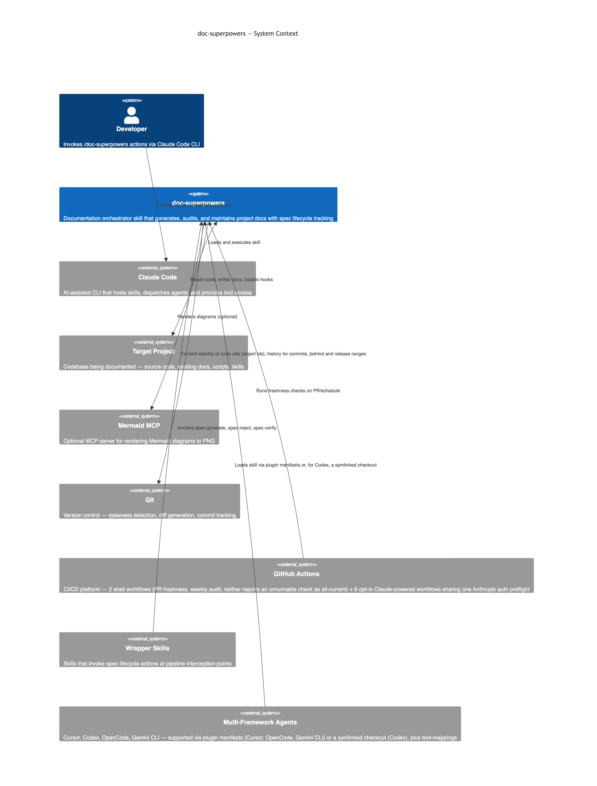
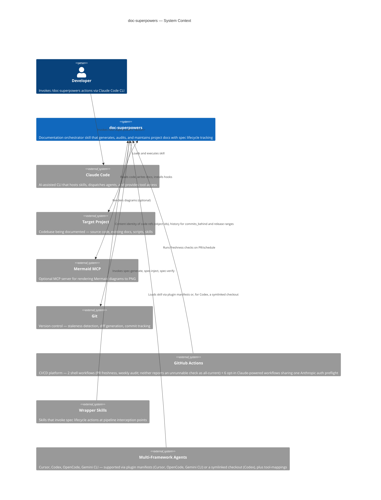
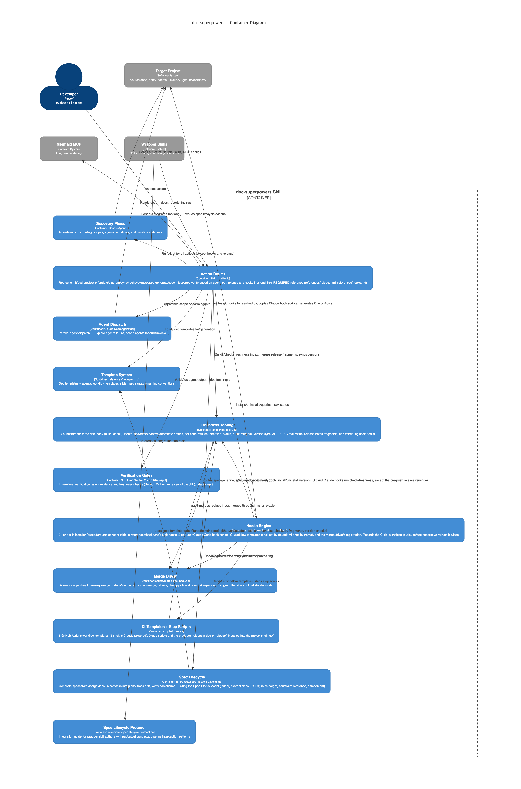
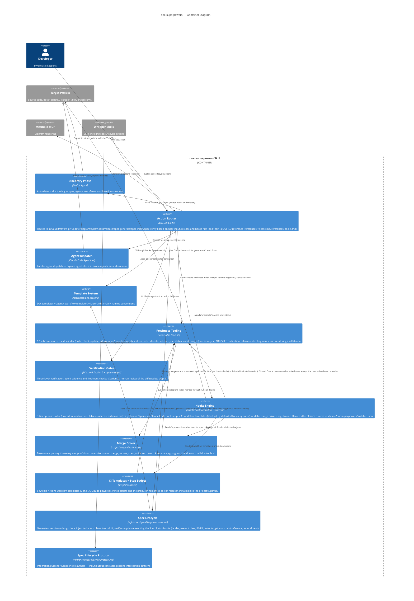

<!-- Generated by doc-superpowers -->

# Architecture

## Overview

doc-superpowers is a Claude Code skill that orchestrates documentation generation, auditing, and maintenance through parallel agent dispatch, automated discovery, Mermaid diagram generation, and release note drafting. It supports multiple agent frameworks (Claude Code, Cursor, Codex, OpenCode, and Gemini CLI) via plugin manifests (Cursor, OpenCode, Gemini CLI), a symlinked checkout (Codex) and cross-framework tool name mappings. It treats documentation as a first-class engineering artifact with verification gates, evidence-based freshness tracking, opt-in workflow hooks, formal spec lifecycle management, and cross-cutting README.md/CLAUDE.md synchronization.

## C4 Context Diagram

The system in its operating environment: users invoke the skill through Claude Code, which dispatches agents and interacts with project files and external tools.

Mermaid source

```mermaid
C4Context
  title doc-superpowers — System Context

  Person(dev, "Developer", "Invokes /doc-superpowers actions via Claude Code CLI")

  System(skill, "doc-superpowers", "Documentation orchestrator skill that generates, audits, and maintains project docs with spec lifecycle tracking")

  System_Ext(claude_code, "Claude Code", "AI-assisted CLI that hosts skills, dispatches agents, and provides tool access")
  System_Ext(project, "Target Project", "Codebase being documented — source code, existing docs, scripts, skills")
  System_Ext(mermaid_mcp, "Mermaid MCP", "Optional MCP server for rendering Mermaid diagrams to PNG")
  System_Ext(git, "Git", "Version control — staleness detection, diff generation, commit tracking")
  System_Ext(ci, "GitHub Actions", "CI/CD platform — 2 shell workflows (PR freshness, weekly audit; neither reports an unrunnable check as all-current) + 6 opt-in Claude-powered workflows sharing one Anthropic auth preflight")
  System_Ext(wrapper, "Wrapper Skills", "Skills that invoke spec lifecycle actions at pipeline interception points")
  System_Ext(frameworks, "Multi-Framework Agents", "Cursor, Codex, OpenCode, Gemini CLI — supported via plugin manifests (Cursor, OpenCode, Gemini CLI) or a symlinked checkout (Codex), plus tool-mappings")

  Rel(dev, claude_code, "Invokes /doc-superpowers <action>")
  Rel(claude_code, skill, "Loads and executes skill")
  Rel(skill, project, "Reads code, writes docs, installs hooks")
  Rel(skill, mermaid_mcp, "Renders diagrams (optional)")
  Rel(skill, git, "Content identity of code refs (object ids), history for commits_behind and release ranges")
  Rel(ci, skill, "Runs freshness checks on PR/schedule")
  Rel(wrapper, skill, "Invokes spec-generate, spec-inject, spec-verify")
  Rel(frameworks, skill, "Loads skill via plugin manifests or, for Codex, a symlinked checkout")
```

## C4 Container Diagram

Internal components of the skill showing the discovery phase, action router, agent dispatch, template system, hooks engine, merge driver, CI templates, and spec lifecycle protocol, and the flows between the hooks, `doc-tools.sh` and CI.

Mermaid source

```mermaid
C4Container
  title doc-superpowers — Container Diagram

  Person(dev, "Developer", "Invokes skill actions")

  Container_Boundary(skill, "doc-superpowers Skill") {
    Container(discovery, "Discovery Phase", "Bash + Agent", "Auto-detects doc tooling, scopes, agentic workflows, and baseline staleness")
    Container(router, "Action Router", "SKILL.md logic", "Routes to init/audit/review-pr/update/diagram/sync/hooks/release/spec-generate/spec-inject/spec-verify based on user input. release and hooks first load their REQUIRED reference (references/release.md, references/hooks.md)")
    Container(agents, "Agent Dispatch", "Claude Code Agent tool", "Parallel agent dispatch — Explore agents for init, scope agents for audit/review")
    Container(templates, "Template System", "references/doc-spec.md", "Doc templates + agentic workflow templates + Mermaid syntax + naming conventions")
    Container(doctools, "Freshness Tooling", "scripts/doc-tools.sh", "17 subcommands: the doc-index (build, check, update, add/remove/move/deprecate entries, set-code-refs, set-doc-type, status, audit-merges), version sync, ADR/SPEC realization, release-notes fragments, and vendoring itself (tools)")
    Container(verification, "Verification Gates", "SKILL.md Section 2 + update step 8", "Three-layer verification: agent evidence and freshness checks (Section 2), human review of the diff (update step 8)")
    Container(hooks, "Hooks Engine", "scripts/hooks/install.sh + state.sh", "3-tier opt-in installer (procedure and consent table in references/hooks.md): 5 git hooks, 3 per-user Claude Code hook scripts, CI workflow templates (shell set by default, AI ones by name), and the merge driver's registration. Records the CI tier's choices in .claude/doc-superpowers/installed.json")
    Container(mergedriver, "Merge Driver", "scripts/merge-doc-index.sh", "Base-aware per-key three-way merge of docs/.doc-index.json on merge, rebase, cherry-pick and revert. A separate jq program that does not call doc-tools.sh")
    Container(citemplates, "CI Templates + Step Scripts", "scripts/hooks/ci/", "8 GitHub Actions workflow templates (2 shell, 6 Claude-powered), 9 step scripts and the producer helpers in doc-pr-release/, installed into the project's .github/")
    Container(speclifecycle, "Spec Lifecycle", "references/spec-lifecycle-actions.md", "Generate specs from design docs, inject tasks into plans, track drift, verify compliance — citing the Spec Status Model (ladder, exempt class, R1-R4; roles: target, constraint reference, amendment)")
    Container(specprotocol, "Spec Lifecycle Protocol", "references/spec-lifecycle-protocol.md", "Integration guide for wrapper skill authors — input/output contracts, pipeline interception patterns")
  }

  System_Ext(project, "Target Project", "Source code, docs/, scripts/, .claude/, .github/workflows/")
  System_Ext(mermaid, "Mermaid MCP", "Diagram rendering")
  System_Ext(wrapper, "Wrapper Skills", "Skills invoking spec lifecycle actions")

  Rel(dev, router, "Invokes action")
  Rel(router, discovery, "Runs first for all actions (except hooks and release)")
  Rel(discovery, project, "Scans structure, scripts, skills, MCP configs")
  Rel(router, agents, "Dispatches scope-specific agents")
  Rel(agents, project, "Reads code + docs, reports findings")
  Rel(router, templates, "Loads doc templates for generation")
  Rel(router, doctools, "Builds/checks freshness index, merges release fragments, syncs versions")
  Rel(router, verification, "Validates agent output + doc freshness")
  Rel(router, mermaid, "Renders diagrams (optional)")
  Rel(router, hooks, "Installs/uninstalls/queries hook status")
  Rel(hooks, project, "Writes git hooks to resolved dir, copies Claude hook scripts, generates CI workflows")
  Rel(hooks, doctools, "Vendors doc-tools.sh (tools install/uninstall/version). Git and Claude hooks run check-freshness, except the pre-push release reminder")
  Rel(hooks, mergedriver, "Registers it for docs/.doc-index.json")
  Rel(doctools, mergedriver, "audit-merges replays index merges through it, as an oracle")
  Rel(hooks, citemplates, "Renders workflow templates, ships step scripts")
  Rel(citemplates, doctools, "Runs the vendored .github/scripts/doc-tools.sh (freshness-check.sh, fragments, version checks)")
  Rel(router, speclifecycle, "Routes spec-generate, spec-inject, spec-verify")
  Rel(speclifecycle, doctools, "Reads/updates .doc-index.json for spec tracking")
  Rel(speclifecycle, templates, "Uses spec template from doc-spec.md")
  Rel(wrapper, specprotocol, "References integration contracts")
  Rel(wrapper, router, "Invokes spec lifecycle actions")
```

## Tech Stack

| Layer | Technology | Purpose |
|-------|-----------|---------|
| Runtime | Claude Code CLI | Hosts the skill, provides Agent/Bash/Read/Write/Grep/Glob tools |
| Skill Format | YAML frontmatter + Markdown | Standard obra/superpowers skill structure |
| Agent Dispatch | Claude Code Agent tool | Parallel Explore and general-purpose agents |
| Diagrams | Mermaid | C4, flowchart, sequence, ERD, state diagram syntax |
| Diagram Rendering | Mermaid MCP (optional) | PNG generation from Mermaid source |
| Discovery | Bash (git, ls), Claude Code Glob tool | Auto-detect project structure and tooling |
| Staleness Detection | `scripts/doc-tools.sh` | 17 subcommands for content hashing (SHA-256) for docs, content identity for code (each code ref's git object id, `code_oids`, recorded by `update-index` — the only verb that attests, and the only writer of `last_verified` — or, unverified, as of the doc's own last commit by `build-index`/`add-entry`, and compared with one `git cat-file --batch-check`; record docs such as plans, issues and archived docs are never stale), lossless re-keying when a doc moves (`move-entry`, singly or `--stdin` in a batch — preserves the `code_refs`/`code_oids` pair staleness is derived from, which `remove-entry` + `add-entry` drops, and repoints every other entry's `code_refs`/`code_oids` naming the moved doc), a read-only replay of index merges through the driver (`audit-merges`), in-place `code_refs` edits (`set-code-refs`) and `doc_type` retyping (`set-doc-type`), version management across manifests, ADR/SPEC realization tracking via `implementation-status` / `set-implementation` (the `Implementation:` / `Realized-by:` block surfaced as the `implementation` array in `.doc-index.json`), per-PR release-notes fragments (`fragments list\|validate\|merge`), and `tools {install, uninstall, status, version}` for vendoring doc-tools.sh + the CI helpers into a consumer repo (and printing the plugin's version). The index is schema v3 (`schema_version` 3, per-ref `code_oids`): every writer stamps 3, a v2 index is read as it is, and an entry without `code_oids` keeps the old commit comparison until `update-index` re-verifies it; the field reference is `references/doc-spec.md` → Doc-Index Schema Reference |
| Hooks Installer | Bash (`scripts/hooks/install.sh` + `scripts/hooks/state.sh`) | 3-tier opt-in installer for git hooks (5: `pre-commit`, `post-merge`, `post-checkout`, `prepare-commit-msg`, `pre-push`; plus custom merge driver registration for doc-index.json), Claude Code hooks (3 scripts: `pre-commit-gate` on PreToolUse, `post-commit-sync` on PostToolUse, `session-summary` on Stop; all three source `hook-lib.sh`, which caps every list and keeps each emitted string under Claude Code's 10,000-character hook-output limit, and runs each check under a watchdog inside the registered 10 s timeout), and CI/CD workflows. Acts on `git rev-parse --show-toplevel`; git hooks go to `git rev-parse --git-path hooks` (a global `core.hooksPath` is refused). CI tier: the 2 shell workflows by default, the others by name (a retired `doc-index-update.yml` the installer owns is removed on any install) via `--workflows=<csv\|all\|none>` (`--helpers=<bool>` is deprecated and inert: the helpers ship exactly while a workflow runs them, except that `--helpers=false` is refused while `doc-pr-release` is selected or installed); `--force` bypasses state-respect; `--transient` flags an uninstall as non-intentional (will re-install on the next no-flag run); vendoring goes through `doc-tools.sh tools install\|uninstall --helper`. `state.sh` (sourced by `install.sh`) records the CI tier's workflow set and choices (base branch, cron, strict) in `.claude/doc-superpowers/installed.json` (its own `schema_version` 2, unrelated to the index's) — one read and one write per run, refuses an unreadable file, takes no lock. `install.sh` derives the workflow list from `scripts/hooks/ci/*.yml`. `status` compares every installed hook, local copy, Claude script and settings command with what this install renders (the install date aside), so an install another version made reads outdated |
| CI/CD Templates | GitHub Actions YAML | 8 workflow templates: 2 shell-based (PR freshness check, weekly scheduled audit) + 6 Claude-powered AI workflows (feature branch audit+update, PR doc review with @claude interactive, release notes drafting, spec compliance verification, PR full-cycle (review, update, diagram, sync), per-PR release-notes fragment producer `doc-pr-release.yml`). The producer workflow ships with three colocated shell helpers in `doc-pr-release/` (`extract-context.sh`, `update-pr-body.sh`, `commit-and-push.sh`) and a library, `fragment-lib.sh`, that `extract-context.sh` and `commit-and-push.sh` source (`update-pr-body.sh` does not), installed to `.github/scripts/doc-pr-release/`, plus a `RELEASE-NOTES.next/README.md` documenting the fragment-format contract (only dropped if missing — never overwritten). Nine step scripts in `scripts/hooks/ci/doc-superpowers-steps/` (`commit-changes.sh`, `freshness-check.sh`, `pr-guard.sh`, `precheck.sh`, `prepare-agent.sh`, `resolve-auth.sh`, `sentinel-check.sh`, `verify-fragment.sh`, `write-context.sh`) hold the step bodies: every `run:` step is a script in `.github/scripts/doc-superpowers-steps/` (the committing steps run a pre-agent snapshot of `commit-changes.sh` from `$RUNNER_TEMP`; the producer's commit is `doc-pr-release/commit-and-push.sh`), except `doc-pr-release.yml`'s first step, its pre-checkout PR resolver, which stays inline. The shell templates run the locally-vendored `.github/scripts/doc-tools.sh` (copied by installer) through `freshness-check.sh`, which never reports an unrunnable check as all-current (the PR check warns, or fails under `--ci-strict`; the schedule run and the AI jobs' scope gate fail) and keeps index-sized results in files. All actions are SHA-pinned with exact version comments; every job has `timeout-minutes`. AI workflows pass `github_token: ${{ github.token }}`, install the plugin pinned to the installed version, give the agent a scoped `--allowedTools` and `--max-turns`, run only for same-repository PRs, and never let the agent commit (a checked `commit-changes.sh` step does — for `doc-pr-release`, `commit-changes.sh --check-only` verifies and `commit-and-push.sh` commits; an integrity check, not a sandbox: `references/hooks.md` says what a steered agent can reach). Four of the six (`doc-audit-update`, `doc-review-pr`, `doc-spec-verify`, `doc-pr-full-cycle`) gate on the doc index (`freshness-check.sh scope`) instead of path filters; the producer has its own gate (`paths-ignore` for fragments and RELEASE-NOTES.md, then `write-context.sh`) and the release drafter runs on any push to `release/**` and gates on `precheck.sh`; the three that commit to a branch share one concurrency group per branch, and a run superseded by someone's push ends green where that push re-runs it (`doc-audit-update`, `doc-pr-release`) and fails, asking for a re-run, in `doc-pr-full-cycle`. All 6 AI workflows share a unified auth preflight that prefers `CLAUDE_CODE_OAUTH_TOKEN` and falls back to `ANTHROPIC_API_KEY` (fails fast with a clear error when both are unset; emits `::notice::` when both are set) |
| Spec Lifecycle Protocol | `references/spec-lifecycle-protocol.md` | Integration guide defining input/output contracts for wrapper skill authors |
| Spec Lifecycle Actions | `references/spec-lifecycle-actions.md` | Detailed procedures for spec-generate, spec-inject, spec-verify |
| Release Procedure | `references/release.md` | REQUIRED reference for `release` (steps 1–12): range start, fragment merge, drafting agent, version bump, release commit, tag |
| Hooks Procedure | `references/hooks.md` | REQUIRED reference for `hooks`: installer routing, the CI consent table (triggers, permissions, what each workflow may commit), and what an AI job's agent can reach |
| Output | Markdown + HTML comments | Generated docs with freshness markers |
| Templates | references/doc-spec.md | Architecture, workflow, spec, ADR, guide, and scope-specific templates |
| Agent Prompt Template | `references/agent-prompt-template.md` | Review agent prompt template with scope-specific focus areas |
| Output Templates | `references/output-templates.md` | Audit report format (including README.md Status and RELEASE-NOTES.md Status sections, and the Update Tasks that `update --report=<path>` applies) and the spec compliance report format |
| Integration Patterns | `references/integration-patterns.md` | Code review, commit review, and wrapper skill integration patterns |
| Multi-Framework Support | `references/tool-mappings.md` | The one capability matrix: each client's tool for every Claude Code tool the skill names, which hook tiers, subagent and diagram features each client (Cursor, Codex, OpenCode, Gemini CLI) supports, and how it resolves `$ROOT` |
| Test Suites | `scripts/test-doc-tools.sh`, `scripts/test-hooks.sh`, `scripts/test-merge-driver.sh`, `scripts/test-doc-pr-release.sh`, `scripts/test-spec-status-model.sh`, `scripts/test-helpers.sh` | Shell test suites sharing one harness (`test-helpers.sh`) for the bundled freshness tooling, the hooks installer and hooks, the merge driver, the CI templates and their helpers, and the skill prompt ↔ tool contract (Spec Status Model, commands the prompts run, evals, packaging). Assertion counts: [CLAUDE.md → Conventions](../../CLAUDE.md#conventions), the one place they are kept. `.github/workflows/tests.yml` runs them under bash 5.x and `/bin/bash` 3.2, plus `check-version` and a check that this repo's self-installed CI tier matches its templates |
| Evaluation Suite | `evals/evals.json`, `evals/fixtures/` | Skill behavior evaluation tests for measuring accuracy and triggering, plus 12 fixture setups (`evals/fixtures/<eval>/setup.sh`, sharing `lib.sh`) that build each scenario's project; `scripts/test-spec-status-model.sh` runs every one |

## Key Decisions

- **Discovery-first architecture**: Every action runs the discovery phase as its first step, except `hooks` (scaffolding — routes directly to the installer) and `release` (parses RELEASE-NOTES.md and commits directly). This avoids hardcoding project assumptions and makes the skill work across any project type. Trade-off: slightly slower startup, but significantly more accurate results.

- **Parallel agent dispatch per scope**: Audit and review-pr dispatch one agent per documentation scope in parallel, each with isolated context. This prevents context pollution between unrelated doc reviews and enables concurrent work. Trade-off: more agent invocations, but each is focused and verifiable.

- **In-memory inventory (not persisted)**: The agentic workflow inventory is rebuilt each invocation rather than cached. This ensures freshness at the cost of repeated discovery work. Acceptable because discovery is fast (bash commands) compared to agent review work.

- **Three-layer verification**: Agent evidence → freshness check → human review (SKILL.md Section 2 holds the first two: the dispatched-agent evidence rule and the gate function; the human review of the diff is `update` step 8). No doc update is claimed complete without all three layers passing. This prevents false confidence from partial checks.

- **Template-driven generation**: All doc content follows templates in doc-spec.md rather than freeform generation. This ensures consistency across projects and makes the skill's output predictable and auditable.

- **Graceful degradation**: Missing tools (no Mermaid MCP, no doc-index on first run) trigger fallbacks rather than failures. Freshness tooling is always available (bundled). If doc-index doesn't exist, `check-freshness` exits with `Run build-index first.` — at the skill level, `init` is the action that builds it.

- **Zero skill dependencies**: The skill itself (`skills/doc-superpowers/SKILL.md` + `references/`) has zero dependencies. The bundled tooling in `scripts/` requires bash ≥ 3.2 (macOS's `/bin/bash` included), `git` (≥ 2.25 on a CI runner, where `commit-changes.sh` uses `--pathspec-from-file`), `jq` ≥ 1.6 and `sha256sum`/`shasum`, and otherwise only the POSIX userland stock macOS and Linux ship (no GNU sed, no ripgrep). This makes installation trivial (copy or symlink).

- **Bundled shell tooling**: `scripts/doc-tools.sh` provides freshness tracking as portable shell scripts rather than Python or Node. This ensures zero language dependencies, works on any system with bash/git/jq, and complies with the Agent Skills spec that forbids external runtime requirements for the skill itself. The scripts are bundled (not generated per-project) so they stay versioned with the skill.

- **Content hash + code object ids**: Staleness detection uses SHA-256 content hashes for doc files and, for each code reference, the git object id of its content (a blob, a tree, or a submodule's commit) when the doc was verified. Commit ids are not used, because squash merges, rebases, cherry-picks and reverts mint new ones for identical bytes. This is deterministic — the tooling reports facts (hash changed, a ref's content changed) and the agent decides what the change means. No heuristic "probably stale" guessing.

- **Audit owns discovery**: Discovery is fundamentally an audit operation — it answers "what exists and what state is it in?" All actions (init, update, diagram, sync) consume the same discovery output rather than duplicating scope detection logic. This single-source-of-truth design prevents drift between what init generates and what audit checks. The audit process also checks RELEASE-NOTES.md currency — counting the commits since the latest entry (after its tag when one exists, else after its date) and reporting any as a P2 finding that points to `release`.

- **README.md/CLAUDE.md sync as cross-cutting concern**: README.md and CLAUDE.md synchronization is not scoped to a single action — it is a cross-cutting concern of every write action: `init` (bootstrap from current codebase state), `update` (propagate structural changes), `sync` (catch accumulated drift), `release` (ensure user-facing docs match the new version) and `spec-generate` (new spec paths). Both files are verified during `audit` for consistency with the skill's actual capabilities and directory structure. In a doc-superpowers CI workflow, `update` and `sync` report the change these files need instead of making it: the checked commit step accepts only `docs/` and the indexed docs.

- **3-tier opt-in hooks**: The hooks system uses three independent tiers (git, Claude Code, CI/CD) that can be installed separately or together. Each tier is opt-in — `hooks install` requires explicit `--git`, `--claude`, `--ci`, or `--all` flags when invoked programmatically. This avoids surprising developers with unwanted automation. The installer is idempotent (safe to re-run) and places everything with git plumbing: it acts on `git rev-parse --show-toplevel` and writes git hooks to `git rev-parse --git-path hooks`, where git runs them (worktrees and submodules included); a global `core.hooksPath` is refused. It never writes through a symbolic link, and every check runs before the first write. It auto-integrates into an existing shell hook with one marked POSIX block (`# doc-superpowers:begin`/`# doc-superpowers:end`) right after the `#!` line, which runs a locally-copied hook with git's arguments (pre-commit passes the exit code on). Uninstall deletes exactly the marked blocks and the local copies, so the user's files come back byte-for-byte. Claude uninstall removes only the entries running the installer's scripts and the three scripts. Status output shows the resolved hooks directory path and distinguishes between owned hooks and integrated hooks. Interactive mode (terminal menu) is reserved for direct CLI invocation only. The git tier also registers a custom merge driver for `docs/.doc-index.json` to auto-resolve index conflicts during merge/rebase.

- **Claude hooks use local copies, per-user**: Claude hook scripts are copied to `.claude/hooks/doc-superpowers/` and registered as `bash "$CLAUDE_PROJECT_DIR"/.claude/hooks/doc-superpowers/<hook>.sh`, so they run whatever the cwd. They find `doc-tools.sh` by the merge driver's rule (newest version-named plugin-cache sibling, or a checkout's own path), so a plugin update needs no re-install. The copies and `.claude/settings.local.json` hold this machine's paths, so the tier is per-user: both are excluded from git through `info/exclude`, and each contributor installs their own.

- **Claude hook settings use nested matcher format**: Hook entries in `.claude/settings.local.json` use the nested `{ matcher, hooks: [{ type, command, timeout }] }` structure required by Claude Code. Events are keyed under `.hooks.PreToolUse`, `.hooks.PostToolUse`, and `.hooks.Stop`. The installer merges per entry: an entry is its own only when its command runs one of its three scripts, so every other entry and group survives install and uninstall byte-for-byte. Note: hook source templates contain the `__DOC_TOOLS_RESOLVE__` placeholder that is only resolved by the installer at install time — manual hook entries in settings files will contain unresolved placeholders and will not function correctly. The installer is the sole authority for hook registration.

- **Hooks report, never attest**: No hook runs `update-index` or writes `docs/.doc-index.json`: attesting a doc is a reviewer's act. The git `pre-commit` hook judges the staged tree (`check-freshness --tree "$(git write-tree)"`, which reads the index and the docs from that tree as well as the code refs), so it sees exactly the commit being made — scoped to the staged paths plus every entry the staged index adds; an indexed doc the commit leaves out is "not in this commit" (`git add` it) when it is on disk, "missing from disk" only when it is gone. The Claude hooks follow the harness contract: the event arrives as JSON on stdin, and the reply goes out as JSON (`additionalContext` for Claude, `systemMessage` for the user), or as exit 2 with a stderr reason under STRICT. The gate defers commands that stage as they commit to the git hook, which sees the real index. `Stop` fires after every response, so the summary is scoped to working-tree changes and bounded (2 s, process-group watchdog). Absent tooling is silent. A failing check prints one line and blocks only under STRICT. Trade-off: the Claude gate decides only pre-staged commits; the rest rely on the git tier.

- **Spec lifecycle as composable primitives**: The three spec lifecycle actions (`spec-generate`, `spec-inject`, `spec-verify`) are context-agnostic — they have zero knowledge of which wrapper skill invokes them. This keeps doc-superpowers decoupled from any specific development workflow. Wrapper skills wire the actions into their pipelines at 5 interception points (post-brainstorm, during-plan, during-execute, pre-finish, during-review) using the contracts defined in `references/spec-lifecycle-protocol.md`.

- **Spec lifecycle protocol as a reference doc**: The integration guide for wrapper authors lives in `references/spec-lifecycle-protocol.md` rather than inline in SKILL.md. This separates the "how to use these actions" (protocol doc, aimed at wrapper authors) from "what these actions do" (SKILL.md, aimed at the skill runtime). Wrapper authors read the protocol doc; the skill engine reads SKILL.md.

- **Agent-assisted release note drafting**: The `release` action uses agent-assisted drafting with conventional commit parsing to generate RELEASE-NOTES.md entries. Before drafting it runs `doc-tools.sh fragments merge <previous release | ROOT> HEAD` (the previous release: its tag, else the commit that added its RELEASE-NOTES.md heading) over the `RELEASE-NOTES.next/PR-*.md` fragments produced by the `doc-pr-release.yml` CI workflow. Consumption is recorded only by deleting a fragment in the release commit, so a fragment is unreleased while it is present — also one merged after an earlier release branch was cut. Each fragment is merged losslessly (units deduped, sections folded onto one vocabulary) or skipped with a warning and kept for the next release; drifted hashes (human edits) are merged as written, with a warning. The release commit deletes exactly the consumed fragments (`--remove`), and it must reach `main`: until it does, `fragments merge` refuses rather than release those fragments twice. During release, CLAUDE.md and README.md are synchronized to reflect the current state of the skill, and `bump-version` + `check-version` enforce manifest version consistency before tagging. The action offers backfill tagging for releases that were cut without a git tag.

- **Formal spec tracking with drift detection**: `spec-inject` (execute phase) distinguishes between alignment (implementation achieves spec intent) and drift (implementation contradicts spec). Aligned changes update spec status and Implementation Notes only when the **Spec Status Model** permits — the spec must be an implementation *target* rather than a constraint reference or an amendment, it must sit at a ladder status, and the transition must move forward. Drifted changes are flagged for human review without auto-modifying spec content. This prevents the system from silently papering over design divergences while still reducing manual bookkeeping for routine updates. This page summarizes; it does not define — the canonical rules live in the **Spec Status Model** section of `references/spec-lifecycle-actions.md`.

- **Custom merge driver for doc-index**: The git tier registers a merge driver (`scripts/merge-doc-index.sh`) for `docs/.doc-index.json`. Git runs it for merge, rebase, cherry-pick and revert. It is a base-aware, per-key three-way merge in jq: an entry that only one side changed or deleted takes that side. An entry both sides changed is merged field by field. The side that changed a field wins, and a field both sides changed goes to the entry with the newer `last_verified` (non-null beats null). The verification record (`content_hash`, `code_oids`, `code_commit`, `last_verified`) moves as one unit, so a merge never attests a doc/code pair nobody verified, and `deprecated` wins. The driver does not guess in three per-entry cases, and each leaves `git merge-file` conflict markers, exits 1 and names the doc key on stderr (the first also names the fields). The first is a field both sides changed where `last_verified` does not order them. That is the usual case for two edits of one field, because only `update-index` writes `last_verified`: two `set-code-refs` runs, a repoint against a re-deprecation, or two same-second re-verifies with different results all tie. Two ties are merged rather than refused: `code_refs` both sides rewrote as in-place substitutions (two branches that each moved a different doc the entry cites, or a repoint beside an added ref) take one side's substitutions applied to the other's list, when the result holds exactly the refs a three-way set merge keeps; and a verification record whose `last_verified` is still the base's on both sides (neither re-verified the entry), with `content_hash` and `code_commit` agreeing, merges `code_oids` key by key. The second is an entry deleted on one side and changed on the other. The third is an entry that is not an object on every side. A failure of the whole file gets the same treatment but names no key: an input (ours, theirs or the base) that is not a single index object, `jq` missing, a scratch file that cannot be created, or a signal mid-write. The top level and key order start from ours, with no regenerated `generated_at`/`build_commit` and no re-sort. For a given pair of commits, the result is deterministic. The registered command resolves the driver at merge time: the newest version-named plugin-cache sibling, or a checkout's own copy. The path is quoted, and no driver found gives conflict markers. The driver keeps routine index updates on two branches from conflicting locally. GitHub's mergeability check does not run custom drivers.

- **Granular CI install with state-respect**: The CI tier supports per-workflow install/uninstall via `--workflows=<csv|all|none>`, with persistent install-state in `.claude/doc-superpowers/installed.json` (managed by `scripts/hooks/state.sh`). A workflow that was uninstalled intentionally is NOT re-added on the next no-flag `install --ci` — preserving user intent across re-runs. `--force` bypasses state-respect; `--transient` flags an uninstall as non-intentional so the next install re-adds it. Explicit `--workflows=<name>` always beats state-respect on the rationale that "explicit > implicit." The state file is committed to the repo so install choices persist across contributors: it records the workflow set and the choices (base branch, cron, strict), so a plain re-install — the upgrade path — reproduces them instead of resetting them. A workflow on disk counts as installed whatever the state says; with no state file, the workflows on disk are the set and a pre-3.0 install's choices are read back from them. An unreadable state file (a merge conflict) is refused, never overwritten. The default set is the 2 shell workflows; the Claude-powered ones are opt-in by name. The installer takes no lock, so runners that parallelize installs into one repository should wrap them in one. `install.sh` derives the canonical workflow list from `scripts/hooks/ci/*.yml` (`state.sh` only records it), so dropping a new template into the directory is automatically picked up.
