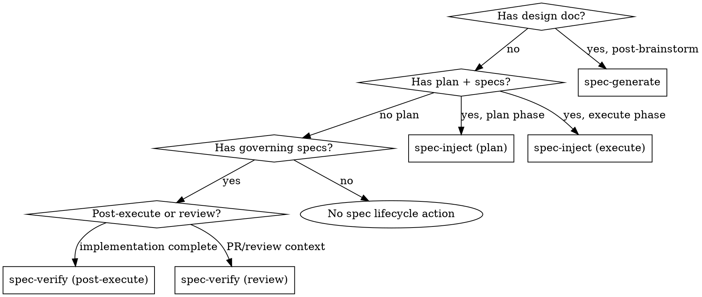

# Spec Lifecycle Protocol Implementation Plan

> **For agentic workers:** REQUIRED: Use superpowers:subagent-driven-development (if subagents available) or superpowers:executing-plans to implement this plan. Steps use checkbox (`- [ ]`) syntax for tracking.

**Goal:** Add 3 composable spec lifecycle actions (spec-generate, spec-inject, spec-verify) to doc-superpowers, plus a protocol reference doc for wrapper skill authors.

**Architecture:** New actions follow the existing SKILL.md pattern — each has a trigger, input requirements, process steps, and output contract. They compose with existing `doc-tools.sh` infrastructure (check-freshness, update-index) without modifying it. A new reference doc (`references/spec-lifecycle-protocol.md`) defines the integration contract for wrapper skills.

**Tech Stack:** Markdown (SKILL.md action definitions), bash (doc-tools.sh calls — existing, not modified)

**Spec:** `docs/superpowers/specs/2026-03-14-spec-lifecycle-protocol-design.md`

---

## Chunk 1: Template Update and Protocol Reference Doc

### Task 1: Add `Source` metadata field to spec template

**Files:**
- Modify: `references/doc-spec.md:162-189` (spec template section)

- [ ] **Step 1: Add `Source` field to the spec template**

In `references/doc-spec.md`, the spec template block (lines 162-189) defines the metadata header for `SPEC-{CAT}-{NNN}` files. Add a `Source` field after the `Superseded by` line:

```markdown
**Source**: {path to design doc or "manual"}
```

The full metadata header becomes:

```markdown
# SPEC-{CAT}-{NNN}: {Title}

**Status**: Draft | In Review | Approved | Implemented | Superseded
**Category**: {CAT}
**Created**: YYYY-MM-DD
**Author**: {name}
**Supersedes**: {path or "none"}
**Superseded by**: {path or "none"}
**Source**: {path to design doc or "manual"}
```

This field is Markdown-header only — NOT indexed in `.doc-index.json`.

- [ ] **Step 2: Verify the edit**

Read `references/doc-spec.md` lines 162-195 and confirm:
- `Source` field is present after `Superseded by`
- No other template fields were altered
- The closing ``` of the code block is intact

- [ ] **Step 3: Commit**

```bash
git add references/doc-spec.md
git commit -m "feat: add Source metadata field to spec template"
```

---

### Task 2: Create protocol reference doc

**Files:**
- Create: `references/spec-lifecycle-protocol.md`

- [ ] **Step 1: Create the protocol reference doc**

Create `references/spec-lifecycle-protocol.md` with this content:

```markdown
# Spec Lifecycle Protocol — Integration Guide

Reference for wrapper skill authors integrating doc-superpowers spec lifecycle actions into their pipelines. doc-superpowers actions are context-agnostic composable primitives — they have zero knowledge of what wrapper skill invokes them.

## Lifecycle Overview

5 pipeline interception points mapped to 3 actions:

| Pipeline Point | When | Action | Mode |
|---|---|---|---|
| Post-brainstorm | Design doc written and committed | `spec-generate` | — |
| During plan | Implementation plan being written | `spec-inject` | `plan` |
| During execute | After each plan chunk completes | `spec-inject` | `execute` |
| Pre-finish | All tasks done, before merging | `spec-verify` | `post-execute` |
| During review | Alongside other review participants | `spec-verify` | `review` |

```
Design doc ──→ spec-generate ──→ formal SPEC-{CAT}-NNN files
                                      │
Plan doc ──→ spec-inject (plan) ──→ plan + spec maintenance tasks
                                      │
Chunk done ──→ spec-inject (execute) ──→ spec status updates / drift flags
                                      │
All done ──→ spec-verify (post-execute) ──→ compliance report (PASS/FAIL)
                                      │
PR review ──→ spec-verify (review) ──→ freshness + coverage findings
```

## Action Reference

### spec-generate

**Input:**
- `--design-doc=<path>` — Path to the narrative design spec

**Output:**
- N formal `SPEC-{CAT}-NNN-{slug}.md` files in `docs/specs/`
- Updated `.doc-index.json` entries
- Updated `docs/specs/README.md` index
- Modified design doc with `Generated Specs` section appended
- List of generated spec paths (for downstream `--specs` parameters)

**Prerequisites:**
- Design doc must exist and be committed
- `docs/specs/` directory must exist (bootstrapped if missing)
- `references/doc-spec.md` must be accessible (for spec template)

**Error handling:**
- Missing design doc → error with path suggestion
- No `docs/specs/` directory → bootstrap it (mkdir + create template + README)
- No `.doc-index.json` → run `doc-tools.sh build-index` first

---

### spec-inject

**Input (plan phase):**
- `--phase=plan`
- `--plan=<path>` — Path to the implementation plan
- `--specs=<paths>` — Comma-separated paths to governing specs

**Output (plan phase):**
- Modified plan document with spec maintenance tasks appended to each chunk

**Input (execute phase):**
- `--phase=execute`
- `--specs=<paths>` — Paths to governing specs

**Output (execute phase):**
- Updated spec files (status, Implementation Notes, code_refs) if aligned
- Deviation flags if drifted (what spec says vs. what code does)

**Prerequisites:**
- Governing specs must exist (output of `spec-generate`)
- `.doc-index.json` must exist with entries for governing specs
- For plan phase: plan document must exist
- For execute phase: code changes must be committed

**Error handling:**
- Missing governing specs → warning listing missing paths
- No `.doc-index.json` → error suggesting `doc-tools.sh build-index`
- Plan without chunk boundaries → fall back to `### Task N:` headings

---

### spec-verify

**Input (post-execute mode):**
- `--mode=post-execute`
- `--specs=<paths>` — Paths to governing specs
- `--design-doc=<path>` — Path to original design doc

**Output (post-execute mode):**
- Structured compliance report with PASS/FAIL verdict

**Input (review mode):**
- `--mode=review`
- `--changed-files=<paths>` — Files changed in the PR/branch

**Output (review mode):**
- Review findings in standard doc-superpowers severity format

**Prerequisites:**
- `.doc-index.json` must exist with `code_refs` populated
- For post-execute: governing specs must exist
- For review: changed files list must be provided

**Error handling:**
- Missing `.doc-index.json` → error suggesting `doc-tools.sh build-index`
- No governing specs found → finding: "No formal specs govern this implementation"
- No changed files match any `code_refs` → report: "No spec-governed files changed"

---

## Integration Patterns

### Wiring into a wrapper skill

At each pipeline point, invoke the corresponding doc-superpowers action. Pass results downstream where needed.

```
Post-brainstorm:
  After design doc committed →
    invoke doc-superpowers spec-generate --design-doc=<path>
    Store generated spec paths for downstream use

During plan:
  After writing-plans produces plan →
    invoke doc-superpowers spec-inject --phase=plan --plan=<path> --specs=<paths>
    (modifies plan in-place — no further action needed)

During execute:
  After each plan chunk completes →
    invoke doc-superpowers spec-inject --phase=execute --specs=<paths>
    If deviation flags returned → surface to user

Pre-finish:
  After all tasks, before finishing →
    invoke doc-superpowers spec-verify --mode=post-execute --specs=<paths> --design-doc=<path>
    If FAIL → surface report to user, let them decide

During review:
  Alongside other review participants →
    invoke doc-superpowers spec-verify --mode=review --changed-files=<paths>
    Merge findings into review report
```

### Standalone usage

All actions are user-invocable outside wrapper skills:

```
/doc-superpowers spec-generate --design-doc=docs/superpowers/specs/2026-03-14-feature-design.md

/doc-superpowers spec-inject --phase=plan --plan=docs/superpowers/plans/2026-03-14-feature.md --specs=docs/specs/SPEC-AUTH-001-oauth-flow.md

/doc-superpowers spec-inject --phase=execute --specs=docs/specs/SPEC-AUTH-001-oauth-flow.md

/doc-superpowers spec-verify --mode=post-execute --specs=docs/specs/SPEC-AUTH-001-oauth-flow.md --design-doc=docs/superpowers/specs/2026-03-14-feature-design.md

/doc-superpowers spec-verify --mode=review --changed-files=src/auth/oauth.py,src/auth/session.py
```

## Host Project Assumptions

doc-superpowers expects these to exist (or bootstraps them):

| Artifact | Created by | Bootstrapped by |
|----------|-----------|----------------|
| `docs/specs/` directory | `init` action | `spec-generate` (mkdir + template + README) |
| `docs/specs/template.md` | `init` action | `spec-generate` |
| `docs/specs/README.md` | `init` action | `spec-generate` |
| `docs/.doc-index.json` | `doc-tools.sh build-index` | `spec-generate` |
| Spec template in `references/doc-spec.md` | Bundled with skill | (always available) |
```

- [ ] **Step 2: Verify the file**

Read `references/spec-lifecycle-protocol.md` and confirm:
- All 3 actions are documented with input/output/prerequisites/error handling
- Integration patterns section has both wrapper and standalone examples
- No references to specific wrapper skills (axiom, ios-superpowers, etc.)
- Host project assumptions table is complete

- [ ] **Step 3: Commit**

```bash
git add references/spec-lifecycle-protocol.md
git commit -m "feat: add spec lifecycle protocol reference doc for wrapper authors"
```

---

## Chunk 2: spec-generate action in SKILL.md

### Task 3: Update SKILL.md action routing header and diagram

**Files:**
- Modify: `SKILL.md:14-197` (usage line and action routing diagram)

- [ ] **Step 1: Update the usage line**

In `SKILL.md` line 16, change:

```
Actions: init | audit | review-pr | update | diagram | sync | hooks
```

to:

```
Actions: init | audit | review-pr | update | diagram | sync | hooks | spec-generate | spec-inject | spec-verify
```

- [ ] **Step 2: Update the action routing diagram**

In SKILL.md section 1, the existing `digraph action_selection` (lines 171-197) routes to the 7 existing actions. Add spec lifecycle routing nodes after the existing diagram. Add a new paragraph and diagram after the existing one (do NOT modify the existing diagram):

```markdown
### Spec Lifecycle Routing


```

- [ ] **Step 3: Verify edits**

Read SKILL.md lines 14-20 and confirm the usage line is updated.
Read the new spec lifecycle routing section and confirm the diagram is well-formed.

- [ ] **Step 4: Commit**

```bash
git add SKILL.md
git commit -m "feat: add spec lifecycle routing to SKILL.md action header"
```

---

### Task 4: Add spec-generate action definition

**Files:**
- Modify: `SKILL.md` (add after the `hooks` action definition, before Section 2)

- [ ] **Step 1: Add the spec-generate action**

Insert the following after the `hooks` action section (after line 366, before the `---` that starts Section 2) in SKILL.md:

```markdown
### `spec-generate` — Generate Formal Specs from Design Doc

Use after brainstorming produces a design spec. Decomposes a narrative design document into formal `SPEC-{CAT}-NNN-{slug}.md` files with full metadata, indexing, and freshness tracking.

**Input:** `--design-doc=<path>` — Path to the narrative design spec.

1. **Run discovery** (if not already run in this session).
2. **Bootstrap if needed**: If `docs/specs/` doesn't exist, create it with `template.md` and `README.md` from `references/doc-spec.md`. If `.doc-index.json` doesn't exist, run `doc-tools.sh build-index`.
3. **Parse the design doc** — Read the narrative design spec and identify distinct specification domains using the 9 CAT codes (ARCH, AUTH, DATA, API, UI, PIPE, OPS, INFRA, TEST) as a classification lens.
4. **Check for idempotency** — If the design doc already has a `## Generated Specs` section, read it to identify previously generated specs. Only generate specs for newly identified domains not already listed.
5. **Check for overlapping existing specs** — For each identified domain, scan `docs/specs/` for existing specs in that category:
   - If the design doc **replaces** the existing spec's scope entirely → Create the new spec with `Supersedes: <path-to-old>`, update the old spec's `Superseded by` field, move the old spec to `docs/archive/specs/`, and update the archived spec's `.doc-index.json` entry to `status: "deprecated"`.
   - If the design doc **extends** existing scope → Create a new spec with the next sequential number (e.g., AUTH-002 if AUTH-001 exists), no supersession.
   - If the design doc covers the **same scope with the same intent** → Do not create a duplicate. Flag for human review: "Existing SPEC-{CAT}-NNN already covers this scope. Update existing or supersede?"
6. **Generate formal specs** — For each identified domain, create `SPEC-{CAT}-NNN-{slug}.md` using the template from `references/doc-spec.md`:
   - `Status`: Draft
   - `Category`: matched CAT code
   - `NNN`: next available sequential number for that category
   - `Author`: inherited from design doc or `git config user.name`
   - `Supersedes` / `Superseded by`: linked if replacing existing specs (step 5)
   - `Source`: path to the design doc (Markdown-header only, NOT indexed in `.doc-index.json`)
   - Content: extracted and formalized from the relevant design doc sections
7. **Populate `code_refs`** — For each spec, extract `code_refs` from the design doc's references to code paths (file paths, directory references, module names). If the design doc doesn't reference specific code paths, set `code_refs` to the project directories most likely affected by the spec's category based on project structure discovery. These initial `code_refs` are best-effort — they get refined during `spec-inject` (execute phase).
8. **Update indexes** — Call `doc-tools.sh update-index` for each new spec (including populated `code_refs`). Update `docs/specs/README.md` index table.
9. **Link back to design doc** — Append a `## Generated Specs` section to the design doc listing all formal specs produced:
   ```markdown
   ## Generated Specs

   | Spec | Category | Path |
   |------|----------|------|
   | SPEC-AUTH-001-oauth-flow | AUTH | docs/specs/SPEC-AUTH-001-oauth-flow.md |
   ```
10. **Output**: Report list of generated spec paths. These paths are the `--specs` input for downstream `spec-inject` and `spec-verify` actions.

**Decomposition decision tree:**
- Does the design span multiple CAT domains? → Generate one spec per domain
- Does a domain have sub-concerns that benefit from separate tracking? → Split (e.g., AUTH-001 for OAuth flow, AUTH-002 for session management)
- Is the design doc small and focused? → Generate one spec, one category
```

- [ ] **Step 2: Verify the insertion**

Read SKILL.md and confirm:
- `spec-generate` section appears after `hooks` and before Section 2
- All 10 process steps are present
- The decomposition decision tree is included
- References to `doc-tools.sh` and `references/doc-spec.md` are correct

- [ ] **Step 3: Commit**

```bash
git add SKILL.md
git commit -m "feat: add spec-generate action to SKILL.md"
```

---

## Chunk 3: spec-inject and spec-verify actions in SKILL.md

### Task 5: Add spec-inject action definition

**Files:**
- Modify: `SKILL.md` (add after spec-generate, before Section 2)

- [ ] **Step 1: Add the spec-inject action**

Insert the following after the `spec-generate` action in SKILL.md:

```markdown
### `spec-inject` — Inject Spec Maintenance into Plans and Track During Execution

Two modes: **plan phase** (inject spec tasks into implementation plan) and **execute phase** (detect drift and update spec status after each chunk).

#### Plan Phase

**Input:**
- `--phase=plan`
- `--plan=<path>` — Path to the implementation plan
- `--specs=<paths>` — Comma-separated paths to governing specs (output of `spec-generate`)

1. **Read the plan document** and identify chunk boundaries. Plans produced by `superpowers:writing-plans` use `## Chunk N: <name>` headings (each chunk ≤1000 lines). If the plan doesn't use that convention, treat each `### Task N:` heading as a chunk boundary instead.
2. **Per-chunk injection** — Append a spec update task at the end of each chunk:
   ```markdown
   ### Task N+1: Update governing specs for this chunk

   **Files:**
   - Modify: {paths to governing specs relevant to this chunk}

   - [ ] **Step 1: Update spec status**
   Update SPEC-{CAT}-NNN `Status` from `Draft` to `In Review`.
   - [ ] **Step 2: Verify implementation notes**
   Check that the spec's Implementation Notes section matches what was built in this chunk. Add notes for actual file paths created/modified.
   - [ ] **Step 3: Refine code_refs**
   Update the spec's `code_refs` in `.doc-index.json` to reflect actual file paths created/modified (replacing best-effort estimates from `spec-generate`).
   - [ ] **Step 4: Update index**
   Run `doc-tools.sh update-index <spec-path>` to refresh content hash.
   ```
3. **Final chunk injection** — In the last chunk, also add a spec finalization task:
   ```markdown
   ### Task N+2: Finalize all governing specs

   **Files:**
   - Modify: {all governing spec paths}

   - [ ] **Step 1: Set all specs to Implemented**
   Update every governing spec's `Status` to `Implemented`.
   - [ ] **Step 2: Fill Implementation Notes**
   For each spec, ensure the Implementation Notes section has actual file paths, decisions made, and any deviations from the original design.
   - [ ] **Step 3: Final index update**
   Run `doc-tools.sh update-index` for all governing specs.
   ```
4. **Output**: Modified plan document with spec maintenance tasks injected. Tasks follow the same checkbox syntax as other plan tasks.

#### Execute Phase

**Input:**
- `--phase=execute`
- `--specs=<paths>` — Paths to governing specs

Runs after each plan chunk completes (not after every individual task).

1. **Check freshness** — Call `doc-tools.sh check-freshness` against the governing specs. This compares the spec's `content_hash` in `.doc-index.json` against the current `code_commit` for its `code_refs`.
2. **Determine alignment vs. drift** — If code changed but spec wasn't updated (flagged stale), the agent reads three inputs: (a) the spec's relevant section content, (b) the code changes in files matching the spec's `code_refs`, (c) the plan task description that was just executed. The key question: "Does the implementation achieve what the spec describes, even if through a different mechanism?"
   - **Aligned** (implementation achieves spec intent): Update the spec's `Status` field. Update the spec's Implementation Notes to reflect actual approach taken. Refine `code_refs` if actual file paths differ from initial estimates. Call `doc-tools.sh update-index` to refresh hashes. No human intervention.
   - **Drifted** (implementation contradicts spec intent, omits requirements, or introduces unspecified behavior): Flag for human review with a deviation note: what the spec says, what the code does, and why they diverge. Do not auto-update spec content.
3. **Status transitions**: Draft → In Review (first implementation) → Implemented (verification passes).
4. **Output**: Updated spec files (if aligned) or deviation flags (if drifted).
```

- [ ] **Step 2: Verify the insertion**

Read SKILL.md and confirm:
- `spec-inject` section appears after `spec-generate`
- Both plan and execute phases are defined
- Injected task templates use checkbox syntax
- References to `doc-tools.sh check-freshness` and `update-index` are correct

- [ ] **Step 3: Commit**

```bash
git add SKILL.md
git commit -m "feat: add spec-inject action to SKILL.md"
```

---

### Task 6: Add spec-verify action definition

**Files:**
- Modify: `SKILL.md` (add after spec-inject, before Section 2)

- [ ] **Step 1: Add the spec-verify action**

Insert the following after the `spec-inject` action in SKILL.md:

```markdown
### `spec-verify` — Verify Spec Compliance Post-Execution and During Review

Two modes: **post-execute** (final compliance check before merging) and **review** (spec findings for code review).

#### Post-Execute Mode

**Input:**
- `--mode=post-execute`
- `--specs=<paths>` — Paths to governing specs
- `--design-doc=<path>` — Path to original design doc (for three-way check)

1. **Existence check** — Run `doc-tools.sh check-freshness` across all specs in scope. If governing specs don't exist, that's a finding.
2. **Staleness check** — Are any specs still flagged stale after all tasks completed? This catches specs that `spec-inject` (execute phase) flagged for review but were never addressed.
3. **Status check** — Are all governing specs in `Implemented` status? Any still at `Draft` or `In Review` means implementation tasks were skipped or the plan didn't cover that spec's scope.
4. **Coverage check** — Three-way alignment across three artifacts:

   **Design doc → Specs:** Parse the design doc's major sections (identified by `##` headings that describe system behavior or architecture). For each section, check whether a governing spec exists whose `Source` field points to this design doc AND whose category and content correspond to that section's domain. Missing correspondence = "design intent without formal spec."

   **Specs → Code:** For each governing spec, check whether its `code_refs` directories/files exist and contain implementation. A spec with empty or nonexistent `code_refs` targets = "spec without implementation." A spec whose `code_refs` exist but whose status is still `Draft` = "spec with untouched implementation."

   **Code → Specs:** For files changed during this implementation (identified via `git diff` against the branch base), check whether each changed file falls within any governing spec's `code_refs`. Changed files with no governing spec = "unspecified implementation."

5. **PASS/FAIL verdict:**
   - **PASS:** All governing specs in `Implemented` status AND no unresolved deviations AND no "design intent without formal spec" findings
   - **FAIL:** Any spec not in `Implemented` status, OR any unresolved deviation, OR any "design intent without formal spec" finding

6. **Compliance report** — Output in this format:

   ```markdown
   ## Spec Compliance Report

   **Verdict:** PASS | FAIL

   ### Summary
   - Specs: N total, N implemented, N stale, N missing
   - Deviations: N flagged during execution

   ### Details

   | Spec | Status | Freshness | Notes |
   |------|--------|-----------|-------|
   | SPEC-AUTH-001 | Implemented | Current | — |
   | SPEC-DATA-001 | In Review | Stale | Deviation: uses push instead of polling |

   ### Unresolved
   - SPEC-DATA-001 section 3.2: implementation diverged, needs human review

   ### Recommendation
   [Fix before merging | Accept with noted gaps | Block merge]
   ```

   If FAIL, the report is surfaced to the user before `finishing-a-development-branch` proceeds. The user decides whether to fix or accept.

#### Review Mode

**Input:**
- `--mode=review`
- `--changed-files=<paths>` — Files changed in the PR/branch

1. **Map changed files to governing specs** — Using `.doc-index.json` `code_refs`, identify which specs are affected by the changed files.
2. **Run `check-freshness` on affected specs** — Are any stale relative to the changes?
3. **Coverage gap detection** — Are there changed files that have no governing spec at all? Flag as "unspecified changes."
4. **Produce review findings** — Standard doc-superpowers severity format:
   - **P1 Stale**: Spec exists but hasn't been updated to reflect code changes
   - **P2 Incomplete**: Changed files have no governing spec
   - **P3 Style**: Spec metadata inconsistencies

   Output is ready for synthesis into a review report by whatever wrapper or process invoked this action.
```

- [ ] **Step 2: Verify the insertion**

Read SKILL.md and confirm:
- `spec-verify` section appears after `spec-inject`
- Both post-execute and review modes are defined
- Compliance report template is present
- PASS/FAIL criteria are explicit
- Review mode uses standard doc-superpowers severity format

- [ ] **Step 3: Commit**

```bash
git add SKILL.md
git commit -m "feat: add spec-verify action to SKILL.md"
```

---

## Chunk 4: Documentation Updates

### Task 7: Update SKILL.md error handling and common mistakes

**Files:**
- Modify: `SKILL.md` (sections 7 and 8)

- [ ] **Step 1: Add spec lifecycle entries to error handling table**

In SKILL.md Section 7 (Error Handling), add these rows to the error handling table:

```markdown
| No governing specs for `spec-inject`/`spec-verify` | Warning listing missing paths; suggest running `spec-generate` first |
| Design doc has no `## Generated Specs` section for `spec-inject` | Suggest running `spec-generate --design-doc=<path>` first |
| `spec-verify` FAIL verdict | Surface compliance report to user; do not block automatically |
```

- [ ] **Step 2: Add spec lifecycle entries to common mistakes table**

In SKILL.md Section 8 (Common Mistakes), add these rows:

```markdown
| Running `spec-inject` without `spec-generate` first | Run `spec-generate` to create governing specs before injecting into plans |
| Auto-updating spec content on drift | Only update status and Implementation Notes when aligned; flag drifted content for human review |
| Running `spec-inject --phase=execute` after every task | Run after each chunk, not each task — per-task is excessive and noisy |
```

- [ ] **Step 3: Commit**

```bash
git add SKILL.md
git commit -m "feat: add spec lifecycle error handling and common mistakes"
```

---

### Task 8: Update README.md

**Files:**
- Modify: `README.md`

- [ ] **Step 1: Update the usage line**

In `README.md` line 44, change:

```
Actions: init | audit | review-pr | update | diagram | sync | hooks
```

to:

```
Actions: init | audit | review-pr | update | diagram | sync | hooks | spec-generate | spec-inject | spec-verify
```

- [ ] **Step 2: Add new actions to the Actions table**

In the Actions table (lines 50-58), add 3 new rows after the `hooks` row:

```markdown
| `spec-generate` | Generate formal specs from design doc | After brainstorming produces a design spec |
| `spec-inject` | Inject spec tasks into plans, track during execution | During plan writing and after each chunk executes |
| `spec-verify` | Verify spec compliance, review spec coverage | Before merging or during code review |
```

- [ ] **Step 3: Add spec lifecycle examples**

After the existing Examples section (line 77), add:

```markdown
### Spec Lifecycle

```bash
# Generate formal specs from a design doc
/doc-superpowers spec-generate --design-doc=docs/superpowers/specs/2026-03-14-feature-design.md

# Inject spec tasks into an implementation plan
/doc-superpowers spec-inject --phase=plan --plan=docs/superpowers/plans/2026-03-14-feature.md --specs=docs/specs/SPEC-AUTH-001-oauth-flow.md

# Check spec freshness after a chunk executes
/doc-superpowers spec-inject --phase=execute --specs=docs/specs/SPEC-AUTH-001-oauth-flow.md

# Final compliance check before merging
/doc-superpowers spec-verify --mode=post-execute --specs=docs/specs/SPEC-AUTH-001-oauth-flow.md --design-doc=docs/superpowers/specs/2026-03-14-feature-design.md

# Spec coverage check during review
/doc-superpowers spec-verify --mode=review --changed-files=src/auth/oauth.py,src/auth/session.py
```

For wrapper skill integration, see `references/spec-lifecycle-protocol.md`.
```

- [ ] **Step 4: Update file structure**

In the File Structure section (lines 173-195), add the new reference file:

```
├── references/
│   ├── doc-spec.md       # Templates and conventions
│   └── spec-lifecycle-protocol.md  # Spec lifecycle integration guide
```

- [ ] **Step 5: Verify**

Read README.md and confirm:
- Usage line includes all 10 actions
- Actions table has 10 rows
- Examples section has spec lifecycle examples
- File structure shows the new reference file

- [ ] **Step 6: Commit**

```bash
git add README.md
git commit -m "docs: add spec lifecycle actions to README"
```

---

### Task 9: Update CLAUDE.md

**Files:**
- Modify: `CLAUDE.md`

- [ ] **Step 1: Add new commands**

In the Commands section (lines 47-55), add after the hooks commands:

```markdown
- `/doc-superpowers spec-generate --design-doc=<path>` — Generate formal specs from design doc
- `/doc-superpowers spec-inject --phase=plan|execute` — Inject spec tasks or track drift
- `/doc-superpowers spec-verify --mode=post-execute|review` — Verify spec compliance
```

- [ ] **Step 2: Add key file entry**

In the Key Files table (lines 35-43), add after the `references/doc-spec.md` row:

```markdown
| `references/spec-lifecycle-protocol.md` | Wrapper author integration guide — input/output contracts, integration patterns | Adding integration patterns, changing action contracts |
```

- [ ] **Step 3: Verify**

Read CLAUDE.md and confirm:
- 3 new commands listed
- New key file entry present
- No duplicate entries

- [ ] **Step 4: Commit**

```bash
git add CLAUDE.md
git commit -m "docs: add spec lifecycle commands and key file to CLAUDE.md"
```

---

### Task 10: Update SKILL.md integration section

**Files:**
- Modify: `SKILL.md` (Section 6: Integration with Other Skills)

- [ ] **Step 1: Add spec lifecycle integration pattern**

In SKILL.md Section 6 (Integration with Other Skills, around line 529), add a new subsection:

```markdown
### Called BY wrapper skills (spec lifecycle pattern):

Wrapper skills integrate doc-superpowers spec lifecycle actions at pipeline interception points. See `references/spec-lifecycle-protocol.md` for the full integration guide.

```
Post-brainstorm → spec-generate --design-doc=<path>
During plan    → spec-inject --phase=plan --plan=<path> --specs=<paths>
After chunk    → spec-inject --phase=execute --specs=<paths>
Pre-finish     → spec-verify --mode=post-execute --specs=<paths> --design-doc=<path>
During review  → spec-verify --mode=review --changed-files=<paths>
```

All actions are context-agnostic — doc-superpowers has zero knowledge of the wrapper skill invoking them.
```

- [ ] **Step 2: Verify**

Read SKILL.md Section 6 and confirm the new subsection is present and correctly references the protocol doc.

- [ ] **Step 3: Commit**

```bash
git add SKILL.md
git commit -m "feat: add spec lifecycle integration pattern to SKILL.md"
```
