<!-- Generated by doc-superpowers | 2026-03-27 | commit: 97134e0 -->

# Workflows

## Routing

SKILL.md includes a **When-to-Use decision flowchart** and a **Red Flags table** (added in d46ec45) to help determine which action to invoke and which common mistakes to avoid before entering the primary workflow.

## Primary Workflow

All actions share a common entry pattern: discovery phase first, then action-specific logic. The `hooks` and `release` actions are exceptions — `hooks` is a scaffolding command that skips discovery entirely, and `release` analyzes git history rather than documentation scopes.

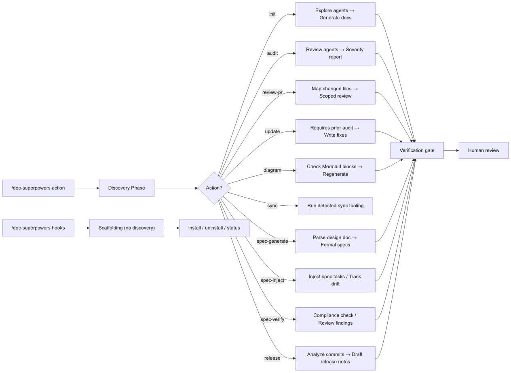

<details>
<summary>Mermaid source</summary>

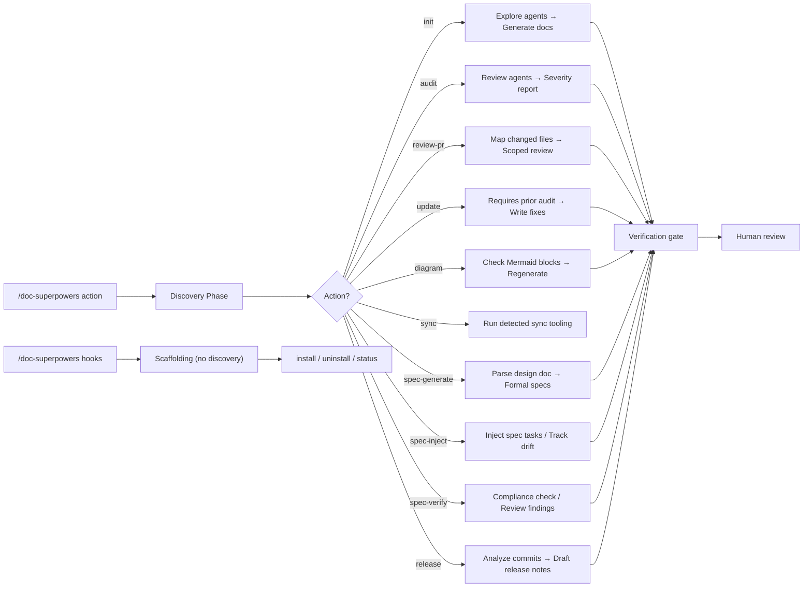

</details>

## Process: Discovery Phase

Runs before every action (except `hooks`). Audit defines the discovery logic (it is the canonical implementation). Other actions invoke the same discovery function. Builds an in-memory inventory of the target project.

### Steps

1. **Detect doc tooling** — scan `scripts/` for doc-related scripts (freshness, validation, archival)
2. **Detect scopes** — list `docs/` subdirectories, map each to likely code references
3. **Run baseline checks** — execute detected scripts or fall back to git-based staleness
4. **Detect agentic workflows** — scan `.claude/skills/`, `.claude/commands/`, MCP configs
5. **Build inventory** — compile skills, commands, MCP tools, scripts, artifacts, user gates, state/recovery into in-memory inventory

### Sequence Diagram

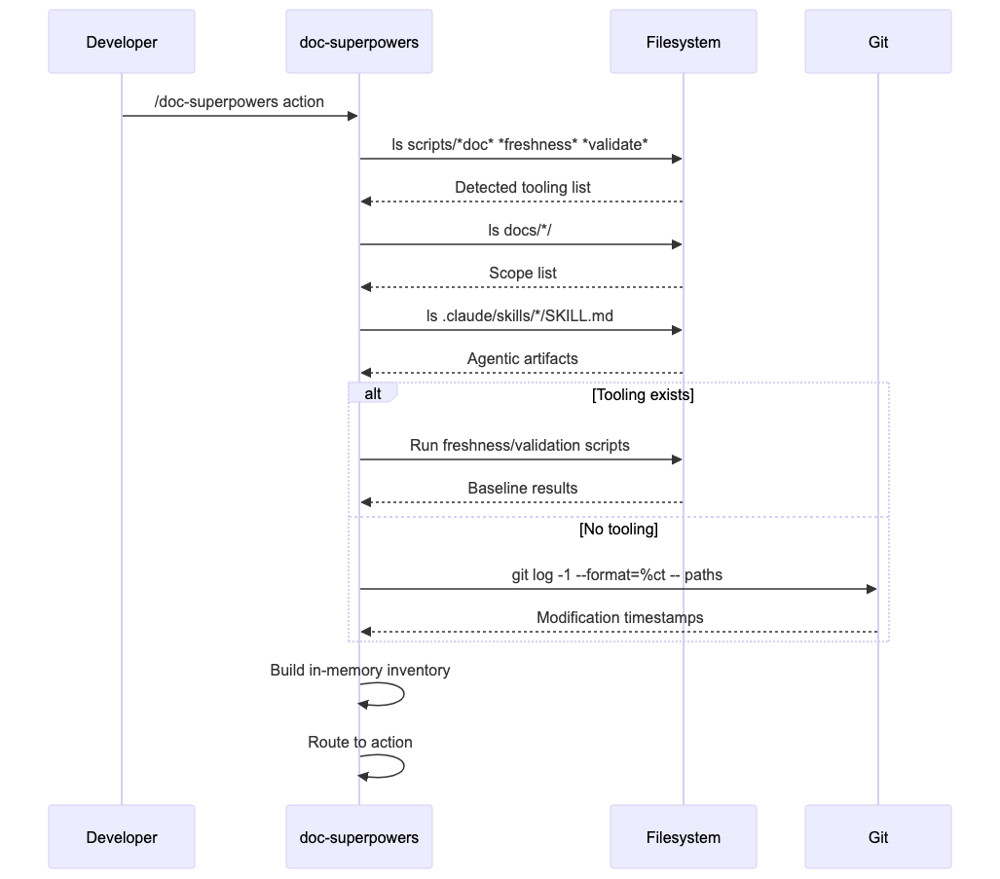

<details>
<summary>Mermaid source</summary>

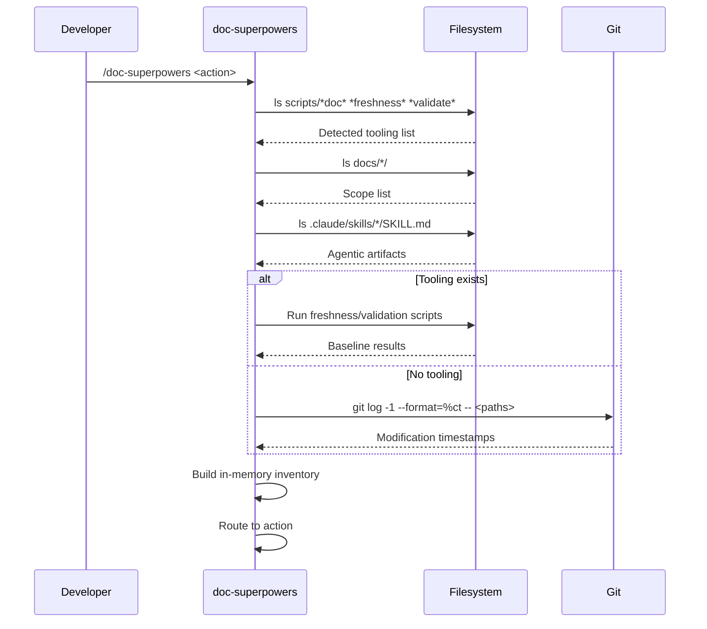

</details>

## Discovery Boundary

Discovery is owned by the audit/review-pr path. All actions consume the same discovery output — init does not have its own scope detection logic. This prevents drift between what init generates and what audit checks.

```
Discovery (audit owns this)
  → Scope detection (10 structural scopes, never platform-specific)
  → Freshness baseline (via scripts/doc-tools.sh)
  → Agentic inventory

Actions consume discovery output:
  init           → uses scopes to decide what to generate
  audit          → uses scopes + freshness to dispatch scope agents
  review-pr      → uses scopes + git diff to dispatch scope agents
  update         → uses prior audit report
  diagram        → uses scopes for diagram inventory
  sync           → uses doc-index vs filesystem
  spec-generate  → uses scopes + specs inventory for idempotency/overlap checks
  spec-inject    → uses doc-index for freshness checks on governing specs
  spec-verify    → uses doc-index code_refs for coverage mapping

Does not use discovery:
  hooks          → scaffolding command, routes directly to install.sh
  release        → analyzes git history, not documentation scopes
```

## Canonical Reference Files

SKILL.md delegates detailed content to standalone reference files. These are the authoritative sources:

| Reference File | Canonical For |
|---|---|
| `references/agent-prompt-template.md` | Agent prompt template and scope-specific focus areas (Quick Reference table) |
| `references/output-templates.md` | Audit report format and plan template (Quick Reference table) |
| `references/spec-lifecycle-actions.md` | Detailed procedures for spec-generate, spec-inject, spec-verify (SKILL.md Section 1) |
| `references/spec-lifecycle-protocol.md` | Wrapper author integration guide (Quick Reference table) |
| `references/integration-patterns.md` | Code review, commit review, and wrapper skill integration (Quick Reference table) |
| `references/doc-spec.md` | Doc templates, Mermaid syntax, naming conventions (SKILL.md Sections 0-1) |

## Process: `init` — Generate Documentation from Scratch

### Steps

1. Run discovery phase (scope detection, agentic inventory)
2. **Flat-to-structured migration check** — detect old-structure files with doc-superpowers freshness markers (e.g., `docs/architecture.md`), offer migration to structured paths instead of creating duplicates
3. Dispatch up to 3 parallel Explore agents to audit project structure, tech stack, APIs, data layer, workflows, conventions, existing docs
4. For each skill in agentic inventory, dispatch Explore agent to extract pipeline details
5. **Create directory structure** — `docs/architecture/diagrams/`, `docs/specs/`, `docs/adr/`, `docs/workflows/agentic/`, `docs/workflows/diagrams/`, `docs/guides/`, `docs/plans/`, `docs/archive/{adr,specs,plans,architecture}/`
6. Generate docs per scope using structured directories (`architecture/`, `specs/`, `adr/`, `workflows/`, `guides/`)
7. **Seed ADRs** for discovered architectural patterns — agent-driven, uses `<!-- Generated by doc-superpowers -->` marker
8. Update or create `CLAUDE.md`
9. Sync README.md — update feature list, action list, and usage examples if README.md exists
10. Generate Mermaid diagrams (C4, workflows, sequence, ERD) in co-located `diagrams/` directories
11. **Add freshness markers** as first line of each generated file: `<!-- Generated by doc-superpowers | YYYY-MM-DD | commit: SHORT_HASH -->`
12. Run `scripts/doc-tools.sh build-index` to create `docs/.doc-index.json`
13. Verification gate
14. Suggest workflow hooks: "Run `/doc-superpowers hooks install` to set up workflow hooks."

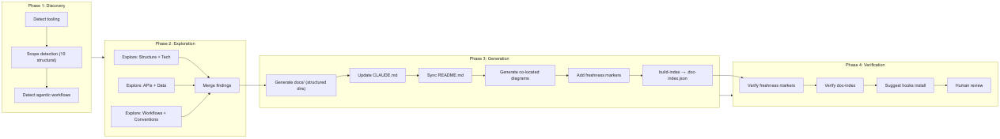

<details>
<summary>Mermaid source</summary>

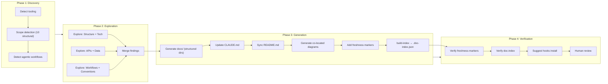

</details>

## Process: `audit` — Full Documentation Health Check

### Read-Only Analysis

Audit is **read-only**. It discovers what needs attention and produces a severity-ranked report written to `docs/plans/YYYY-MM-DD-audit-report.md`. It never creates, edits, or deletes docs — execution belongs to `update`.

### Steps

1. Run discovery phase (scope detection, freshness baseline via `check-freshness`, naming convention violations)
2. Call `doc-tools.sh check-freshness` — get full staleness report (including untracked docs)
3. Compare scope inventory against existing docs — find gaps
4. Validate naming conventions, detect structural issues (flat files, non-co-located diagrams)
5. Check CLAUDE.md currency — compare Directory Structure, Key Files, and Commands against actual filesystem; flag as P1 Stale (structural drift) or P2 Incomplete (missing entries)
6. Check README.md currency — compare feature list, action list, and usage examples against actual SKILL.md actions; flag as P1 Stale (feature drift) or P2 Incomplete (missing actions)
7. Check RELEASE-NOTES.md currency — parse latest version date, find unreleased commits; emit P2 Incomplete if commits exist since last release
8. For each affected scope, dispatch a scope agent in parallel
9. Each scope agent runs the **read-only** cycle: **gather** (collect scope context) → **analyze** (read docs + code_refs, identify accurate/stale/missing/conflicting) → **report** (findings with evidence — exact doc text vs exact code state)
10. Orchestrator merges scope reports into severity-sorted unified report (P0 > P1 > P2 > P3), including CLAUDE.md, README.md, and RELEASE-NOTES.md findings
11. Compare agentic inventory against documented workflow sections
12. Write audit report to `docs/plans/YYYY-MM-DD-audit-report.md`
13. Output the report to the user.
14. Suggest: "Run `/doc-superpowers update` to apply fixes from this audit."

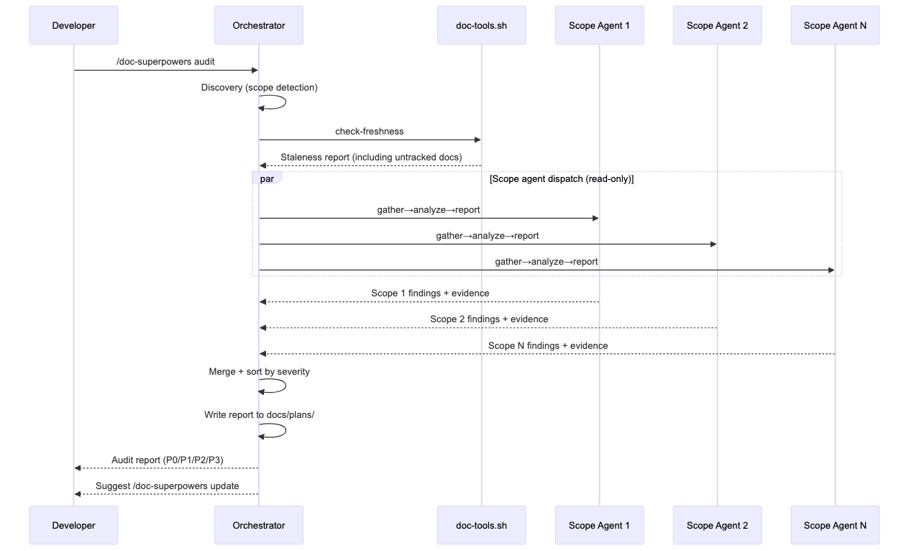

<details>
<summary>Mermaid source</summary>

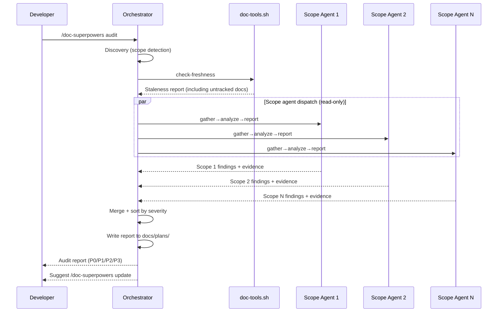

</details>

## Process: `review-pr` — PR-Scoped Review

### Read-Only Analysis (PR-Scoped)

Same read-only gather-analyze-report pattern as audit, but scoped to PR-affected files only. Uses `git diff` to determine which scopes have changed code, then dispatches scope agents only for affected scopes.

### Steps

1. Detect base branch, get changed files via `git diff`
2. Run discovery to map changed files to documentation scopes (via doc-index `code_refs`, directory heuristics, or skill/command file changes)
3. Call `doc-tools.sh check-freshness --code-refs <changed_paths>` — scope freshness check to PR
4. Dispatch scope agents only for affected scopes (same read-only gather→analyze→report cycle as audit)
5. Merge scope reports into PR-scoped findings
6. Check CLAUDE.md impact — if PR changes affect directory structure, scripts, commands, or key files listed in CLAUDE.md, flag as P1 (removed/renamed paths) or P2 (new paths to add)
7. Check README.md impact — if PR changes affect actions, features, or capabilities described in README.md, flag as P1 (removed/changed features) or P2 (new features to add)
8. Output list of docs needing updates

## Process: `update` — Execute Documentation Updates

Update is the **write counterpart** to audit's read-only analysis. It consumes an audit report and dispatches scope agents to make changes.

### Steps

1. **Locate audit report**: Check for the most recent `docs/plans/*-audit-report.md`. If none exists and no audit was run in this session, fall back to `doc-tools.sh check-freshness`. If nothing stale, exit with "Nothing to update."
2. **Detect structural migration needs**: Scan `docs/` for flat-structure files with doc-superpowers freshness markers. If detected, migrate to structured directories and rebuild doc-index.
3. For each stale doc, dispatch a scope agent that runs: **gather** → **plan** → **execute** → **diagram** → **sync**. The EXECUTE sub-phase preserves manually-added content and updates freshness markers as part of writing each doc.
4. Sync CLAUDE.md — after all doc changes, update to reflect current project state (catches structural changes from this update cycle)
5. Sync README.md — update feature list, action list, and usage examples if README.md exists (catches capability changes from this update cycle)
6. **Verification gate**: Run `doc-tools.sh check-freshness` to confirm all updated docs are current
7. Human reviews diffs before committing

## Process: `diagram` — Regenerate Diagrams

### Steps

1. Find docs containing Mermaid code blocks
2. Load agentic inventory from discovery
3. For each skill, check required diagrams exist (respecting depth guidance)
4. Verify diagram accuracy against current code
5. Render via Mermaid MCP (or output inline source if unavailable)
6. Flag missing or diverged diagrams as P2 Incomplete

## Process: `sync` — Sync Doc Index

### Steps

1. Run `scripts/doc-tools.sh check-freshness` to detect drift
2. Investigate `doc_modified` entries — flag for agent review if doc changed outside doc-superpowers
3. Run optional user scripts if detected (e.g., `validate_doc_references.py`)
4. Run `scripts/doc-tools.sh update-index` for verified docs
5. Update `docs/specs/README.md` and `docs/adr/README.md` indexes
6. Check CLAUDE.md currency — compare sections against actual filesystem; update if stale per `references/doc-spec.md` rules
7. Check README.md currency — compare feature list, action list, and usage examples against actual SKILL.md actions; update if stale per `references/doc-spec.md` rules
8. If `scripts/hooks/install.sh` exists, run `install.sh status` and append a one-line summary: `Hooks: N/5 git, N/3 claude, N/7 ci`

## Process: `hooks` — Install Workflow Hooks

Scaffolding command that installs opt-in hooks into the target project for automated freshness monitoring. Unlike other actions, `hooks` does not run the discovery phase — it routes directly to `scripts/hooks/install.sh`.

### Subcommands

```
/doc-superpowers hooks install [--git] [--claude] [--ci] [--all]
/doc-superpowers hooks status
/doc-superpowers hooks uninstall [--git] [--claude] [--ci] [--all]
```

### Tier Options

| Tier | Flag | Hooks Installed |
|------|------|----------------|
| Git | `--git` | `pre-commit` (freshness gate), `post-merge` (stale + untracked alert), `post-checkout` (branch check), `prepare-commit-msg` (inject comments), `pre-push` (unreleased commits warning) |
| Claude Code | `--claude` | PreToolUse pre-commit gate, PostToolUse post-commit sync, Stop session summary |
| CI/CD | `--ci` | PR freshness check workflow, weekly audit workflow, doc-index auto-update workflow |

### CI-Specific Flags

- `--base-branch NAME` — Target branch (default: `main`)
- `--cron EXPR` — Schedule expression (default: `0 9 * * 1`)
- `--ci-strict` — Fail PR check on stale docs (exit non-zero)

The `--ci-strict` flag maps to the `__CI_STRICT__` placeholder in CI workflow templates, which sets the `DOC_SUPERPOWERS_STRICT` environment variable in generated GitHub Actions workflows.

### Steps

1. Parse subcommand and tier flags
2. Route to `scripts/hooks/install.sh <subcommand> [flags]`
3. **install**:
   - **Git**: Resolve hooks directory via priority chain (`core.hooksPath` > `.githooks/` > `.git/hooks/`). For new hooks, copy scripts with `__DOC_TOOLS_PATH__` and `__INSTALL_DATE__` placeholder substitution, stamped with `doc-superpowers hook v1` marker. For existing hooks, copy hook script locally as `.doc-superpowers-{name}` with placeholder substitution, then auto-integrate via `# doc-superpowers:begin`/`end` marker block using `dirname $0` for portability — inserts before `exit 0` if present, otherwise appends.
   - **Claude Code**: Copy hook scripts to `.claude/hooks/doc-superpowers/` with `__DOC_TOOLS_PATH__` and `__INSTALL_DATE__` placeholder substitution, add entries to `.claude/settings.local.json` (PreToolUse + PostToolUse + Stop events) using nested format: `{"matcher":"Bash","hooks":[{"type":"command","command":"...","timeout":10}]}`. PostToolUse hooks use a Bash matcher to trigger after git commits. Stop hooks use an empty matcher (`"matcher":""`). The `post-commit-sync.sh` hook auto-runs `update-index` after git commits and reports any stale docs. The `session-summary.sh` hook auto-refreshes the doc index before session exit.
   - **CI/CD**: Generate `.github/workflows/` YAML files from templates with placeholder substitution (`__BASE_BRANCH__`, `__VERSION__`, `__CRON_SCHEDULE__`, `__CI_STRICT__`)
4. **uninstall**: When tier flags are provided:
   - **Git**: Two modes — full removal for hooks owned by doc-superpowers (matching the marker), or begin/end marker block deletion plus local hook copy cleanup (with legacy single-line fallback) for integrated hooks in third-party hook files.
   - **Claude Code**: Removes entries from `.claude/settings.local.json` and deletes the `.claude/hooks/doc-superpowers/` directory.
   - **CI/CD**: Deletes workflow files matching the workflow marker.
   - When no tier flags are given, prompts for confirmation in TTY mode or exits with an error in non-TTY mode.
5. **status**: Report installed hook state per tier. Git hooks show three states: `installed DATE` (owned hook), `integrated (source)` (source block in existing hook), or `not installed`.

> **IMPORTANT**: Never manually add hook entries to `.claude/settings.local.json`. Manual entries will contain unresolved `__DOC_TOOLS_PATH__` placeholders and break. Always use `install.sh install --claude` which performs placeholder substitution during copy.

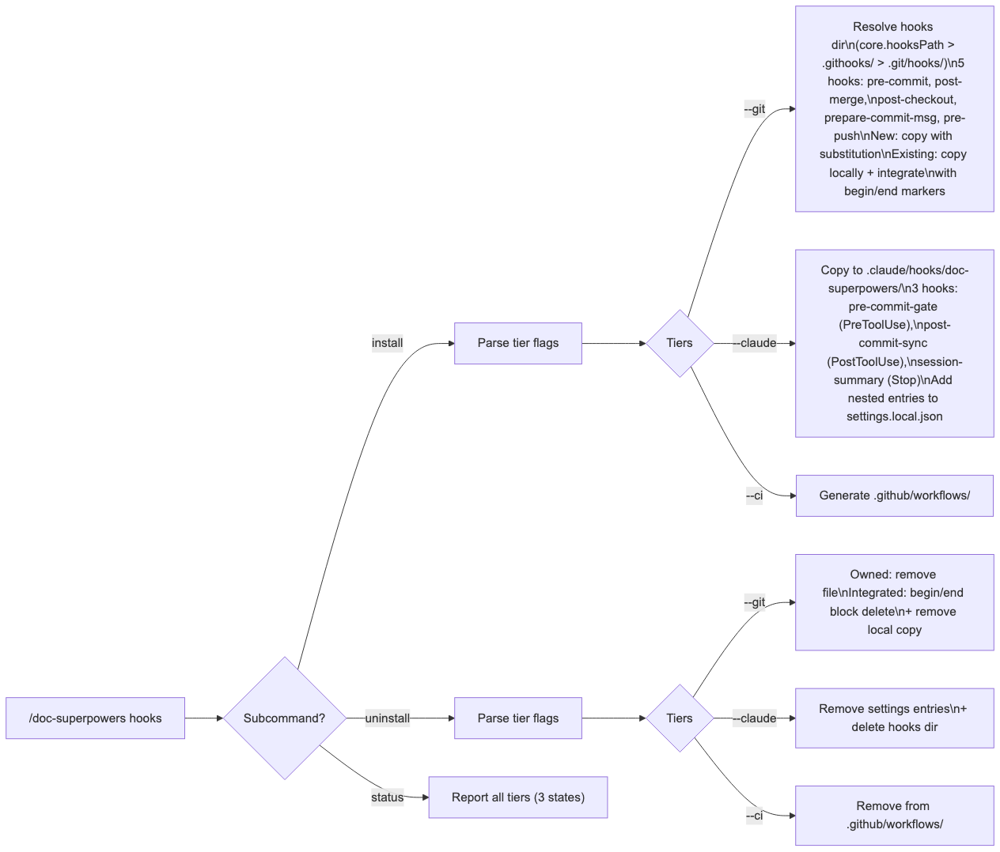

<details>
<summary>Mermaid source</summary>

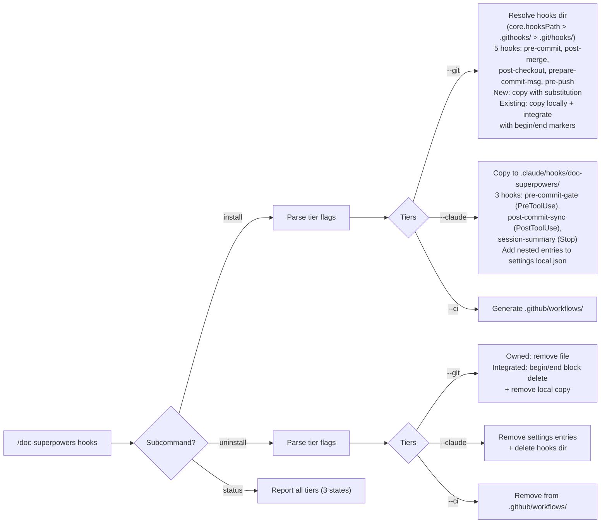

</details>

## Process: `release` — Draft Release Notes Entry

Analyzes commits since the last release and drafts a RELEASE-NOTES.md entry with agent-assisted diff review.

### Steps

1. Parse RELEASE-NOTES.md to extract latest version, date, and format
2. Determine commit range via git tags or date-based fallback (respects `--from=<ref>` override)
3. Auto-suggest version bump from conventional commit prefixes (feat→MINOR, fix→PATCH, BREAKING→MAJOR)
4. Dispatch a single general-purpose agent with commit list, diffs, and format exemplar to draft the entry
5. Present draft for user approval
6. Prepend approved entry to RELEASE-NOTES.md
7. Sync CLAUDE.md and README.md if released changes affect documented features
8. Offer to create git tag

## Process: `spec-generate` — Generate Formal Specs from Design Doc

Use after brainstorming produces a design spec. Decomposes a narrative design document into formal `SPEC-{CAT}-NNN-{slug}.md` files with full metadata, indexing, and freshness tracking.

### Input

- `--design-doc=<path>` — Path to the narrative design spec

### Steps

1. **Run discovery** (if not already run in this session)
2. **Bootstrap if needed** — create `docs/specs/` with `template.md` and `README.md` if missing; run `doc-tools.sh build-index` if no `.doc-index.json`
3. **Parse the design doc** — identify distinct specification domains using the 9 CAT codes (ARCH, AUTH, DATA, API, UI, PIPE, OPS, INFRA, TEST)
4. **Idempotency check** — if the design doc already has a `## Generated Specs` section, only generate specs for newly identified domains
5. **Overlap check** — for each domain, scan `docs/specs/` for existing specs in that category. Handle supersession, extension, or flag duplicates for human review
6. **Generate formal specs** — create `SPEC-{CAT}-NNN-{slug}.md` per domain using templates from `references/doc-spec.md`
7. **Populate `code_refs`** — extract from design doc references or infer from project structure (best-effort, refined later by `spec-inject`)
8. **Update indexes** — call `doc-tools.sh update-index` for each new spec; update `docs/specs/README.md`
9. **Link back to design doc** — append `## Generated Specs` section to the design doc
10. **Output** — report list of generated spec paths (used as `--specs` input for downstream actions)

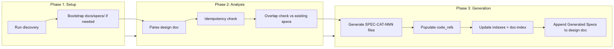

<details>
<summary>Mermaid source</summary>

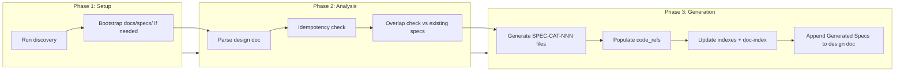

</details>

## Process: `spec-inject` — Inject Spec Tasks into Plans / Track Drift

Two modes: **plan phase** (inject spec maintenance tasks into implementation plan) and **execute phase** (detect drift and update spec status after each chunk).

### Plan Phase

**Input:**
- `--phase=plan`
- `--plan=<path>` — Path to the implementation plan
- `--specs=<paths>` — Comma-separated paths to governing specs

**Steps:**

1. Read the plan document and identify chunk boundaries (`## Chunk N:` or `### Task N:` headings)
2. For each chunk, append a spec update task (update status, verify Implementation Notes, refine `code_refs`, run `update-index`)
3. In the last chunk, also append a spec finalization task (set all specs to `Implemented`, fill Implementation Notes, final index update)
4. Output modified plan document

### Execute Phase

**Input:**
- `--phase=execute`
- `--specs=<paths>` — Paths to governing specs

Runs after each plan chunk completes (not after every individual task).

**Steps:**

1. **Check freshness** — call `doc-tools.sh check-freshness` against governing specs
2. **Determine alignment vs. drift:**
   - **Aligned** (implementation achieves spec intent) — update spec `Status`, update Implementation Notes, refine `code_refs`, call `update-index`
   - **Drifted** (implementation contradicts spec intent) — flag for human review with deviation note; do not auto-update spec content
3. **Status transitions**: Draft → In Review (first implementation) → Implemented (verification passes)
4. Output updated spec files (if aligned) or deviation flags (if drifted)

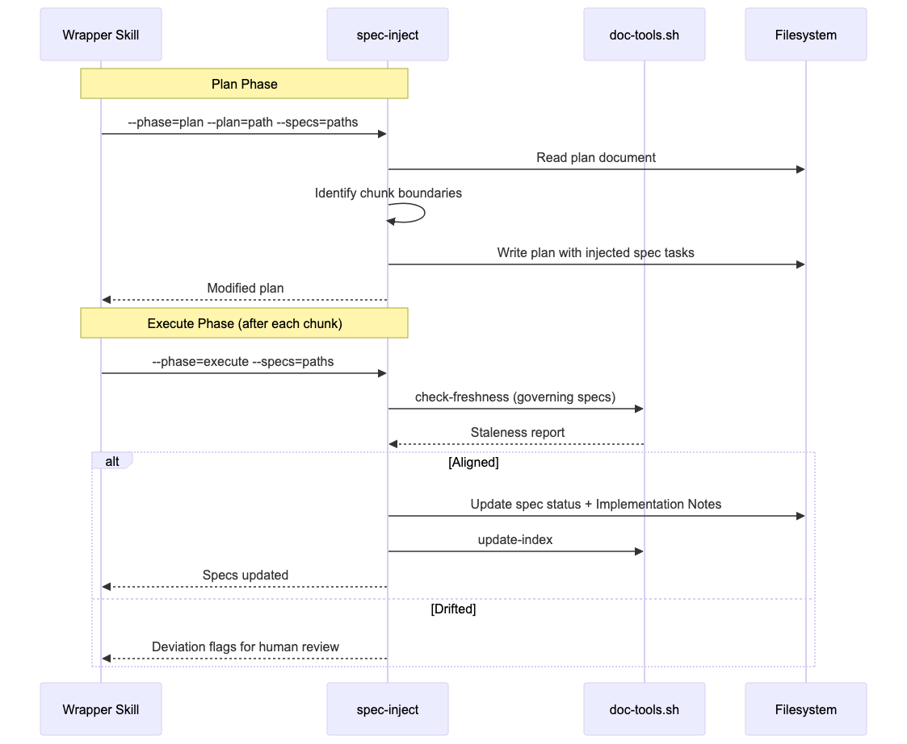

<details>
<summary>Mermaid source</summary>

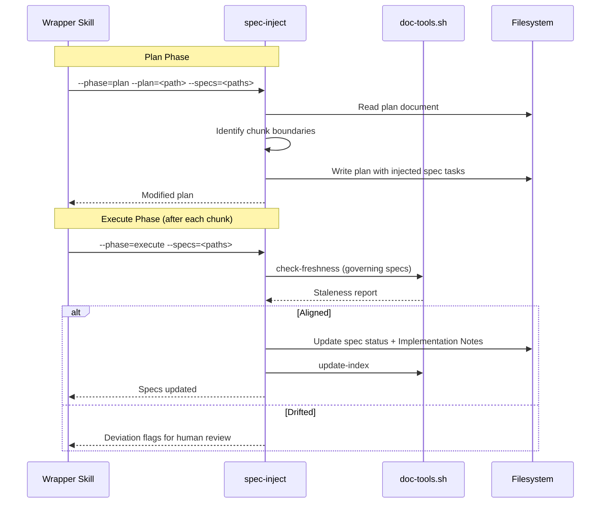

</details>

## Process: `spec-verify` — Verify Spec Compliance

Two modes: **post-execute** (final compliance check before merging) and **review** (spec findings for code review).

### Post-Execute Mode

**Input:**
- `--mode=post-execute`
- `--specs=<paths>` — Paths to governing specs
- `--design-doc=<path>` — Path to original design doc (for three-way check)

**Steps:**

1. **Existence check** — run `doc-tools.sh check-freshness` across all specs in scope
2. **Staleness check** — are any specs still flagged stale after all tasks completed?
3. **Status check** — are all governing specs in `Implemented` status?
4. **Coverage check** — three-way alignment:
   - **Design doc → Specs**: does each design section have a corresponding formal spec?
   - **Specs → Code**: do spec `code_refs` directories/files exist with implementation?
   - **Code → Specs**: do changed files fall within a governing spec's `code_refs`?
5. **PASS/FAIL verdict**:
   - **PASS**: all specs `Implemented`, no unresolved deviations, no uncovered design intent
   - **FAIL**: any spec not `Implemented`, unresolved deviations, or uncovered design intent
6. **Output compliance report** with verdict, summary, details table, unresolved items, and recommendation

### Review Mode

**Input:**
- `--mode=review`
- `--changed-files=<paths>` — Files changed in the PR/branch

**Steps:**

1. **Map changed files to governing specs** via `.doc-index.json` `code_refs`
2. **Run `check-freshness` on affected specs**
3. **Coverage gap detection** — flag changed files with no governing spec as "unspecified changes"
4. **Produce review findings** in standard severity format (P1 Stale, P2 Incomplete, P3 Style)

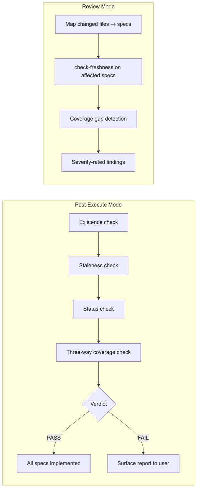

<details>
<summary>Mermaid source</summary>

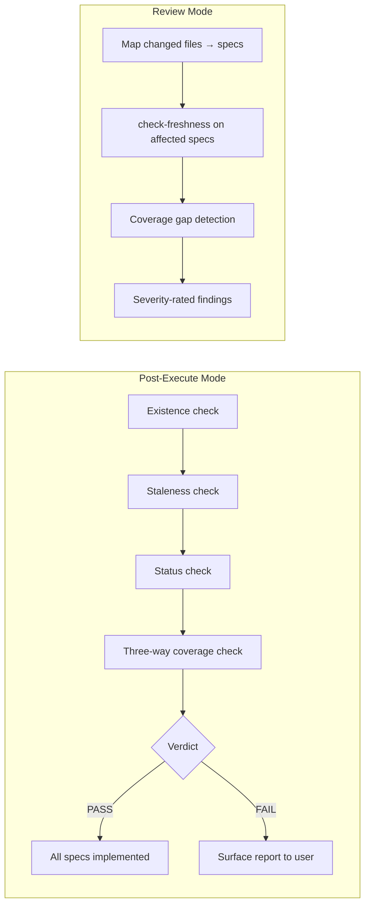

</details>

## Spec Lifecycle Routing

The spec lifecycle actions (`spec-generate`, `spec-inject`, `spec-verify`) form a pipeline typically driven by wrapper skills at 5 interception points.

```
Design doc ──→ spec-generate ──→ formal SPEC-{CAT}-NNN files
                                      │
Plan doc ──→ spec-inject (plan) ──→ plan + spec maintenance tasks
                                      │
Chunk done ──→ spec-inject (execute) ──→ spec status updates / drift flags
                                      │
All done ──→ spec-verify (post-execute) ──→ compliance report (PASS/FAIL)
                                      │
PR review ──→ spec-verify (review) ──→ freshness + coverage findings
```

| Pipeline Point | When | Action | Mode |
|---|---|---|---|
| Post-brainstorm | Design doc written and committed | `spec-generate` | — |
| During plan | Implementation plan being written | `spec-inject` | `plan` |
| During execute | After each plan chunk completes | `spec-inject` | `execute` |
| Pre-finish | All tasks done, before merging | `spec-verify` | `post-execute` |
| During review | Alongside other review participants | `spec-verify` | `review` |

## Scripts & Commands

| Command | Purpose |
|---------|---------|
| `/doc-superpowers init` | Generate full documentation suite from scratch |
| `/doc-superpowers audit` | Run documentation health check, write report to docs/plans/ |
| `/doc-superpowers review-pr` | Check docs affected by current PR |
| `/doc-superpowers update` | Apply fixes from prior audit/review |
| `/doc-superpowers diagram` | Regenerate architecture and workflow diagrams |
| `/doc-superpowers sync` | Sync doc index with filesystem |
| `/doc-superpowers hooks install [--git] [--claude] [--ci] [--all]` | Install workflow hooks into target project |
| `/doc-superpowers hooks status` | Show installed hooks per tier |
| `/doc-superpowers hooks uninstall [--git] [--claude] [--ci] [--all]` | Remove installed hooks |
| `/doc-superpowers release` | Draft release notes entry from git history |
| `/doc-superpowers spec-generate --design-doc=<path>` | Generate formal specs from a design document |
| `/doc-superpowers spec-inject --phase=plan` | Inject spec maintenance tasks into implementation plan |
| `/doc-superpowers spec-inject --phase=execute` | Detect drift and update spec status after chunk |
| `/doc-superpowers spec-verify --mode=post-execute` | Final compliance check with PASS/FAIL verdict |
| `/doc-superpowers spec-verify --mode=review` | Spec coverage findings for code review |

## Agentic Workflow: doc-superpowers (Self-Reference)

**Command**: `/doc-superpowers <action>`

### Pipeline Overview

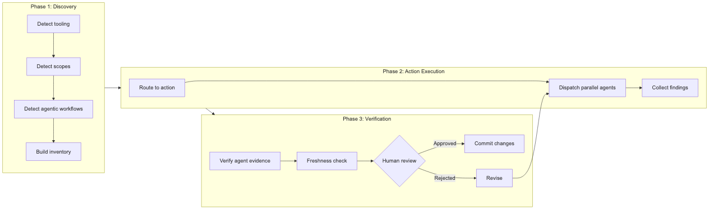

<details>
<summary>Mermaid source</summary>

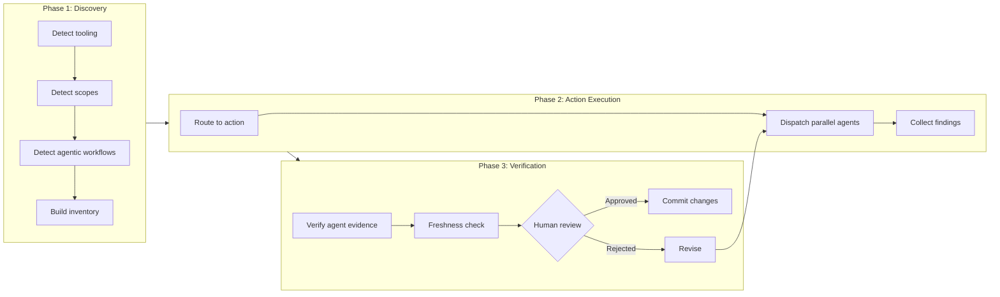

</details>

### Steps

| Phase | Action | Script/Agent | Output Artifact |
|-------|--------|-------------|----------------|
| 1 | Detect tooling, scopes, agentic workflows | Bash (ls, fd, rg) | In-memory inventory |
| 2 | Explore project structure | Explore agents (up to 3 parallel) | Project analysis |
| 3 | Generate/audit/review docs | General-purpose agents (one per scope) | Findings or doc files |
| 3b | Spec lifecycle (generate/inject/verify) | Spec lifecycle agents | Formal specs, plan tasks, compliance reports |
| 4 | Install hooks (scaffolding) | `scripts/hooks/install.sh` | Git/Claude/CI hooks |
| 5 | Verify correctness | Verification gate function | Evidence-confirmed results |
| 6 | Human review | Developer approval | Approved changes |

### Sub-Agents

| Agent | Dispatched In | Task | Fresh Context |
|-------|--------------|------|--------------|
| Explore (structure) | init Phase 2 | Scan directory tree, key files, entry points | Yes |
| Explore (tech) | init Phase 2 | Identify languages, frameworks, dependencies | Yes |
| Explore (conventions) | init Phase 2 | Detect linting, formatting, naming patterns | Yes |
| Explore (per skill) | init Phase 2 | Extract SKILL.md pipeline details | Yes |
| General-purpose (per scope) | audit/review-pr Phase 3 | Review docs against code with evidence | Yes |
| General-purpose (per doc) | update Phase 3 | Write updated doc preserving manual content | Yes |
| General-purpose (drafting) | release | Group commits into release sections, flag breaking changes | Yes |
| Spec generate (per domain) | spec-generate Phase 3 | Parse design doc, create formal SPEC-{CAT}-NNN files | Yes |
| Spec inject (plan) | spec-inject plan phase | Read plan, inject spec maintenance tasks per chunk | Yes |
| Spec inject (execute) | spec-inject execute phase | Check freshness, determine aligned vs. drifted | Yes |
| Spec verify (post-execute) | spec-verify post-execute | Three-way coverage check, PASS/FAIL verdict | Yes |
| Spec verify (review) | spec-verify review mode | Map changed files to specs, produce severity findings | Yes |

### User Interaction Gates

| Gate | Phase | User Action | Output |
|------|-------|-------------|--------|
| Audit report review | After audit writes report to docs/plans/ | Review findings, decide to update | Decision to run update |
| Diff review | After update | Review git diff of changes | Approval to commit |
| Release draft review | After release drafting agent | Review drafted release notes entry | Approval or edits |
| Release tag confirmation | After RELEASE-NOTES.md update | Confirm git tag creation | Tag created or skipped |
| Spec drift review | After spec-inject (execute) | Review deviation flags | Decision to fix or accept |
| Compliance report review | After spec-verify (post-execute) | Review PASS/FAIL verdict | Decision to merge, fix, or accept gaps |

### MCP Tools Used

| Tool | Purpose | When Called |
|------|---------|-----------|
| `mcp__mermaid__generate_mermaid_diagram` | Render Mermaid source to PNG | `diagram` action, `init` action (diagram generation step) |

### Sequence Diagram

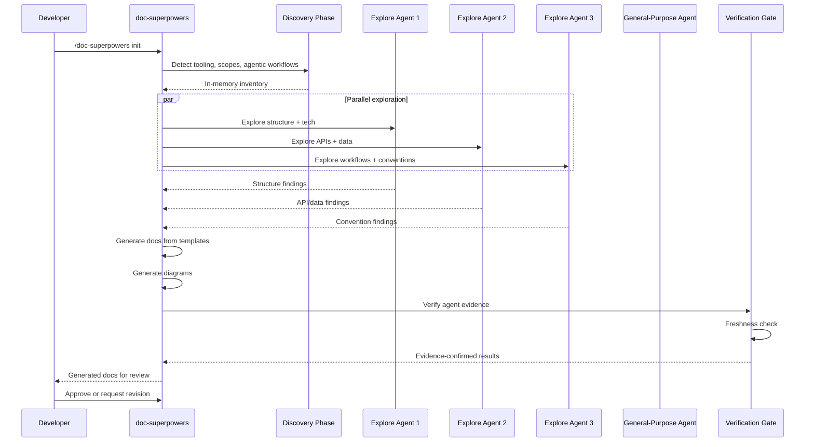

### Verification Model

| Layer | What It Checks | Required |
|-------|---------------|----------|
| Agent evidence | Exact doc vs code quotes in findings | Always |
| Freshness check | Hash or git-based staleness | After update |
| Spec compliance | Three-way design→spec→code alignment | After spec-verify |
| Human review | Git diff coherence | Before commit |
