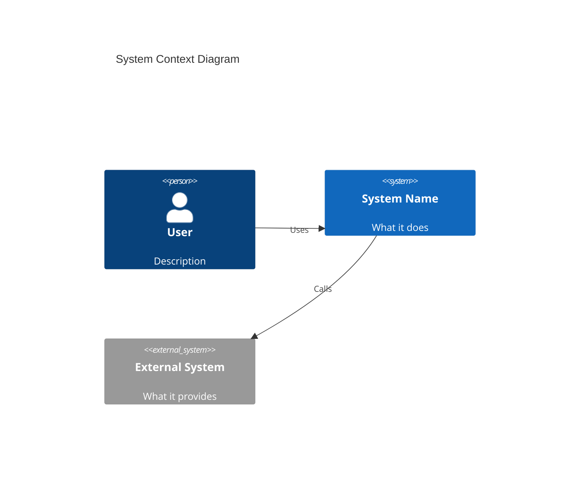
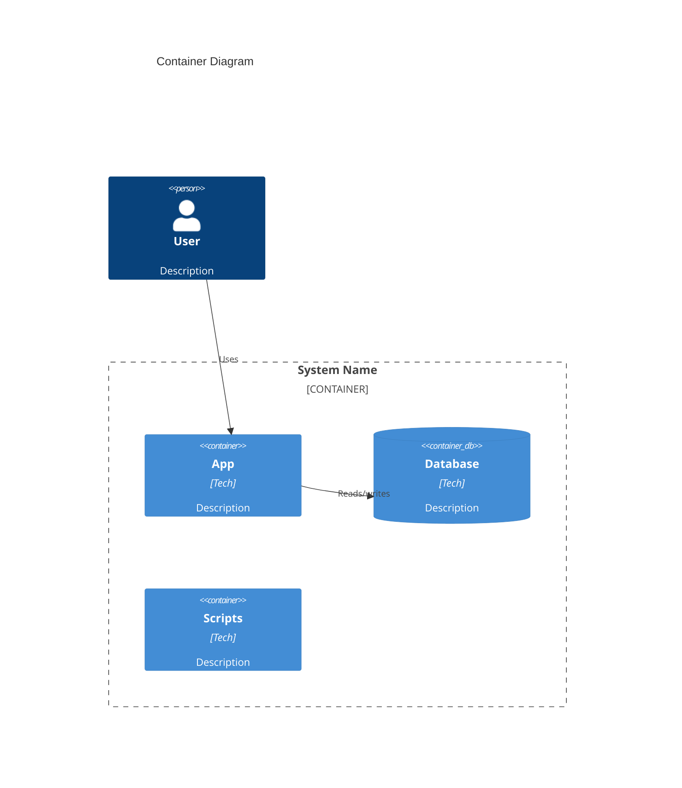
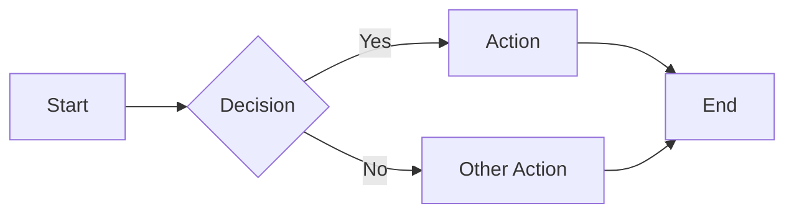
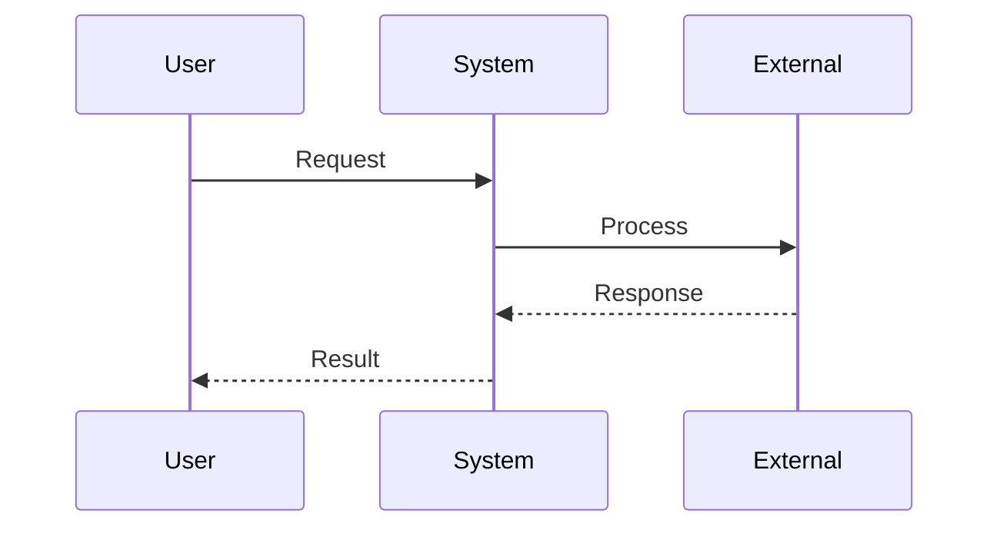
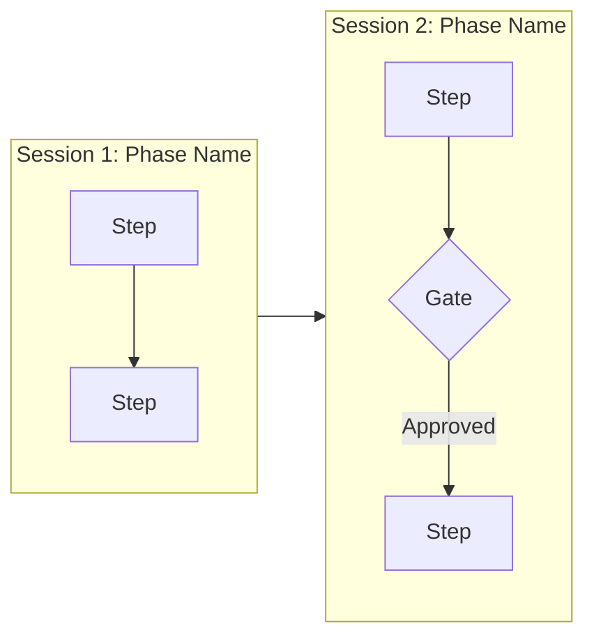
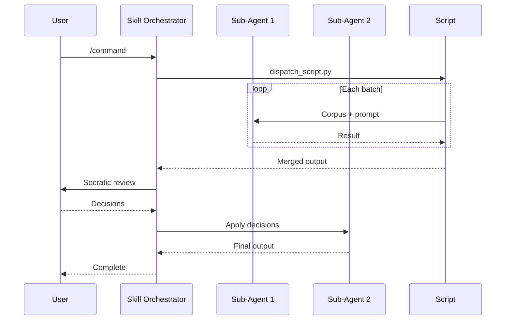
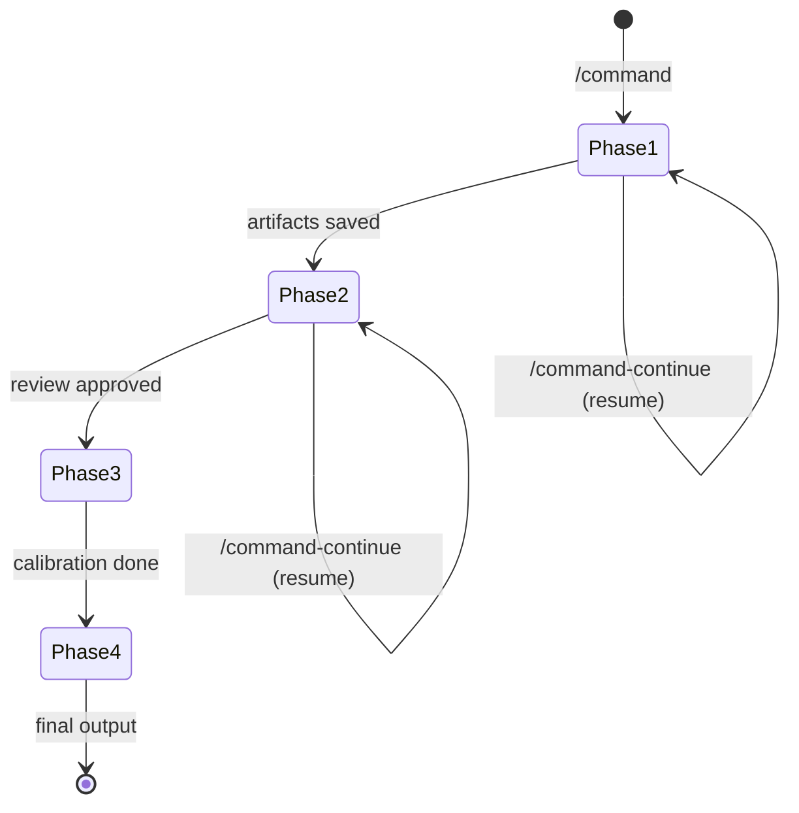
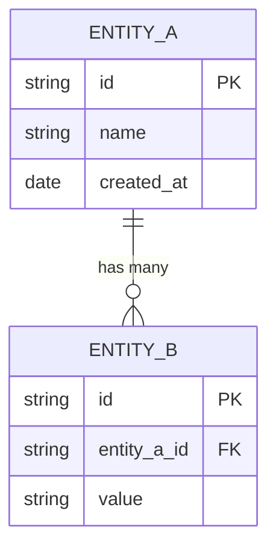

# Doc Spec - Templates Reference

Templates for each doc file generated by the `init` action. Adapt content to the specific project.

## Table of Contents

- [Freshness Marker](#freshness-marker)
- [docs/architecture/system-overview.md](#docsarchitecturesystem-overviewmd)
- [docs/architecture/{component}.md](#docsarchitecturecomponentmd)
- [docs/api-contracts.md](#docsapi-contractsmd)
- [docs/specs/template.md](#docsspecstemplatemd)
- [docs/adr/template.md](#docsadrtemplatemd)
- [docs/specs/README.md](#docsspecsreadmemd)
- [docs/adr/README.md](#docsadrreadmemd)
- [docs/workflows/{name}.md](#docsworkflowsnamemd) — includes agentic workflow section template, Mermaid patterns, depth guidance
- [docs/ci-cd.md](#docsci-cdmd)
- [docs/infra.md](#docsinframd)
- [docs/workflows/agentic/{skill-name}.md](#docsworkflowsagenticskill-namemd)
- [docs/data-layer.md](#docsdata-layermd)
- [docs/guides/getting-started.md](#docsguidsgetting-startedmd)
- [docs/codebase-guide.md](#docscodebase-guidemd)
- [docs/conventions.md](#docsconventionsmd)
- [CLAUDE.md Updates](#claudemd-updates)
- [Required Diagrams](#required-diagrams)
- [Naming Conventions Reference](#naming-conventions-reference)
- [Doc-Index Schema Reference](#doc-index-schema-reference)

## Freshness Marker

Add this HTML comment as the first line of every generated doc file:

```
<!-- Generated by doc-superpowers | YYYY-MM-DD | commit: SHORT_HASH -->
```

Use the current date and the HEAD commit short hash (from `git rev-parse --short HEAD`). In update mode, update the marker for any file that was regenerated; leave unchanged files alone.

---

## docs/architecture/system-overview.md

```markdown
# Architecture

## Overview
<!-- 2-3 sentence summary of what the system does and its primary purpose -->

## C4 Context Diagram
<!-- System in its environment: users, external systems, interactions -->
<!-- REQUIRED: Generate with mermaid C4Context -->


## C4 Container Diagram
<!-- Internal containers: apps, services, databases, file stores -->
<!-- REQUIRED: Generate with mermaid C4Container -->


## Tech Stack

| Layer | Technology | Purpose |
|-------|-----------|---------|
| Language | | |
| Framework | | |
| Database | | |
| Infrastructure | | |

## Key Decisions
<!-- ADR-style: what was decided and why, for non-obvious choices -->
- **Decision**: Rationale
```

### Mermaid: C4 Context



### Mermaid: C4 Container



---

## docs/architecture/{component}.md

Per-component architecture doc. Create one for each major component/domain discovered by scope detection.

```markdown
# {Component Name}

## Overview
<!-- 2-3 sentence summary of what this component does -->

## Responsibilities
<!-- Bulleted list of what this component owns -->

## Dependencies
<!-- What this component depends on -->

| Dependency | Type | Purpose |
|-----------|------|---------|
| | internal/external | |

## Key Interfaces
<!-- Public API / entry points -->

## Diagrams


## Key Decisions
<!-- Component-specific ADR references -->
```

---

## docs/api-contracts.md

Skip this file entirely if the project has no HTTP/RPC/GraphQL API.

```markdown
# API Contracts

## Base URL
<!-- e.g., http://localhost:3000/api -->

## Authentication
<!-- Auth method, headers, tokens -->

## Endpoints

### `METHOD /path`

**Description**: What this endpoint does

**Request**:
| Parameter | Type | Required | Description |
|-----------|------|----------|-------------|
| | | | |

**Request Body** (if applicable):
\`\`\`json
{}
\`\`\`

**Response** (200):
\`\`\`json
{}
\`\`\`

**Error Responses**:
| Status | Description |
|--------|-------------|
| 400 | |
| 404 | |

<!-- Repeat for each endpoint -->
```

---

## docs/specs/template.md

Template for new specs. Copy to create `SPEC-{CAT}-NNN-{slug}.md`.

```markdown
# SPEC-{CAT}-{NNN}: {Title}

**Status**: Draft | In Review | Approved | Implemented | Superseded
**Category**: {CAT}
**Created**: YYYY-MM-DD
**Author**: {name}
**Supersedes**: {path or "none"}
**Superseded by**: {path or "none"}
**Source**: {path to design doc or "manual"}

## Summary
<!-- 2-3 sentences describing what this spec defines -->

## Motivation
<!-- Why this spec is needed -->

## Design
<!-- Detailed design description -->

## Implementation Notes
<!-- Key implementation considerations -->

## Testing Strategy
<!-- How to verify the implementation matches this spec -->

## Open Questions
<!-- Unresolved questions (remove when resolved) -->
```

---

## docs/adr/template.md

Template for architecture decision records. Copy to create `ADR-NNN-{slug}.md`.

```markdown
# ADR-{NNN}: {Title}

**Status**: Proposed | Active | Superseded | Deprecated
**Date**: YYYY-MM-DD
**Supersedes**: {ADR number or "none"}
**Superseded by**: {ADR number or "none"}

## Context
<!-- What is the issue that we're seeing that is motivating this decision? -->

## Decision
<!-- What is the change that we're proposing and/or doing? -->

## Consequences
<!-- What becomes easier or more difficult because of this change? -->

### Positive
-

### Negative
-

### Neutral
-
```

---

## docs/specs/README.md

Auto-generated spec index. Updated by `init` and `audit`.

```markdown
# Specs Index

| ID | Title | Status | Category | Date |
|----|-------|--------|----------|------|
<!-- Auto-generated rows. Do not edit manually. -->
```

---

## docs/adr/README.md

Auto-generated ADR log. Updated by `init` and `audit`.

```markdown
# Architecture Decision Records

| # | Title | Status | Date |
|---|-------|--------|------|
<!-- Auto-generated rows. Do not edit manually. -->
```

---

## docs/workflows/{name}.md

Per-workflow doc. Create one for each distinct workflow/process discovered.

```markdown
# {Workflow Name}

## Overview
<!-- 2-3 sentence summary of this workflow -->

## Trigger
<!-- What initiates this workflow -->

## Steps

1. Step description
2. Step description

## Sequence Diagram
<!-- For multi-actor workflows -->


## Error Handling
<!-- What happens when steps fail -->
```

### Mermaid: Flowchart



### Mermaid: Sequence Diagram



### Agentic Workflow Section Template

Use once per discovered skill/command from the agentic inventory:

```markdown
## Agentic Workflow: [Skill/Command Name]

**Command**: `/command-name`

### Pipeline Overview
<!-- REQUIRED: Subgraph flowchart showing sessions/phases -->


### Steps

| Phase | Action | Script/Agent | Output Artifact |
|-------|--------|-------------|----------------|
| 1 | | | |

### Sub-Agents

| Agent | Dispatched In | Task | Fresh Context |
|-------|--------------|------|--------------|
| | | | |

### User Interaction Gates

| Gate | Phase | User Action | Output |
|------|-------|-------------|--------|
| | | | |

### MCP Tools Used

| Tool | Purpose | When Called |
|------|---------|-----------|
| | | |

### Sequence Diagram
<!-- REQUIRED: Multi-actor with sub-agent lifelines, loops, user gates -->


```

### Mermaid: Subgraph Flowchart (Multi-Session Pipelines)



### Mermaid: Multi-Actor Sequence Diagram (Sub-Agent Dispatch)



### Mermaid: State Diagram (Pipeline Recovery / Session State)



### Workflow Depth Guidance

When generating agentic workflow docs, use this table to decide how many diagrams a skill needs:

| Depth | When to use | Diagram type |
|---|---|---|
| **Overview** | Always — shows how commands/skills relate | Single flowchart with all commands as entry points |
| **Workflow** | Each skill with 2+ phases | Subgraph flowchart + sequence diagram |
| **Internals** | Complex pipelines only (4+ sub-agents, batching, recovery) | State diagram + detailed sequence with script-level lifelines |

Rule of thumb: every skill gets overview + workflow depth. Only add internals depth if the pipeline has state tracking, auto-batching, or recovery flows.

---

## docs/ci-cd.md

Skip if no CI/CD scope detected.

```markdown
# CI/CD

## Pipeline Overview
<!-- Build, test, deploy stages -->

## Triggers
<!-- What triggers each pipeline -->

| Pipeline | Trigger | Branch |
|----------|---------|--------|
| | | |

## Environments
<!-- Deployment targets -->

| Environment | URL | Deploy Method |
|-------------|-----|--------------|
| | | |

## Scripts
<!-- CI/CD related scripts and their purpose -->
```

---

## docs/infra.md

Skip if no infrastructure scope detected.

```markdown
# Infrastructure

## Overview
<!-- Infrastructure topology -->

## Components
<!-- Cloud services, containers, networking -->

| Component | Service | Purpose |
|-----------|---------|---------|
| | | |

## Configuration
<!-- How infrastructure is configured (IaC, manifests, etc.) -->

## Deployment
<!-- How to deploy infrastructure changes -->
```

---

## docs/workflows/agentic/{skill-name}.md

Per-skill agentic workflow doc. Create one for each discovered skill.

```markdown
# Agentic Workflow: {Skill Name}

**Command**: `/command-name`

## Pipeline Overview
<!-- REQUIRED: Subgraph flowchart showing sessions/phases -->


## Steps

| Phase | Action | Script/Agent | Output Artifact |
|-------|--------|-------------|----------------|
| 1 | | | |

## Sub-Agents

| Agent | Dispatched In | Task | Fresh Context |
|-------|--------------|------|--------------|
| | | | |

## User Interaction Gates

| Gate | Phase | User Action | Output |
|------|-------|-------------|--------|
| | | | |

## MCP Tools Used

| Tool | Purpose | When Called |
|------|---------|-----------|
| | | |

## Sequence Diagram
<!-- REQUIRED: Multi-actor with sub-agent lifelines, loops, user gates -->


```

---

## docs/data-layer.md

Skip this file if the project has no data persistence (no database, no file-based storage, no models).

```markdown
# Data Layer

## Overview
<!-- What data the system manages and how -->

## Entity Relationship Diagram
<!-- REQUIRED: Generate ERD diagram -->


## Models / Schemas

### [ModelName]
| Field | Type | Constraints | Description |
|-------|------|-------------|-------------|
| | | | |

<!-- Repeat for each model/schema -->

## Storage
<!-- Database type, file storage, caching layer -->
<!-- Connection details, configuration -->

## Migrations
<!-- Migration strategy, how to run migrations -->
```

### Mermaid: ERD



---

## docs/guides/getting-started.md

```markdown
# Getting Started

## Prerequisites
<!-- Required software, versions, accounts -->
- [ ] Prerequisite 1
- [ ] Prerequisite 2

## Installation

\`\`\`bash
# Clone and setup steps
\`\`\`

## Configuration
<!-- Environment variables, config files -->

| Variable | Required | Default | Description |
|----------|----------|---------|-------------|
| | | | |

## Running

\`\`\`bash
# How to start/run the project
\`\`\`

## Verification
<!-- How to confirm it's working -->
```

---

## docs/codebase-guide.md

```markdown
# Codebase Guide

## Directory Structure

\`\`\`
project/
├── dir/          # Description
│   ├── file      # Description
│   └── file      # Description
├── dir/          # Description
└── file          # Description
\`\`\`

## Key Files

| File | Purpose | When to Modify |
|------|---------|---------------|
| | | |

## Where to Find Things

| Looking For | Location |
|-------------|----------|
| Entry point | |
| Configuration | |
| Tests | |
| Scripts/tools | |
| Documentation | |

## Code Flow
<!-- How a typical request/operation flows through the code -->
```

---

## docs/conventions.md

```markdown
# Conventions

## Code Style
<!-- Language-specific formatting, linting rules -->

## Naming Conventions
<!-- Files, functions, variables, classes -->

| Element | Convention | Example |
|---------|-----------|---------|
| | | |

## Git Conventions

### Branches
<!-- Branch naming pattern -->

### Commits
<!-- Commit message format -->

### Pull Requests
<!-- PR process, review requirements -->

## Project-Specific Patterns
<!-- Patterns unique to this project -->
```

---

## CLAUDE.md Updates

CLAUDE.md is loaded at the start of every Claude session. Stale entries mean every future session starts with incorrect context about the project. This makes CLAUDE.md sync a critical step — not just for `init`, but for every write action that changes project structure.

**When to apply these rules**: After ANY doc-superpowers write action that changes directory structure, adds/removes files, or modifies commands. This includes `init`, `update`, `spec-generate`, `sync`, and `release`. The `audit` and `review-pr` actions detect CLAUDE.md staleness and report it; the write actions fix it.

**If CLAUDE.md exists**: Read it first. Only update sections that are factually stale:
- **Directory Structure**: Sync the tree with actual filesystem (new dirs, removed dirs, renamed paths)
- **Key Files**: Update the table if files were added, removed, or changed purpose
- **Commands**: Add/remove any slash commands or scripts that changed
- **File references**: Update paths, line counts, or descriptions that no longer match
- **Category/enum lists**: Sync with code if the canonical list lives in CLAUDE.md

**Preserve everything else** — tone, workflow descriptions, extraction rules, conventions, and any manually-written guidance. Do NOT rewrite sections that are still accurate. Do NOT reformat or restructure. Treat CLAUDE.md as the project owner's voice.

**If CLAUDE.md does not exist**: Create one with these sections:

```markdown
# [Project Name]

[1-2 sentence description]

## Quick Start

\`\`\`bash
# Essential setup/run commands
\`\`\`

## Directory Structure

\`\`\`
project/
├── dir/    # description
└── file    # description
\`\`\`

## Commands

- `/command` - description

## Key Files

| File | Purpose |
|------|---------|
| | |

## Conventions

<!-- Project-specific patterns, naming rules, important constraints -->
```

Keep it concise — CLAUDE.md should be a quick-reference entry point, not a comprehensive doc (that's what `docs/` is for).

## README.md Updates

README.md is the project's public documentation — if it lists outdated features or missing actions, users and contributors don't know what the tool can do. Like CLAUDE.md, README.md sync is a cross-cutting concern for every write action.

**When to apply these rules**: After ANY doc-superpowers write action that changes capabilities, actions, features, or project structure. This includes `init`, `update`, `sync`, `release`, and `spec-generate`. The `audit` and `review-pr` actions detect README.md staleness and report it; the write actions fix it.

**If README.md exists**: Read it first. Only update sections that are factually stale:
- **Feature list**: Sync with actual SKILL.md actions and capabilities
- **Action list**: Sync with action definitions (init, audit, review-pr, update, diagram, sync, hooks, release, spec-*)
- **Usage examples**: Verify examples still work and reference current action names/flags
- **Project description**: Ensure it covers current major capabilities

**Preserve everything else** — tone, structure, installation instructions, contributing guidelines, and any manually-written content. Do NOT rewrite sections that are still accurate. Do NOT reformat or restructure. Treat README.md as the project owner's voice.

**If README.md does not exist**: Do not create one — README.md is the project owner's responsibility. Flag as P2 Incomplete in audit if the project has docs but no README.md.

---

## Required Diagrams

Do NOT skip these — every project has architecture and workflows:

| Doc | Diagram | Syntax | When |
|-----|---------|--------|------|
| `architecture/system-overview.md` | C4 Context | `C4Context` | Always |
| `architecture/system-overview.md` | C4 Container | `C4Container` | Always |
| `workflows/{name}.md` | Flowchart | `flowchart LR` | Always |
| `workflows/{name}.md` | Sequence (if multi-step) | `sequenceDiagram` | Always |
| `data-layer.md` | ERD | `erDiagram` | Always |
| `workflows/agentic/{skill}.md` | Subgraph flowchart | `flowchart LR` + `subgraph` | Each skill with 2+ sessions/phases |
| `workflows/agentic/{skill}.md` | Multi-actor sequence | `sequenceDiagram` with agent lifelines | Each skill with sub-agent dispatch |
| `workflows/agentic/{skill}.md` | State diagram | `stateDiagram-v2` | Each skill with state/recovery (detected in inventory) |

## Diagram File Naming

Diagrams are co-located with their doc section:

| Diagram | Location | Filename |
|---------|----------|----------|
| C4 Context | `docs/architecture/diagrams/` | `c4-context.png` |
| C4 Container | `docs/architecture/diagrams/` | `c4-container.png` |
| Component | `docs/architecture/diagrams/` | `{component}.png` |
| ERD | `docs/architecture/diagrams/` | `erd.png` |
| Primary workflow | `docs/workflows/diagrams/` | `workflow-primary.png` |
| Additional workflows | `docs/workflows/diagrams/` | `workflow-{name}.png` |
| Sequence diagrams | `docs/workflows/diagrams/` | `sequence-{name}.png` |
| State diagram | `docs/workflows/diagrams/` | `state-{name}.png` |

---

## Naming Conventions Reference

### File Naming

| Doc Type | Pattern | Example |
|----------|---------|---------|
| Architecture | `{component-slug}.md` (kebab-case) | `auth-service.md` |
| Specs | `SPEC-{CAT}-{NNN}-{slug}.md` | `SPEC-AUTH-001-oauth-flow.md` |
| ADRs | `ADR-{NNN}-{slug}.md` | `ADR-001-use-jwt-for-auth.md` |
| Workflows | `{workflow-slug}.md` (kebab-case) | `deployment.md` |
| Agentic workflows | `{skill-name}.md` | `doc-superpowers.md` |
| Diagrams | `{type}-{name}.png` | `c4-context.png` |
| Guides | `{topic-slug}.md` (kebab-case) | `getting-started.md` |
| Templates | `template.md` (one per structured dir) | `docs/adr/template.md` |
| Plans | `YYYY-MM-DD-{slug}.md` | `2026-03-12-doc-update-plan.md` |

### Spec Categories

Discovered from code analysis. Canonical list maintained in `docs/specs/README.md`.

| Code | Scope |
|------|-------|
| `ARCH` | System architecture |
| `AUTH` | Authentication / authorization |
| `DATA` | Data layer / schema / persistence |
| `API` | API contracts / endpoints |
| `UI` | User interface / views |
| `PIPE` | Processing pipelines |
| `OPS` | Operations / DevOps / CI-CD |
| `INFRA` | Infrastructure |
| `TEST` | Testing strategy |

New categories: uppercase, max 5 characters. Check `docs/specs/README.md` before creating.

### ADR Numbering

Sequential, monotonic, never reused. Zero-padded 3 digits: `ADR-001`, `ADR-002`.

### Spec Numbering

Sequential per category. Zero-padded 3 digits: `SPEC-AUTH-001`, `SPEC-DATA-001`.

---

## Doc-Index Schema Reference

Schema for `docs/.doc-index.json`. Generated by `scripts/doc-tools.sh build-index`.

| Field | Type | Purpose |
|-------|------|---------|
| `version` | integer | Schema version (currently 1) |
| `generated_by` | string | Always `"doc-superpowers"` |
| `generated_at` | ISO 8601 | When index was last built/updated |
| `build_commit` | string | Repo HEAD at last `build-index` |
| `docs.<path>.content_hash` | string | `sha256:<hex>` of doc content |
| `docs.<path>.code_refs` | string[] | Directories/files this doc covers |
| `docs.<path>.code_commit` | string | Latest commit SHA for code_refs |
| `docs.<path>.doc_type` | string | Template type |
| `docs.<path>.status` | enum | `current` \| `stale` \| `deprecated` |
| `docs.<path>.replaces` | string\|null | Path to superseded doc |
| `docs.<path>.superseded_by` | string\|null | Path to superseding doc |
| `docs.<path>.last_verified` | ISO 8601 | Last freshness check confirmed current |

### Status Transitions

- `current` → `stale`: reported by `check-freshness` (read-only, doesn't write index)
- `stale` → `current`: set by `update-index` after doc regeneration
- `current` → `deprecated`: human-set only, never overridden by tooling
- `deprecated` is terminal for automated tools
