# Doc Spec - Templates Reference

Templates for each doc file generated by the `init` action. Adapt content to the specific project.

Templates that contain a code block are wrapped in a four-backtick fence, so the inner fences are real: copy them as they are. Every diagram is a PNG **plus its Mermaid source** in a `<details><summary>Mermaid source</summary>` block right under it — `diagram` finds docs by that source and regenerates the PNG from it, so a PNG without its source cannot be maintained. Which diagrams a doc needs is decided by [Required Diagrams](#required-diagrams) alone.

## Table of Contents

- [Freshness Marker](#freshness-marker)
- [docs/architecture/system-overview.md](#docsarchitecturesystem-overviewmd)
- [docs/architecture/{component}.md](#docsarchitecturecomponentmd)
- [docs/api-contracts.md](#docsapi-contractsmd)
- [docs/specs/template.md](#docsspecstemplatemd)
- [docs/adr/template.md](#docsadrtemplatemd) — and the ADR/spec header style and realization block (`Implementation:` / `Realized-by:`)
- [docs/specs/README.md](#docsspecsreadmemd)
- [docs/adr/README.md](#docsadrreadmemd)
- [docs/workflows/{workflow-name}.md](#docsworkflowsworkflow-namemd) — includes Mermaid patterns and depth guidance
- [docs/ci-cd.md](#docsci-cdmd)
- [docs/infra.md](#docsinframd)
- [docs/workflows/agentic/README.md](#docsworkflowsagenticreadmemd)
- [docs/workflows/agentic/{skill-name}.md](#docsworkflowsagenticskill-namemd)
- [docs/data-layer.md](#docsdata-layermd)
- [docs/guides/getting-started.md](#docsguidesgetting-startedmd)
- [docs/codebase-guide.md](#docscodebase-guidemd)
- [docs/conventions.md](#docsconventionsmd)
- [CLAUDE.md Updates](#claudemd-updates)
- [README.md Updates](#readmemd-updates)
- [Required Diagrams](#required-diagrams)
- [Diagram File Naming](#diagram-file-naming)
- [Naming Conventions Reference](#naming-conventions-reference)
- [Doc-Index Schema Reference](#doc-index-schema-reference)

## Freshness Marker

Add this HTML comment as the first line of every generated doc file — except `template.md` files, since a spec or ADR copied from a template would inherit a false "Generated by" line:

```
<!-- Generated by doc-superpowers -->
```

The marker identifies a generated doc, for example to find flat-structure docs to migrate. It carries no date or commit. Freshness is recorded in one place only, `docs/.doc-index.json`: each entry's `code_oids` and `last_verified` (see [Doc-Index Schema Reference](#doc-index-schema-reference)). A date and commit in the doc would be a second freshness claim that nothing reads, and it would go stale. A marker from an older release, `<!-- Generated by doc-superpowers | YYYY-MM-DD | commit: SHORT_HASH -->`, is still recognized and may be left as it is.

---

## docs/architecture/system-overview.md

````markdown
# Architecture

## Overview
<!-- 2-3 sentence summary of what the system does and its primary purpose -->

## C4 Context Diagram
<!-- System in its environment: users, external systems, interactions -->
<!-- REQUIRED: Generate with mermaid C4Context -->


<details>
<summary>Mermaid source</summary>

```mermaid
C4Context
  title System Context Diagram
```

</details>

## C4 Container Diagram
<!-- Internal containers: apps, services, databases, file stores -->
<!-- REQUIRED: Generate with mermaid C4Container -->


<details>
<summary>Mermaid source</summary>

```mermaid
C4Container
  title Container Diagram
```

</details>

## Tech Stack

| Layer | Technology | Purpose |
|-------|-----------|---------|
| Language | | |
| Framework | | |
| Database | | |
| Infrastructure | | |

## Key Decisions
<!-- ADR-style: what was decided and why, for non-obvious choices -->
- **Decision**: Rationale

## Packages
<!-- monorepo scope only: one row per package — path, role, depends on -->
````

### Mermaid: C4 Context

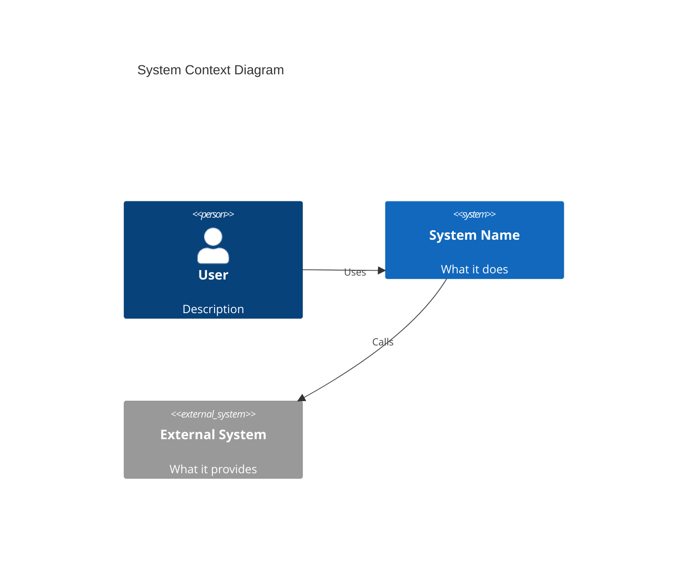
```mermaid
C4Context
  title System Context Diagram
  Person(user, "User", "Description")
  System(system, "System Name", "What it does")
  System_Ext(ext, "External System", "What it provides")
  Rel(user, system, "Uses")
  Rel(system, ext, "Calls")
```

### Mermaid: C4 Container

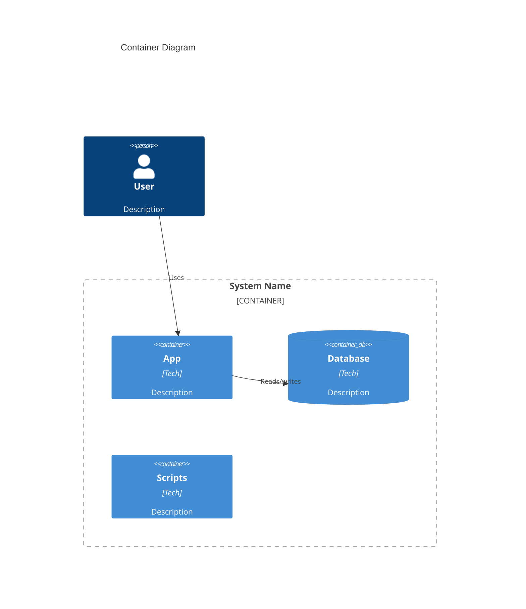
```mermaid
C4Container
  title Container Diagram
  Person(user, "User", "Description")
  Container_Boundary(boundary, "System Name") {
    Container(app, "App", "Tech", "Description")
    ContainerDb(db, "Database", "Tech", "Description")
    Container(scripts, "Scripts", "Tech", "Description")
  }
  Rel(user, app, "Uses")
  Rel(app, db, "Reads/writes")
```

---

## docs/architecture/{component}.md

Per-component architecture doc (the `application` scope). Create one for each major component the Explore agents identify.

````markdown
# {Component Name}

## Overview
<!-- 2-3 sentence summary of what this component does -->

## Responsibilities
<!-- Bulleted list of what this component owns -->

## Dependencies
<!-- What this component depends on -->

| Dependency | Type | Purpose |
|-----------|------|---------|
| | internal/external | |

## Key Interfaces
<!-- Public API / entry points -->

## Diagrams


<details>
<summary>Mermaid source</summary>

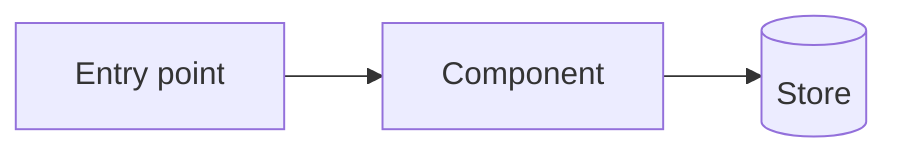
```mermaid
flowchart LR
  A[Entry point] --> B[Component] --> C[(Store)]
```

</details>

## Key Decisions
<!-- Component-specific ADR references -->
````

---

## docs/api-contracts.md

Generate this file when the `api-contracts` scope is detected (SKILL.md *Detect Scopes*: schema files, or route definitions — a routes-only HTTP app counts); otherwise skip it.

````markdown
# API Contracts

## Base URL
<!-- e.g., http://localhost:3000/api -->

## Authentication
<!-- Auth method, headers, tokens -->

## Endpoints

### `METHOD /path`

**Description**: What this endpoint does

**Request**:
| Parameter | Type | Required | Description |
|-----------|------|----------|-------------|
| | | | |

**Request Body** (if applicable):
```json
{}
```

**Response** (200):
```json
{}
```

**Error Responses**:
| Status | Description |
|--------|-------------|
| 400 | |
| 404 | |

<!-- Repeat for each endpoint -->
````

---

## docs/specs/template.md

Template for new specs. Copy to create `SPEC-{CAT}-NNN-{slug}.md`.

```markdown
# SPEC-{CAT}-{NNN}: {Title}

**Status**: Draft | In Review | Approved | Implemented | Active | Deprecated | Superseded
**Category**: {CAT}
**Created**: YYYY-MM-DD
**Author**: {name}
**Supersedes**: {path or "none"}
**Superseded by**: {path or "none"}
**Source**: {path to design doc or "manual"}

Realized-by: []

## Summary
<!-- 2-3 sentences describing what this spec defines -->

## Motivation
<!-- Why this spec is needed -->

## Design
<!-- Detailed design description -->

## Implementation Notes
<!-- Key implementation considerations -->

## Testing Strategy
<!-- How to verify the implementation matches this spec -->

## Open Questions
<!-- Unresolved questions (remove when resolved) -->
```

`Draft`, `In Review`, `Approved`, and `Implemented` form the ladder that `spec-inject` transitions automatically (`spec-verify` is read-only — it reports on `Status` and never writes it). `Active` (continuously-evolving reference specs), `Deprecated`, `Superseded`, **and any status not on that ladder** sit outside it and are never transitioned by automation — the exempt class is open-world, so a status added later cannot fall back to an unguarded write. See **Spec Status Model** in `references/spec-lifecycle-actions.md`.

---

## docs/adr/template.md

Template for architecture decision records. Copy to create `ADR-NNN-{slug}.md`.

```markdown
# ADR-{NNN}: {Title}

**Status**: Proposed | Active | Superseded | Deprecated
**Date**: YYYY-MM-DD
**Supersedes**: {ADR number or "none"}
**Superseded by**: {ADR number or "none"}

Implementation: []

## Context
<!-- What is the issue that we're seeing that is motivating this decision? -->

## Decision
<!-- What is the change that we're proposing and/or doing? -->

## Consequences
<!-- What becomes easier or more difficult because of this change? -->

### Positive
-

### Negative
-

### Neutral
-
```

### Header style and the realization block (ADRs and specs)

Both templates write their metadata one way: `**Key**: value`, the colon outside the bold. Keep it: `set-implementation` looks for the `**Date**:` (ADR) or `**Created**:` (spec) line when it has to create a realization block (it also accepts `**Date:**` / `**Created:**`, and exits 1, writing nothing, when there is neither).

The realization block records how a decision or spec is realized in code, separately from its `Status` (the decision lifecycle). ADRs call it `Implementation:`, specs `Realized-by:`; `[]` means no entry yet (or none needed); blanks inside the brackets (`[ ]`) change nothing. One grammar is shared by `set-implementation` (writes it), `implementation-status` (reports it) and `update-index` (records its entries as the entry's `implementation`):

- the header is `Implementation:` or `Realized-by:` at the start of a line, outside code fences; the **first** one is the block (a fenced example, or a second block, is prose);
- each entry is a `- ` bullet at any indent, column 0 included: `<kind: ref> — <status>[ — <note>]`, status one of `complete`, `partial`, `in-progress`, `not-started`, `reverted`, `superseded`, `blocked`;
- an indented line after an entry wraps it (readers join the pieces with one space);
- any other line ends the block: a blank line, a fence line, or an unindented line that is not a `- ` bullet.

```markdown
Implementation:
  - PR: #42 — complete
  - commit: abc1234 — partial — phase 1; phase 2 tracked in #57
```

`set-implementation <doc> --ref "PR: #42" --status complete [--note …]` replaces the first entry that is `PR: #42` or starts with `PR: #42 —` (every line of it) and drops any later duplicate of it — one entry per ref; `PR: #420` is a different ref — or appends one at the block's indent (turning `[]` into a list). Values are written literally; `--ref` and `--note` must each be one line.

---

## docs/specs/README.md

Auto-generated spec index. Written by `init`; kept current by `spec-generate`, `update` and `sync` (`audit` only reports it stale).

```markdown
# Specs Index

| ID | Title | Status | Category | Date |
|----|-------|--------|----------|------|
<!-- Auto-generated rows. Do not edit manually. -->
```

---

## docs/adr/README.md

Auto-generated ADR log. Written by `init`; kept current by `update` and `sync` (`audit` only reports it stale). A project that already keeps its ADRs in `docs/decisions/` keeps this log there.

```markdown
# Architecture Decision Records

| # | Title | Status | Date |
|---|-------|--------|------|
<!-- Auto-generated rows. Do not edit manually. -->
```

---

## docs/workflows/{workflow-name}.md

Per-workflow doc. Create one for each distinct workflow/process discovered; the project's primary workflow always gets one, named after it (`request-lifecycle.md`, `build-and-release.md`).

````markdown
# {Workflow Name}

## Overview
<!-- 2-3 sentence summary of this workflow -->

## Trigger
<!-- What initiates this workflow -->

## Steps

1. Step description
2. Step description

## Flow


<details>
<summary>Mermaid source</summary>

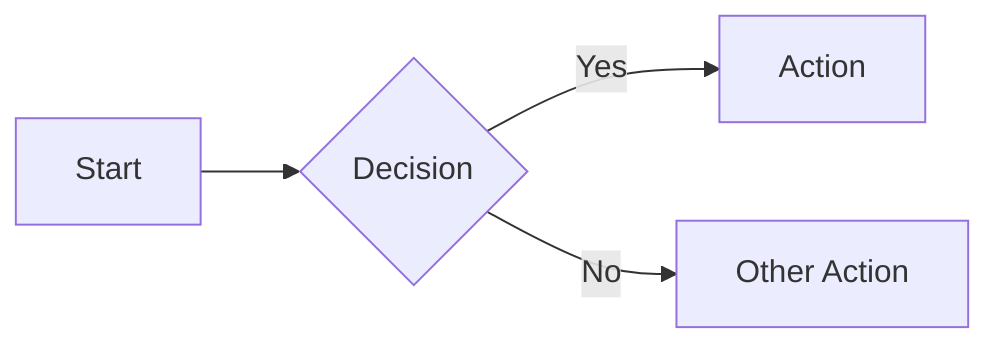
```mermaid
flowchart LR
  A[Start] --> B{Decision}
  B -->|Yes| C[Action]
  B -->|No| D[Other Action]
```

</details>

## Sequence Diagram
<!-- When the workflow has 2+ actors (Required Diagrams) -->


<details>
<summary>Mermaid source</summary>

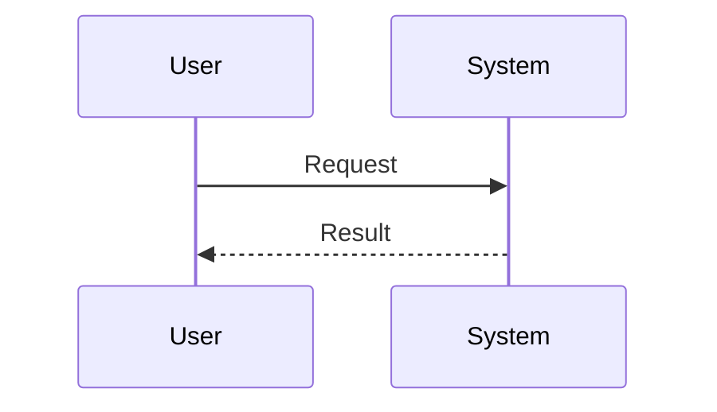
```mermaid
sequenceDiagram
  participant U as User
  participant S as System
  U->>S: Request
  S-->>U: Result
```

</details>

## Error Handling
<!-- What happens when steps fail -->
````

### Mermaid: Flowchart

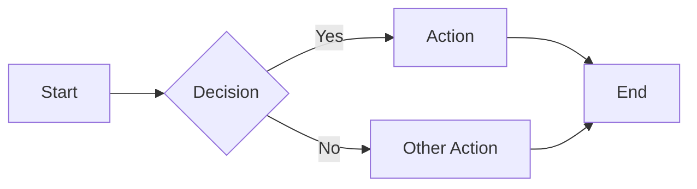
```mermaid
flowchart LR
  A[Start] --> B{Decision}
  B -->|Yes| C[Action]
  B -->|No| D[Other Action]
  C --> E[End]
  D --> E
```

### Mermaid: Sequence Diagram

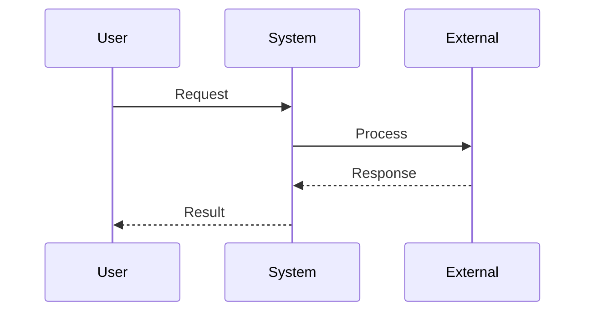
```mermaid
sequenceDiagram
  participant U as User
  participant S as System
  participant E as External
  U->>S: Request
  S->>E: Process
  E-->>S: Response
  S-->>U: Result
```

### Agentic workflows

Each discovered skill or command gets its own doc — [docs/workflows/agentic/{skill-name}.md](#docsworkflowsagenticskill-namemd) — and the `agentic` scope gets an index with the overview flowchart, [docs/workflows/agentic/README.md](#docsworkflowsagenticreadmemd). The Mermaid patterns below serve those docs.

### Mermaid: Subgraph Flowchart (Multi-Session Pipelines)

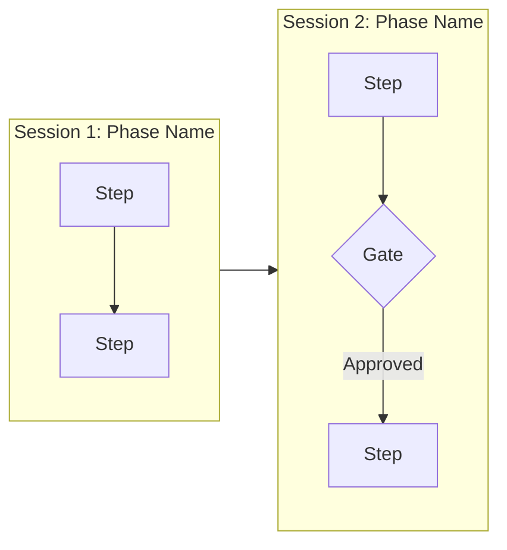
```mermaid
flowchart LR
  subgraph S1["Session 1: Phase Name"]
    A[Step] --> B[Step]
  end
  subgraph S2["Session 2: Phase Name"]
    C[Step] --> D{Gate}
    D -->|Approved| E[Step]
  end
  S1 --> S2
```

### Mermaid: Multi-Actor Sequence Diagram (Sub-Agent Dispatch)

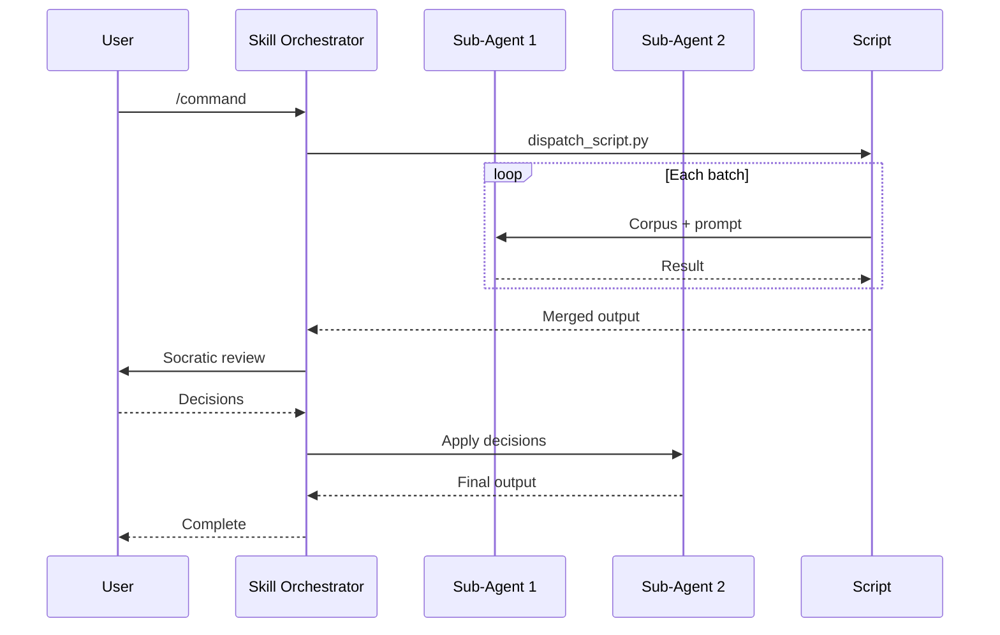
```mermaid
sequenceDiagram
  participant U as User
  participant SK as Skill Orchestrator
  participant A1 as Sub-Agent 1
  participant A2 as Sub-Agent 2
  participant SC as Script

  U->>SK: /command
  SK->>SC: dispatch_script.py
  loop Each batch
    SC->>A1: Corpus + prompt
    A1-->>SC: Result
  end
  SC-->>SK: Merged output
  SK->>U: Socratic review
  U-->>SK: Decisions
  SK->>A2: Apply decisions
  A2-->>SK: Final output
  SK-->>U: Complete
```

### Mermaid: State Diagram (Pipeline Recovery / Session State)

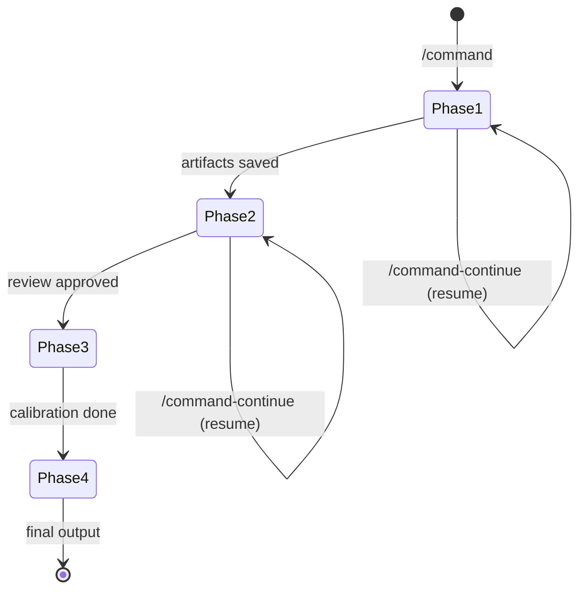
```mermaid
stateDiagram-v2
  [*] --> Phase1: /command
  Phase1 --> Phase2: artifacts saved
  Phase2 --> Phase3: review approved
  Phase3 --> Phase4: calibration done
  Phase4 --> [*]: final output

  Phase2 --> Phase2: revision requested
  Phase1 --> Phase1: /command-continue (resume)
  Phase2 --> Phase2: /command-continue (resume)
```

### Workflow Depth Guidance

When generating agentic workflow docs, use this table to decide how many diagrams a skill needs:

| Depth | When to use | Diagram type |
|---|---|---|
| **Overview** | The `agentic` scope is detected — shows how commands/skills relate | Single flowchart with all commands as entry points, in `workflows/agentic/README.md` |
| **Workflow** | Each skill with 2+ phases | Subgraph flowchart; plus a sequence diagram when it dispatches sub-agents |
| **Internals** | Complex pipelines only (4+ sub-agents, batching, recovery) | State diagram + detailed sequence with script-level lifelines |

These are the rows of [Required Diagrams](#required-diagrams), which is the one list of triggers. Rule of thumb: every skill appears in the overview and gets workflow depth when it has 2+ phases. Only add internals depth if the pipeline has state tracking, auto-batching, or recovery flows.

---

## docs/ci-cd.md

Skip if no CI/CD scope detected.

```markdown
# CI/CD

## Pipeline Overview
<!-- Build, test, deploy stages -->

## Triggers
<!-- What triggers each pipeline -->

| Pipeline | Trigger | Branch |
|----------|---------|--------|
| | | |

## Environments
<!-- Deployment targets -->

| Environment | URL | Deploy Method |
|-------------|-----|--------------|
| | | |

## Scripts
<!-- CI/CD related scripts and their purpose -->
```

---

## docs/infra.md

Skip if no infrastructure scope detected.

```markdown
# Infrastructure

## Overview
<!-- Infrastructure topology -->

## Components
<!-- Cloud services, containers, networking -->

| Component | Service | Purpose |
|-----------|---------|---------|
| | | |

## Configuration
<!-- How infrastructure is configured (IaC, manifests, etc.) -->

## Deployment
<!-- How to deploy infrastructure changes -->
```

---

## docs/workflows/agentic/README.md

Index of the agentic workflows (the `agentic` scope), with the overview flowchart.

````markdown
# Agentic Workflows

| Skill / command | Doc | Phases | Sub-agents |
|-----------------|-----|--------|------------|
| `/command-name` | [{skill-name}]({skill-name}.md) | | |

## Overview


<details>
<summary>Mermaid source</summary>

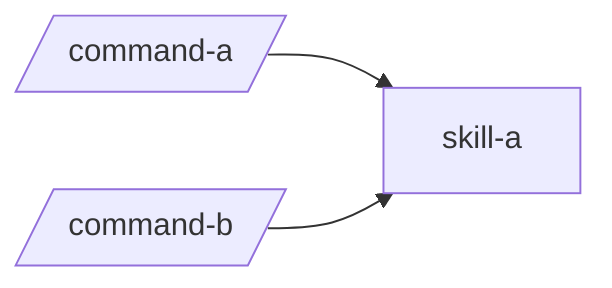
```mermaid
flowchart LR
  C1[/command-a/] --> S1[skill-a]
  C2[/command-b/] --> S1
```

</details>
````

---

## docs/workflows/agentic/{skill-name}.md

Per-skill agentic workflow doc. Create one for each discovered skill.

````markdown
# Agentic Workflow: {Skill Name}

**Command**: `/command-name`

## Pipeline Overview
<!-- Subgraph flowchart of sessions/phases: required when the skill has 2+ phases (Required Diagrams) -->


<details>
<summary>Mermaid source</summary>

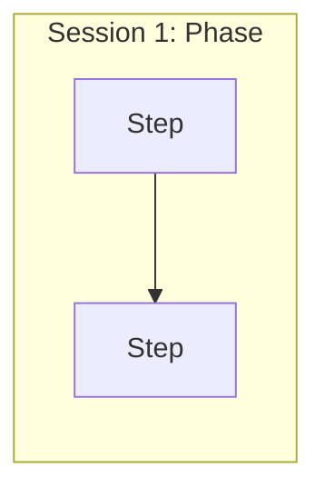
```mermaid
flowchart LR
  subgraph S1["Session 1: Phase"]
    A[Step] --> B[Step]
  end
```

</details>

## Steps

| Phase | Action | Script/Agent | Output Artifact |
|-------|--------|-------------|----------------|
| 1 | | | |

## Sub-Agents

| Agent | Dispatched In | Task | Fresh Context |
|-------|--------------|------|--------------|
| | | | |

## User Interaction Gates

| Gate | Phase | User Action | Output |
|------|-------|-------------|--------|
| | | | |

## MCP Tools Used

| Tool | Purpose | When Called |
|------|---------|-----------|
| | | |

## Sequence Diagram
<!-- Multi-actor, with sub-agent lifelines, loops, user gates: required when the skill dispatches sub-agents -->


<details>
<summary>Mermaid source</summary>

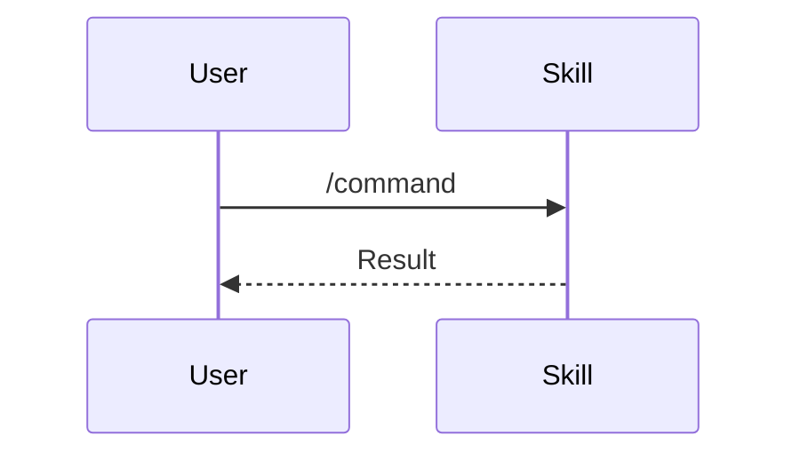
```mermaid
sequenceDiagram
  participant U as User
  participant SK as Skill
  U->>SK: /command
  SK-->>U: Result
```

</details>

## State
<!-- Internals depth only: when the skill tracks state or recovers (Required Diagrams) -->


<details>
<summary>Mermaid source</summary>

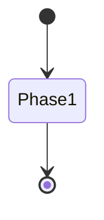
```mermaid
stateDiagram-v2
  [*] --> Phase1
  Phase1 --> [*]
```

</details>
````

---

## docs/data-layer.md

Generate this file — and its ERD — when the `data-layer` scope is detected (SKILL.md *Detect Scopes*); otherwise skip both.

````markdown
# Data Layer

## Overview
<!-- What data the system manages and how -->

## Entity Relationship Diagram
<!-- REQUIRED with this file: Generate ERD diagram -->


<details>
<summary>Mermaid source</summary>

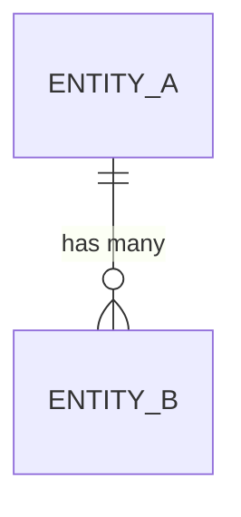
```mermaid
erDiagram
  ENTITY_A ||--o{ ENTITY_B : "has many"
```

</details>

## Models / Schemas

### [ModelName]
| Field | Type | Constraints | Description |
|-------|------|-------------|-------------|
| | | | |

<!-- Repeat for each model/schema -->

## Storage
<!-- Database type, file storage, caching layer -->
<!-- Connection details, configuration -->

## Migrations
<!-- Migration strategy, how to run migrations -->
````

### Mermaid: ERD

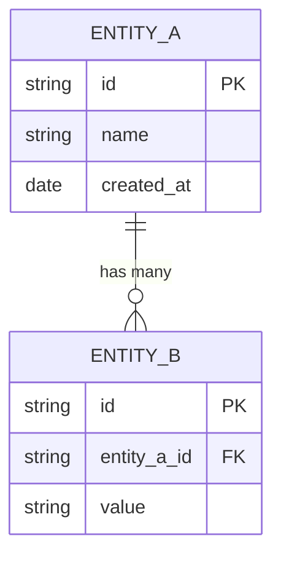
```mermaid
erDiagram
  ENTITY_A {
    string id PK
    string name
    date created_at
  }
  ENTITY_B {
    string id PK
    string entity_a_id FK
    string value
  }
  ENTITY_A ||--o{ ENTITY_B : "has many"
```

---

## docs/guides/getting-started.md

````markdown
# Getting Started

## Prerequisites
<!-- Required software, versions, accounts -->
- [ ] Prerequisite 1
- [ ] Prerequisite 2

## Installation

```bash
# Clone and setup steps
```

## Configuration
<!-- Environment variables, config files -->

| Variable | Required | Default | Description |
|----------|----------|---------|-------------|
| | | | |

## Running

```bash
# How to start/run the project
```

## Verification
<!-- How to confirm it's working -->
````

---

## docs/codebase-guide.md

````markdown
# Codebase Guide

## Directory Structure

```
project/
├── dir/          # Description
│   ├── file      # Description
│   └── file      # Description
├── dir/          # Description
└── file          # Description
```

## Key Files

| File | Purpose | When to Modify |
|------|---------|---------------|
| | | |

## Where to Find Things

| Looking For | Location |
|-------------|----------|
| Entry point | |
| Configuration | |
| Tests | |
| Scripts/tools | |
| Documentation | |

## Code Flow
<!-- How a typical request/operation flows through the code -->

## Packages
<!-- monorepo scope only: where each package lives and how they depend on each other -->
````

---

## docs/conventions.md

```markdown
# Conventions

## Code Style
<!-- Language-specific formatting, linting rules -->

## Naming Conventions
<!-- Files, functions, variables, classes -->

| Element | Convention | Example |
|---------|-----------|---------|
| | | |

## Git Conventions

### Branches
<!-- Branch naming pattern -->

### Commits
<!-- Commit message format -->

### Pull Requests
<!-- PR process, review requirements -->

## Testing
<!-- testing scope: framework, where tests live, how to run them, naming, fixtures -->

## Project-Specific Patterns
<!-- Patterns unique to this project -->
```

---

## CLAUDE.md Updates

CLAUDE.md is loaded at the start of every Claude session. Stale entries mean every future session starts with incorrect context about the project. This makes CLAUDE.md sync a critical step — not just for `init`, but for every write action that changes project structure.

**When to apply these rules**: After ANY doc-superpowers write action that changes directory structure, adds/removes files, or modifies commands. This includes `init`, `update`, `spec-generate`, `sync`, and `release`. The `audit` and `review-pr` actions detect CLAUDE.md staleness and report it; the write actions fix it — except `update` and `sync` in a doc-superpowers CI workflow, which report the change instead (its commit step accepts only `docs/` and the indexed docs).

**If CLAUDE.md exists**: Read it first. Only update sections that are factually stale:
- **Directory Structure**: Sync the tree with actual filesystem (new dirs, removed dirs, renamed paths)
- **Key Files**: Update the table if files were added, removed, or changed purpose
- **Commands**: Add/remove any slash commands or scripts that changed
- **File references**: Update paths, line counts, or descriptions that no longer match
- **Category/enum lists**: Sync with code if the canonical list lives in CLAUDE.md

**Preserve everything else** — tone, workflow descriptions, extraction rules, conventions, and any manually-written guidance. Do NOT rewrite sections that are still accurate. Do NOT reformat or restructure. Treat CLAUDE.md as the project owner's voice.

**If CLAUDE.md does not exist**: Create one with these sections:

````markdown
# [Project Name]

[1-2 sentence description]

## Quick Start

```bash
# Essential setup/run commands
```

## Directory Structure

```
project/
├── dir/    # description
└── file    # description
```

## Commands

- `/command` - description

## Key Files

| File | Purpose |
|------|---------|
| | |

## Conventions

<!-- Project-specific patterns, naming rules, important constraints -->
````

Keep it concise — CLAUDE.md should be a quick-reference entry point, not a comprehensive doc (that's what `docs/` is for).

## README.md Updates

README.md is the project's public documentation — if it lists outdated features or missing actions, users and contributors don't know what the tool can do. Like CLAUDE.md, README.md sync is a cross-cutting concern for every write action.

**When to apply these rules**: After ANY doc-superpowers write action that changes capabilities, actions, features, or project structure. This includes `init`, `update`, `sync`, `release`, and `spec-generate`. The `audit` and `review-pr` actions detect README.md staleness and report it; the write actions fix it — except `update` and `sync` in a doc-superpowers CI workflow, which report the change instead, as for CLAUDE.md.

**If README.md exists**: Read it first. Only update sections that are factually stale, measured against **the project itself** — its code, commands and interfaces (never against doc-superpowers' own actions, unless the project is doc-superpowers):
- **Feature list**: Sync with what the project actually does now
- **Command / API list**: Sync with the project's own commands, CLI subcommands, scripts or public API
- **Usage examples**: Verify examples still work against the project's current names and flags
- **Project description**: Ensure it covers current major capabilities

**Preserve everything else** — tone, structure, installation instructions, contributing guidelines, and any manually-written content. Do NOT rewrite sections that are still accurate. Do NOT reformat or restructure. Treat README.md as the project owner's voice.

**If README.md does not exist**: Do not create one — README.md is the project owner's responsibility. Flag as P2 Incomplete in audit if the project has docs but no README.md.

---

## Required Diagrams

The one list of diagram triggers: the templates, the depth guidance and SKILL.md's `diagram` action all follow it. Do not skip a row whose condition holds.

| Doc | Diagram | Syntax | When |
|-----|---------|--------|------|
| `architecture/system-overview.md` | C4 Context | `C4Context` | Always |
| `architecture/system-overview.md` | C4 Container | `C4Container` | Always |
| `architecture/{component}.md` | Component | `flowchart LR` (or `C4Component`) | Each component doc |
| `workflows/{workflow-name}.md` | Flowchart | `flowchart LR` | Always (every workflow doc) |
| `workflows/{workflow-name}.md` | Sequence | `sequenceDiagram` | When the workflow has 2+ actors |
| `data-layer.md` | ERD | `erDiagram` | With `data-layer.md`: the `data-layer` scope is detected |
| `workflows/agentic/README.md` | Overview flowchart | `flowchart LR` | The `agentic` scope is detected |
| `workflows/agentic/{skill-name}.md` | Subgraph flowchart | `flowchart LR` + `subgraph` | Each skill with 2+ sessions/phases |
| `workflows/agentic/{skill-name}.md` | Multi-actor sequence | `sequenceDiagram` with agent lifelines | Each skill with sub-agent dispatch |
| `workflows/agentic/{skill-name}.md` | State diagram | `stateDiagram-v2` | Each skill with state/recovery (detected in inventory) |

## Diagram File Naming

Diagrams are co-located with their doc section, each named `{type}-{name}.png` — or `{type}.png` for the one diagram of its type (`c4-context.png`, `erd.png`). Agentic diagrams carry their own prefix, so a skill named like a workflow cannot collide with it. The Mermaid source stays in the doc under the PNG.

| Diagram | Location | Filename |
|---------|----------|----------|
| C4 Context | `docs/architecture/diagrams/` | `c4-context.png` |
| C4 Container | `docs/architecture/diagrams/` | `c4-container.png` |
| Component | `docs/architecture/diagrams/` | `component-{component}.png` |
| ERD | `docs/architecture/diagrams/` | `erd.png` |
| Workflow flowchart | `docs/workflows/diagrams/` | `workflow-{workflow-name}.png` |
| Workflow sequence | `docs/workflows/diagrams/` | `sequence-{workflow-name}.png` |
| Agentic overview | `docs/workflows/diagrams/` | `agentic-overview.png` |
| Agentic subgraph flowchart | `docs/workflows/diagrams/` | `agentic-{skill-name}.png` |
| Agentic sequence | `docs/workflows/diagrams/` | `agentic-sequence-{skill-name}.png` |
| Agentic state diagram | `docs/workflows/diagrams/` | `agentic-state-{skill-name}.png` |

---

## Naming Conventions Reference

### File Naming

| Doc Type | Pattern | Example |
|----------|---------|---------|
| Architecture | `{component-slug}.md` (kebab-case) | `auth-service.md` |
| Specs | `SPEC-{CAT}-{NNN}-{slug}.md` | `SPEC-AUTH-001-oauth-flow.md` |
| ADRs | `ADR-{NNN}-{slug}.md` | `ADR-001-use-jwt-for-auth.md` |
| Workflows | `{workflow-slug}.md` (kebab-case) | `deployment.md` |
| Agentic workflows | `{skill-name}.md` | `doc-superpowers.md` |
| Diagrams | `{type}-{name}.png`, or `{type}.png` for a single one | `sequence-deployment.png`, `erd.png` |
| Guides | `{topic-slug}.md` (kebab-case) | `getting-started.md` |
| Templates | `template.md` in `docs/specs/` and `docs/adr/` only | `docs/adr/template.md` |
| Index files | `README.md` in `docs/specs/`, `docs/adr/` and `docs/workflows/agentic/` | `docs/specs/README.md` |
| Plans | `YYYY-MM-DD-{slug}.md` | `2026-03-12-doc-update-plan.md` |

### Spec Categories

Discovered from code analysis. Canonical list maintained in `docs/specs/README.md`.

| Code | Scope |
|------|-------|
| `ARCH` | System architecture |
| `AUTH` | Authentication / authorization |
| `DATA` | Data layer / schema / persistence |
| `API` | API contracts / endpoints |
| `UI` | User interface / views |
| `PIPE` | Processing pipelines |
| `OPS` | Operations / DevOps / CI-CD |
| `INFRA` | Infrastructure |
| `TEST` | Testing strategy |

New categories: uppercase, max 5 characters. Check `docs/specs/README.md` before creating.

### ADR Numbering

Sequential, monotonic, never reused. Zero-padded 3 digits: `ADR-001`, `ADR-002`. The next number is one past the highest in the ADR directory **and** `docs/archive/adr/`, so an archived ADR's number is never issued again.

### Spec Numbering

Sequential per category, never reused. Zero-padded 3 digits: `SPEC-AUTH-001`, `SPEC-DATA-001`. The next number is one past the highest for that category in `docs/specs/` **and** `docs/archive/specs/`.

---

## Doc-Index Schema Reference

Schema for `docs/.doc-index.json`: created by `doc-tools.sh build-index` when no index exists, then maintained by the incremental verbs (SKILL.md *Index-write routing*).

**Key form.** Entries are keyed by paths **relative to the repo root** (`docs/architecture.md`, never `/Users/me/proj/docs/architecture.md`). Every consumer — `update-index`, `check-freshness`, `status`, `remove-entry`, `move-entry`, `deprecate-entry`, the CI coverage gate, and the merge driver — looks entries up by that exact string, so an absolute or `./`-prefixed key is one nothing can find. The subcommands normalize an absolute in-tree path to its relative form and reject anything outside the working tree with a non-zero exit; run `doc-tools.sh` from the repo root so relative paths resolve as intended. The same rule applies to path-valued fields (`replaces`, `superseded_by`) — which is why `move-entry` repoints any other entry's `replaces`/`superseded_by` that named the old path, rather than leaving it dangling at a key nothing can resolve.

**Writing entries.** `build-index` and `add-entry` read one mapping line per doc on stdin: `doc_path:code_refs_csv:doc_type` (e.g. `docs/architecture/system-overview.md:src/,package.json:architecture`). `:` separates the fields, so a doc path or ref must not contain one. A line is rejected when it has no `:` (a bare path, which would otherwise be split into refs and type) or more than two. It is also rejected when its first field is not a file but its first two or three fields joined by `:` name one on disk, since that file would otherwise be indexed under the wrong key. A `:` path whose file does not exist yet cannot be detected. `doc_type` may be empty. Refs are split on `,`, trimmed, and empty ones dropped. The same list is stored as `code_refs` and handed to git. A trailing CR is stripped. A ref is a literal path: a file, a directory, or `.` for the whole repository. It is never a glob. git sees refs with `--literal-pathspecs`, and a ref containing `*`, `?` or `[` draws a warning, because it names only a path of exactly that name. (An entry written before index schema 3 keeps git's pathspec reading, globs included, until it is re-verified.) A ref that matches no file tracked by git and from which git would stage nothing (a typo, an empty or all-ignored directory) also draws a warning. It is recorded as `missing`, and HEAD agrees, so the doc cannot go stale until that path is committed. Untracked (not ignored) files under a ref are part of what is verified: writers stage them (`git add -A` on a private index) and name them in a warning, and the doc reads stale until they are committed or ignored. A key listed twice keeps its first line. `add-entry` applies the valid lines and exits 1 if any was rejected. `build-index` writes nothing if any line is invalid or none is given, and refuses to replace an index that has entries unless given `--force`. `--force` re-records every entry but keeps the deprecation of each key it re-indexes (`status: "deprecated"`, `superseded_by`, `replaces`); a key not in the new mapping lines is dropped. **What `build-index` and `add-entry` record:** a new entry, unverified. Its `last_verified` is `null`, it stores no `status`, and each ref's `code_oids` is the ref's content in the doc's own last commit (the newest commit reachable from HEAD that touched the doc), with `code_commit` the newest commit touching the refs as of that commit. That is the code the doc was written against, so code that changed since reads stale until `update-index` verifies the doc. A doc git has never committed is being written now, so its baseline is the working tree it is written in. To change an indexed doc's refs, use `set-code-refs <doc> --refs a,b` (`--refs ''` for none). It edits `code_refs` in place and keeps the entry's key position and every other field. It is not a verification either.

- **Same list:** refs that name the same paths as the stored list, in the same order, write nothing. `src` and a stored `src/` are the same path. Order is significant: a reorder writes the new order, and every ref keeps its recorded content.
- **`code_oids` is re-derived:**
  - a ref the entry already had keeps its recorded content: its `code_oids` id, or, for an entry written before schema 3, its object id in the tree of the stored `code_commit`, which is when that entry was verified;
  - a new ref, or a kept ref with no usable record (no `code_commit`, or one this repository lacks), is recorded as `add-entry` records it, as of the doc's own last commit.
- **`code_commit`** is the `commits_behind` baseline, so it must be no newer than any ref's recorded content. A change after it would otherwise go uncounted: a masked `0`.
  - **Every ref kept** (refs only removed, re-spelled or reordered): the stored value stays.
  - **Every ref recorded as of the doc's last commit:** it is derived as `add-entry` derives it.
  - **Both:** the older baseline, `git merge-base <stored> <derived>`, the newest commit no newer than either. It is null when the stored value is unusable (absent, not an object id, not a commit of this repository, or not an ancestor of HEAD), when there is no derived one, or when the two share no ancestor, so `commits_behind` reads null. A stored commit off HEAD's line, where only the verify commit was cherry-picked, already reads null, and its merge-base would count from before changes it never saw.
  - `commits_behind` may over-count, but it is never a masked `0`.

Doc paths given anywhere are normalized to the key form: `//` becomes `/`, a path starting with `-` is refused, and a repeated path counts once.

**Command line.** Options may appear anywhere, and `--opt VALUE` equals `--opt=VALUE`; `--` ends the options. `<subcommand> --help` prints its usage and exits 0 (it needs neither jq nor a repository). Exit status: `0` success; `1` the operation failed or was refused; `2` usage error: an unknown subcommand or option, an option without its value, the wrong number of arguments (including any argument to a subcommand that takes none), or a repository subcommand run outside a git work tree or below its top level (run `doc-tools.sh` from the repository root; nothing is written). A malformed argument value, such as `bump-version abc` or an unknown `set-doc-type` type, exits `1` — except two verbs that check their values with the command line: `set-implementation` exits `2` for an invalid `--status`, a missing file or a multi-line `--ref`/`--note`, and `fragments validate` exits `2` for a path that is not a regular file. An unknown option is never ignored, and nothing is written. `update-index` and `deprecate-entry` report and skip a path that is not indexed, apply the rest, then exit 1. `remove-entry` is the one exception: a path not in the index is a `SKIP` and it exits 0, since the entry being absent is the end state asked for. An index that is a symbolic link is refused by every writer, which would otherwise replace the link with a regular file. `check-freshness --code-refs <path>...` (every argument up to the next `--option`) or `--code-refs-from <file|->` (one path per line, or NUL-separated; `-` is stdin, with no argv limit) keeps the docs whose `code_refs` share a path segment with a listed path. `src/m1` matches refs `src/m1`, `src/m1/a.js` and `src/`, but never `src/m10`. `.` is the repository root, and an empty list keeps nothing. Produce the list NUL-separated, `git diff -z --name-only --no-renames <range>`: git quotes a name holding `"`, a backslash or a tab even with `core.quotePath=false`, and a quoted name matches no ref. `check-freshness` and `status` share one evaluation, so they cannot disagree about a doc. Both compare against HEAD, or against the tree given with `--tree <tree-ish>`. With `--tree`, the verdict is one snapshot of that tree: the index is read as `<tree>:docs/.doc-index.json`, and each doc's presence and bytes (`missing`, `doc_modified`) come from the tree too, as its code refs do. Without `--tree`, the working copy's index and docs are judged against HEAD's refs. A pre-commit check passes `--tree "$(git write-tree)"`, the staged tree, so it judges exactly the commit being made: an `update-index` whose index is not staged does not count. A tree that holds no index falls back to the working copy's index and docs, with one note on stderr. An invalid index in the tree exits 1. A `--tree` value may not start with `-` (exit 2), and one that names no tree exits 1. A stored `code_commit` that is not a full hex object id is treated as absent and never passed to git.

**Renames.** When a doc moves, use `move-entry <old> <new>` — it re-keys the entry in position and preserves `code_refs`, `code_oids`, `code_commit`, `last_verified` and every other field, recomputing only `content_hash`, and repoints every other entry that named the old path: its `replaces`/`superseded_by`, and its `code_refs` (in place; a list that already names the new path gains no duplicate) together with the matching `code_oids` key, which keeps its recorded object id. A rename keeps the content, so a doc citing the moved one keeps its verdict; a rename plus an edit reads stale, as it should. An entry without `code_oids` (written before schema 3) gets its `code_refs` repointed and keeps the commit comparison until `update-index`. When an entry also records the new path as a ref of its own, that ref's id is kept. For many moves, `move-entry --stdin` reads one `<old><TAB><new>` pair per line (blank lines skipped, a trailing CR removed) and applies them in one index write with exactly the single form's result. The batch is one simultaneous rename, so a path one pair vacates may be another's target. Every pair is checked before anything is written, and one bad pair (an unindexed source, a target that stays indexed or has no file, a malformed line, a path used by two pairs) writes nothing and exits 1. Do **not** use `remove-entry` + `add-entry`: that drops the entry's deprecation, `replaces`, `implementation` and `last_verified`, and re-baselines its refs. **Archiving** a doc is `git mv` into `docs/archive/<type>/`, then `move-entry`, then `deprecate-entry` on the new path (the old key is gone after the move: naming it exits 1). No `archived_at` field is kept: the path and the deprecation record it. **Auditing merges.** `audit-merges <since> [<until>]` replays every merge commit in the range whose parents' indexes differ through the plugin's merge driver, used as an oracle, and compares the result with the index each merge recorded, entry by entry (a stored `current`/`stale` status and the top-level fields are not compared). It reports, as JSON, an entry the merge kept from one parent where the three-way merge keeps the other parent's change (`"kept": "parent 1"` or `"parent 2"`: a silent revert, e.g. by a driver that is not base-aware, on a `last_verified` tie), an entry the merge commit itself rewrote (`"neither"`: a hand resolution or a re-verification), a merge the driver would refuse, and a recorded index that is not valid; it exits 1 on any finding and writes nothing. Repair a lost change with the verb that made it. **Retyping.** `set-doc-type <doc> <type>` changes an entry's `doc_type` in place, keeping its key position and every other field; the same type writes nothing, and it is not a verification. `doc_type` decides whether a doc is a record, so `<type>` must be a known one — `architecture`, `api-contracts`, `data-layer`, `infra`, `ci-cd`, `workflows`, `agentic`, `guide`, `codebase-guide`, `conventions`, `spec`, `adr`, or a record type (`plan`, `issue`, `audit`, `design-spec`) — or one the index already uses (a project's own vocabulary). Anything else, a typo such as `design_spec`, exits 1 and writes nothing. An index written before schema 3 typed design specs `spec`: retype them `design-spec`.

**Freshness.** A doc is stale when the content of one of its code refs differs from the content it was verified against. The index records that content, not the commit that last touched it. For each ref, `code_oids` holds the git object id of its content: a blob for a file, a tree for a directory, the commit for a submodule, or `missing`. `update-index` captures it from the working tree (through a private git index, so git's own staging is never touched), because that is what the verifier read. `build-index`, `add-entry` and `set-code-refs` (for a new ref) take it from the doc's own last commit, as described under Writing entries. `check-freshness` looks every ref of the index up in HEAD, or in `--tree`, in one `git cat-file --batch-check`. So a squash merge, a GitHub rebase-merge, a cherry-pick, a revert to the verified bytes, a shallow clone, and a doc verified in the same commit as its code all read `current` when the bytes match. For a stale doc, `code_refs_changed` lists exactly the refs whose object id differs. `commits_behind` is `git rev-list --count <code_commit>..HEAD -- <refs>`, and it is `null` when `code_commit` is not an ancestor of HEAD here: the repository does not have it (a squash-merged branch was deleted, or the clone is shallow), or it is on another line of history (only the verify commit was cherry-picked). It is never a masked `0`. A ref naming a submodule records the submodule's commit (its gitlink entry, resolved with `git ls-tree` because the commit is not in the superproject's object store), so a submodule bump reads stale. The doc-index file itself, with its lock and tmp files, is excluded from the content of any ref that covers it (`docs/`, `.`), because otherwise every index write would make that doc stale. An entry without `code_oids` (written before schema 3) is judged the old way until a writer re-verifies it: stale when the newest commit touching its refs is not `code_commit`. **Record docs** are never reported stale: an entry whose `doc_type` is `plan`, `issue`, `audit` or `design-spec`, or whose path is under `docs/archive/`, describes a point in time, and the code moving on does not make it wrong. `check-freshness` and `status` report it `current` with `"record": true` and `commits_behind: null` (not evaluated). No separate status value is used, so every consumer that counts `stale` or `current` needs no change. A missing file still reads `missing`, and a deprecated entry `deprecated`.

| Field | Type | Purpose |
|-------|------|---------|
| `schema_version` | integer | Index schema: `3` (per-ref `code_oids`). A `2` index is read as it is. So is an older one that carries `version: 1` instead. The first write stamps `3` and drops `version`; a run that changes nothing leaves the index untouched |
| `generated_by` | string | Always `"doc-superpowers"` |
| `generated_at` | ISO 8601 | When the index content last changed (a writer run that changes nothing leaves it untouched) |
| `build_commit` | string\|null | Repo HEAD at last `build-index` (null on an unborn HEAD) |
| `docs.<path>.content_hash` | string\|null | `sha256:<hex>` of the doc's bytes. It is null when `add-entry` indexed a doc that was not on disk yet; that doc reads `doc_modified` until `update-index` |
| `docs.<path>.code_refs` | string[] | The literal paths this doc covers: files, directories, or `.` for the repository root |
| `docs.<path>.code_oids` | object | One key per ref (as stored in `code_refs`), holding the git object id of its content in the entry's baseline: a blob id for a file, a tree id for a directory, the submodule's commit id for a submodule (its gitlink entry), or `"missing"` when git holds or would stage nothing there. Freshness is judged against this. `update-index` records the working tree (what was verified); `build-index` and `add-entry` the doc's own last commit (the working tree for a doc never committed); `set-code-refs` keeps a ref's recorded id (a pre-v3 entry's: its id in `code_commit`) and records a new ref as `add-entry` does; `move-entry` carries it over — the moved entry's own, and every other entry's key for the moved path. Absent on entries written before schema 3 |
| `docs.<path>.code_commit` | string\|null | A baseline commit no newer than any ref's recorded content. `update-index` records the newest commit touching the refs as of HEAD, and `build-index` / `add-entry` record it as of the doc's last commit. `move-entry` keeps it. `set-code-refs` keeps it when every ref is kept, derives it as `add-entry` does when every ref's content comes from the doc's last commit, and with both records the older baseline: `git merge-base` of the stored and the derived commit. That is null when there is no derived one, when the stored one is absent, not an object id, not a commit of this repository, or not an ancestor of HEAD, or when the two share no ancestor. `commits_behind` may over-count but is never a masked `0` (see Writing entries). It is the `commits_behind` baseline and is shown to older readers; it does not decide freshness. It is null when no commit touches the refs, on an unborn HEAD, or when the entry was written in a shallow clone (whose truncated history would name the graft, so writers refuse it) |
| `docs.<path>.doc_type` | string | Template type |
| `docs.<path>.status` | string, optional | Stored only as `"deprecated"` (by `deprecate-entry`, kept by every other writer, including `update-index` and `build-index --force`); otherwise absent. `current`, `stale` and `missing` are computed by `check-freshness`, which never writes. A `current` or `stale` stored by an older release is read as absent, and the next write that changes the index drops it |
| `docs.<path>.replaces` | string\|null | Path to the doc this one supersedes: set by `deprecate-entry <old> --superseded-by <this>` when empty (it holds one path; an existing one is kept, with a warning), repointed by `move-entry` |
| `docs.<path>.superseded_by` | string\|null | Path to superseding doc |
| `docs.<path>.last_verified` | ISO 8601\|null | When the doc was last verified against its code. **Only `update-index` writes it**: it is the one verb that attests. `build-index` and `add-entry` write `null` (never verified); `deprecate-entry`, `set-code-refs`, `set-doc-type` and `move-entry` leave it as it is |
| `docs.<path>.implementation` | string[] | Written by `update-index` only: the entries of an ADR's `Implementation:` or a SPEC's `Realized-by:` block — each entry's text, without its indent and `- `, wrapped lines joined with one space; `[]` when the doc has no block or an empty one (`Implementation: []`) (grammar: [Header style and the realization block](#header-style-and-the-realization-block-adrs-and-specs); see `implementation-status`) |

### Status Transitions

Only `deprecated` is stored. `current`, `stale` and `missing` are verdicts that `check-freshness` and `status` compute on every run and never write.

- (new) → no stored status, `last_verified: null`: `build-index` / `add-entry` record the entry against the doc's own last commit. It reads `current` if the code has not changed since the doc was written, and `stale` if it has
- `current` → `stale` (computed): a code ref's content no longer matches `code_oids`
- `stale` → `current` (computed): after `update-index` records the working tree's content and stamps `last_verified`, the attestation that someone checked the doc against that code
- record docs (`doc_type` `plan` / `issue` / `audit` / `design-spec`, or a path under `docs/archive/`): always `current`, marked `"record": true`; they are never compared
- → `deprecated` (stored): `deprecate-entry` only (a human decision, or spec supersession via `spec-generate`); `--superseded-by X` also sets `X.replaces` when it is empty
- `deprecated` is terminal for automated tools: `update-index`, `move-entry`, `set-code-refs`, `set-doc-type` and `build-index --force` all keep it
