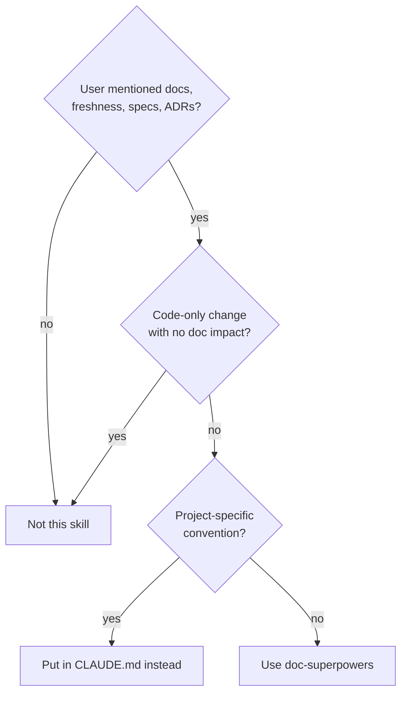
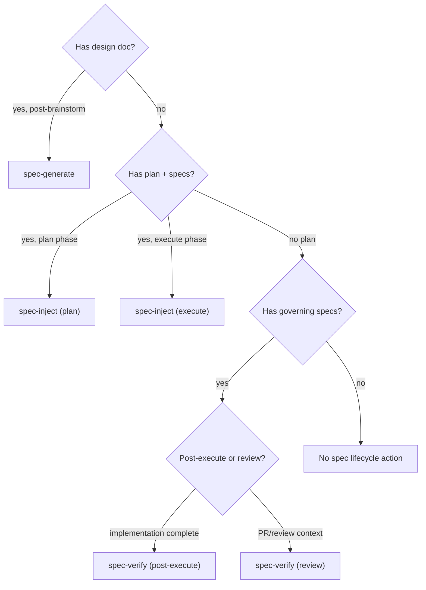
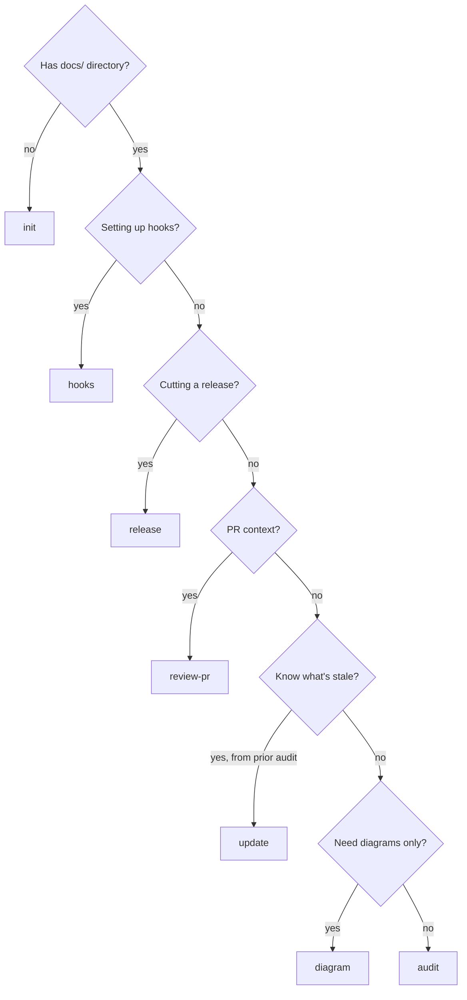

# doc-superpowers

Documentation orchestrator for generating, auditing, and maintaining project docs. Handles both greenfield doc creation and ongoing freshness maintenance.



## Quick Reference

| Action | Purpose | Input |
|--------|---------|-------|
| `init` | Generate full doc suite | Empty or missing `docs/` |
| `audit` | Read-only freshness check → report | Existing docs |
| `review-pr` | PR-scoped doc review | PR changed files |
| `update` | Apply fixes from audit report | `*-audit-report.md` or `check-freshness` |
| `diagram` | Regenerate Mermaid diagrams | Existing docs |
| `sync` | Sync doc index with filesystem | `docs/.doc-index.json` |
| `hooks` | Install git/Claude/CI hooks | `--git`, `--claude`, `--ci`, `--all` |
| `spec-generate` | Design doc → formal specs | `--design-doc=<path>` |
| `spec-inject` | Inject spec tasks into plans | `--phase=plan\|execute` |
| `spec-verify` | Verify spec compliance | `--mode=post-execute\|review` |
| `release` | Draft release notes entry | Optional `--from=<ref>` |

**References** (loaded on demand, not inline):

| Reference | Purpose |
|-----------|---------|
| `references/agent-prompt-template.md` | **REQUIRED** for dispatched review agents — template + scope focus areas |
| `references/output-templates.md` | Audit report format (P0–P3) + plan template for `docs/plans/` |
| `references/integration-patterns.md` | How code review, commit review, and wrapper skills call doc-superpowers |

**When NOT to use:**
- Project-specific conventions belong in CLAUDE.md, not generated docs
- Code-only changes with no documentation impact
- Inline code comments — this skill manages `docs/` artifacts, not source comments

## Usage

```
/doc-superpowers <action> [scope]

Actions: init | audit | review-pr | update | diagram | sync | hooks | release | spec-generate | spec-inject | spec-verify
Scopes:  all | <auto-detected from docs/ structure>
```

---

### Spec Lifecycle Routing



---

## 0. Discovery Phase

Run before any action to understand the project's documentation infrastructure.

**Discovery is universal** — all actions run discovery as their first step, except `hooks` (scaffolding, routes directly to installer) and `release` (parses RELEASE-NOTES.md and commits directly). Audit *defines* the discovery logic (it is the canonical implementation). Other actions invoke the same discovery function.

### Detect Bundled Tooling

doc-superpowers bundles `scripts/doc-tools.sh` in its skill directory. Use it directly:

```bash
# Script location (relative to skill directory)
SKILL_DIR="$(cd "$(dirname "${BASH_SOURCE[0]}")" && pwd)"
DOC_TOOLS="$SKILL_DIR/scripts/doc-tools.sh"
```

For user-provided optional scripts, detect dynamically:

```bash
# Optional user scripts (project-level scripts/ directory)
ls scripts/*validate_docs* scripts/*validate_doc_references* scripts/*fix_doc_references* scripts/*archive_doc* scripts/*map_documents* 2>/dev/null
```

| Script Pattern | Source | Purpose |
|---|---|---|
| `doc-tools.sh build-index` | Bundled | Build `docs/.doc-index.json` from scratch (stdin) |
| `doc-tools.sh check-freshness` | Bundled | Hash-based staleness detection (read-only) |
| `doc-tools.sh update-index` | Bundled | Refresh existing index entries (skips missing files) |
| `doc-tools.sh add-entry` | Bundled | Add new entries to existing index (stdin) |
| `doc-tools.sh remove-entry` | Bundled | Remove entries from index by path |
| `doc-tools.sh deprecate-entry` | Bundled | Mark entries as deprecated (`--superseded-by`) |
| `doc-tools.sh status` | Bundled | Single-doc freshness query (read-only) |
| `*validate_docs*` | Optional, user-provided | Doc validation (links, structure) |
| `*validate_doc_references*` | Optional, user-provided | Code reference validation |
| `*fix_doc_references*` | Optional, user-provided | Broken reference repair |
| `*archive_doc*` | Optional, user-provided | Doc archival |
| `*map_documents*` | Optional, user-provided | Custom document mapping |

### Detect Scopes

Scopes are **structural categories**, not platform or language identifiers. The skill detects *what kind of thing exists*. Explore agents determine specific technology during analysis.

| Structural Signal | Scope | Detection |
|---|---|---|
| Package manifests, project files, source dirs | `application` | Glob for `Package.swift`, `Cargo.toml`, `package.json`, `pyproject.toml`, `*.xcodeproj`, `build.gradle`, `go.mod`, `*.sln`, `pom.xml`, `CMakeLists.txt`, `*.csproj`, `build.sbt`, or `src/`, `Sources/`, `lib/`, `app/` |
| API schema definitions | `api-contracts` | Glob for `openapi.*`, `swagger.*`, `*.graphql`, `*.proto`, `*.thrift`, `*-api.*` |
| Models, migrations, schema definitions | `data-layer` | Glob for migration dirs, ORM model files, database schema files |
| IaC, container configs, deploy manifests | `infrastructure` | Glob for `Dockerfile*`, `docker-compose*`, `k8s/`, `terraform/`, `*.tf`, `pulumi/`, `helm/`, `ansible/` |
| CI/CD configuration | `ci-cd` | Glob for `.github/workflows/`, `Fastfile`, `Jenkinsfile`, `.gitlab-ci.yml`, `.circleci/`, `Makefile` with deploy targets |
| Test directories and frameworks | `testing` | Glob for `Tests/`, `test/`, `__tests__/`, `spec/`, `*_test.*`, `*.test.*` |
| Agent skills, commands, MCP configs | `agentic` | Glob for `.claude/skills/*/SKILL.md`, `.claude/commands/*.md`, `.mcp.json`, `.claude/mcp*.json` |
| Existing ADRs | `adr` | Directory existence: `docs/adr/`, `docs/decisions/` |
| Existing specs | `spec` | Directory existence: `docs/specs/`, `docs/superpowers/specs/` |
| Multiple package manifests at different levels | `monorepo` | Two+ manifests at different directory levels, or workspace config fields |

**Rule**: scopes are never `ios`, `android`, `rust`, `python`, etc. Platform/language details are discovered by agents and reflected in doc content, not scope categories.

### Run Baseline Checks

```bash
# Always available — bundled tooling
doc-tools.sh check-freshness

# Optional user scripts
[ -f scripts/validate_docs.py ] && uv run scripts/validate_docs.py
```

If no doc-index exists (first run), `check-freshness` will report the index is missing — this is expected. `init` builds the index after generating docs.

### Detect Agentic Workflows

```bash
# Skills
ls .claude/skills/*/SKILL.md 2>/dev/null

# Commands
ls .claude/commands/*.md 2>/dev/null

# MCP server configs
ls .claude/mcp*.json .mcp.json claude_desktop_config.json 2>/dev/null
```

Build an internal inventory capturing:

| Element | Source | What to capture |
|---|---|---|
| Skills | `.claude/skills/*/SKILL.md` | Name, sub-agents dispatched, scripts invoked, user gates |
| Commands | `.claude/commands/*.md` | Name, which skill they invoke, parameters |
| MCP tools | MCP config files | Server name, tool names, purpose |
| Scripts | `scripts/` referenced by skills | Name, role in pipeline |
| Artifacts | Skill SKILL.md files | Intermediate files, state files, output files |
| User gates | Skill SKILL.md files | Socratic reviews, approval points |
| State/recovery | Commands + skill files | Has `-continue` command, checkpoint files |

### Generated Directory Structure

```
docs/
├── architecture/
│   ├── system-overview.md
│   ├── {component}.md
│   └── diagrams/
├── specs/
│   ├── README.md
│   ├── template.md
│   └── SPEC-{CAT}-NNN-{slug}.md
├── adr/
│   ├── README.md
│   ├── template.md
│   └── ADR-NNN-{slug}.md
├── workflows/
│   ├── {workflow-name}.md
│   ├── agentic/
│   │   └── {skill-name}.md
│   └── diagrams/
├── guides/
│   └── getting-started.md
├── api-contracts.md
├── data-layer.md
├── ci-cd.md
├── infra.md
├── codebase-guide.md
├── conventions.md
├── plans/
├── archive/
│   ├── adr/
│   ├── specs/
│   ├── plans/
│   └── architecture/
└── .doc-index.json
```

### Scope → Generated Docs Matrix

| Scope | Architecture | Workflows | Other |
|---|---|---|---|
| Always | `architecture/system-overview.md` | `workflows/` primary | `guides/getting-started.md`, `codebase-guide.md`, `conventions.md` |
| `application` | `architecture/{component}.md` per major component | — | — |
| `api-contracts` | — | — | `api-contracts.md` |
| `data-layer` | `architecture/diagrams/erd.png` | — | `data-layer.md` |
| `infrastructure` | — | — | `infra.md` |
| `ci-cd` | — | `workflows/deployment.md` | `ci-cd.md` |
| `testing` | — | — | Section in `conventions.md` |
| `agentic` | — | `workflows/agentic/{skill}.md` per skill | — |
| `adr` (existing) | — | — | `adr/README.md` + `adr/template.md` |
| `spec` (existing) | — | — | `specs/README.md` + `specs/template.md` |
| `monorepo` | Section in `architecture/system-overview.md` | — | Section in `codebase-guide.md` |

---

## 1. Action Routing



### `init` — Generate Documentation from Scratch

Use when a project has no docs or needs a complete documentation suite generated.

1. **Run discovery** to detect all scopes and existing docs.
2. **Flat-to-structured migration check**: If old-structure files exist (e.g., `docs/architecture.md` from a previous init), detect them by checking for files with doc-superpowers freshness markers that map to a structured path. Offer to migrate instead of creating duplicates.
3. **Dispatch Explore agents** (up to 3 parallel via `Agent` tool, `subagent_type: "Explore"`):
   - **Structure**: Directory tree, key files, entry points
   - **Tech Stack**: Languages, frameworks, dependencies
   - **APIs**: Route definitions, endpoint handlers, schemas
   - **Data Layer**: Models, migrations, database configs
   - **Workflows**: CI/CD configs, scripts, Makefiles
   - **Conventions**: Linting configs, formatting rules, naming patterns
   - **Existing Docs**: Current `docs/`, README, CLAUDE.md content
4. For each skill in the agentic inventory, dispatch an Explore agent to read the SKILL.md and extract: sub-agents, scripts, MCP tools, artifacts, user gates, session boundaries, state tracking.
5. **Create directory structure**: `docs/architecture/diagrams/`, `docs/specs/`, `docs/adr/`, `docs/workflows/agentic/`, `docs/workflows/diagrams/`, `docs/guides/`, `docs/plans/`, `docs/archive/{adr,specs,plans,architecture}/`.
6. **Generate docs per scope** using the Scope → Generated Docs Matrix. Use templates from `references/doc-spec.md`. Apply naming conventions (SPEC-{CAT}-NNN, ADR-NNN, kebab-case).
   - **Never overwrite** existing docs — skip files that already exist.
   - Generate `docs/specs/README.md`, `docs/specs/template.md`, `docs/adr/README.md`, `docs/adr/template.md`.
7. **Seed ADRs** for discovered architectural patterns. ADR seeding is agent-driven — Explore agents identify patterns (auth strategy, data flow, framework selection) and propose ADRs. Seeded ADRs use a `<!-- Generated by doc-superpowers -->` marker.
8. Update `CLAUDE.md` to reflect current project state (create if missing). **SEE** `references/doc-spec.md` for CLAUDE.md update rules.
9. **Sync README.md** — If README.md exists, update feature list, action list, and usage examples to reflect current project state. **SEE** `references/doc-spec.md` for README.md update rules. Skip if no README.md exists.
10. **Generate diagrams** per the `diagram` action using co-located paths.
11. Add freshness marker as first line of each generated file: `<!-- Generated by doc-superpowers | YYYY-MM-DD | commit: SHORT_HASH -->`
12. **Build doc-index**: Construct one mapping line per generated doc in the format `doc_path:code_refs_csv:doc_type` (e.g., `docs/architecture.md:SKILL.md,scripts/:architecture`). Include EVERY generated doc file — missing entries make docs invisible to freshness tooling. Pipe all lines to `doc-tools.sh build-index` via stdin.
13. **Verification gate**: Run `doc-tools.sh check-freshness` to confirm all generated docs are indexed and current.
14. **Suggest workflow hooks**: After successful init, suggest: "Documentation generated. To keep docs fresh automatically, run `/doc-superpowers hooks install` to set up workflow hooks."

### `audit` — Full Documentation Health Check

Audit is **read-only**. It discovers what needs attention and produces a severity-ranked report. It never creates, edits, or deletes docs — execution belongs to `update`.

1. **Run discovery** — detect all scopes, existing docs, and naming convention violations.
2. **Call `doc-tools.sh check-freshness`** — get full staleness report (including untracked docs).
3. **Compare scope inventory against existing docs** — find gaps (scope detected but no doc, doc exists but missing sections).
4. **Validate naming conventions** — flag files that don't match SPEC-{CAT}-NNN, ADR-NNN, or kebab-case patterns.
5. **Detect structural issues** — check for flat-structure docs that should be in structured directories, diagrams in global `docs/diagrams/` instead of co-located dirs.
6. **Check CLAUDE.md currency** — If CLAUDE.md exists, compare its Directory Structure tree, Key Files table, and Commands section against the actual filesystem and discovered scopes. Flag discrepancies as P1 Stale (structural drift — listed paths that don't exist, missing new directories) or P2 Incomplete (new commands, key files, or scopes not reflected). Include findings in the audit report.
7. **Check README.md currency** — If README.md exists, compare its feature list, action list, and usage examples against actual SKILL.md actions and capabilities. Flag discrepancies as P1 Stale (features described that no longer exist or work differently) or P2 Incomplete (new actions or features not mentioned). Include findings in the audit report.
8. **Check RELEASE-NOTES.md currency** — If RELEASE-NOTES.md exists, parse the latest version entry's date. Find commits after that date (or after the matching git tag if one exists). If unreleased commits exist, emit a P2 Incomplete finding: "RELEASE-NOTES.md: N commits unreleased since vX.Y.Z (YYYY-MM-DD). Run `/doc-superpowers release` to draft a new version entry."
9. **For each affected scope**, dispatch a scope agent (`Agent` tool, `subagent_type: "general-purpose"`).

   **Isolation constraint**: Each scope agent receives context ONLY for its scope. It does NOT receive context from other scopes — isolation prevents cross-contamination and keeps agent context focused.

   Each scope agent runs the **read-only** cycle:

   **GATHER**: Collect all relevant context for this scope (and only this scope):
   - Stale code refs from the freshness report
   - Existing docs in this scope (architecture, specs, ADRs) — full content
   - The freshness report for this scope from `doc-tools.sh`
   - Naming conventions (SPEC-{CAT}-NNN, ADR-NNN, diagram co-location)

   **ANALYZE**: For each doc in scope:
   - Read the doc completely
   - Read the code_refs directories/files
   - Identify accurate sections, stale sections, missing coverage, and conflicting info

   **REPORT**: Return findings to orchestrator with evidence:
   - Exact doc text vs exact code state for each finding
   - Severity classification (P0/P1/P2/P3)
   - Suggested fixes (description only — no execution)

10. **Merge all scope agent reports** into unified report sorted by severity (include CLAUDE.md findings from step 6, README.md findings from step 7, and RELEASE-NOTES.md findings from step 8):
   - **P0 Critical**: Doc describes behavior code no longer implements
   - **P1 Stale**: Code has changed, doc probably needs updating (includes CLAUDE.md structural drift, README.md feature drift)
   - **P2 Incomplete**: Doc is missing sections for new functionality (includes CLAUDE.md missing entries, README.md missing actions, unreleased RELEASE-NOTES.md commits)
   - **P3 Style**: Formatting, broken links, outdated terminology
11. When auditing `workflows/`, also compare agentic inventory against documented workflow sections.
12. **Write audit report** to `docs/plans/YYYY-MM-DD-audit-report.md` using the format from Section 4. This file is the structured handoff to `update`.
13. Output the report to the user.
14. Suggest: "Run `/doc-superpowers update` to apply fixes from this audit."

### `review-pr` — PR-Scoped Documentation Review

Review-pr is an **orchestrator** like `audit`, but scoped to PR changes.

1. **Run discovery**.
2. **Identify changed files** from PR diff:
   ```bash
   BASE=$(git symbolic-ref refs/remotes/origin/HEAD 2>/dev/null | sed 's@refs/remotes/origin/@@' || echo "main")
   git diff --name-only "$BASE"...HEAD
   ```
3. **Call `doc-tools.sh check-freshness --code-refs <changed_paths>`** — scope check to PR.
4. **Map changed files to affected scopes**.
5. **For each affected scope**, dispatch a scope agent per the read-only orchestrator pattern (same gather→analyze→report cycle as `audit`). **Isolation**: each agent receives context ONLY for its scope — no cross-scope context. The scope agent receives:
   - The scope name and its `code_refs`
   - Changed files relevant to this scope (from PR diff)
   - All existing docs in this scope (full content)
   - Existing specs and ADRs that reference this scope
   - The freshness report for this scope from `doc-tools.sh`
   - Naming conventions (SPEC-{CAT}-NNN, ADR-NNN, diagram co-location)
6. **Check CLAUDE.md impact** — If PR changes affect directory structure, scripts, commands, or key files listed in CLAUDE.md, include a finding: "CLAUDE.md may need updating — {section} references changed paths." Severity: P1 if listed paths were removed/renamed, P2 if new paths should be added.
7. **Check README.md impact** — If PR changes affect actions, features, or capabilities described in README.md, include a finding: "README.md may need updating — {section} references changed capabilities." Severity: P1 if listed features were removed/changed, P2 if new features should be added.
8. **Merge all scope agent reports** (including CLAUDE.md and README.md findings) into PR review output.

### `update` — Execute Documentation Updates

Update is the **write counterpart** to audit's read-only analysis. It consumes an audit report and dispatches scope agents to make changes.

1. **Locate audit report**: Check for the most recent `docs/plans/*-audit-report.md`. If none exists and no audit was run in this session, fall back to `doc-tools.sh check-freshness`. If check-freshness also shows no issues, exit with "Nothing to update."
2. **Detect structural migration needs**: Scan `docs/` for flat-structure files with doc-superpowers freshness markers (e.g., `docs/architecture.md` instead of `docs/architecture/system-overview.md`). If detected:
   - Map flat files to their structured paths per the Generated Directory Structure
   - Create target directories if needed
   - Move files to structured paths (e.g., `docs/architecture.md` → `docs/architecture/system-overview.md`, `docs/getting-started.md` → `docs/guides/getting-started.md`)
   - Update internal cross-references in all moved docs
   - Relocate diagrams from `docs/diagrams/` to co-located directories (`docs/architecture/diagrams/`, `docs/workflows/diagrams/`)
   - Rebuild doc-index after migration
3. **For each stale doc**, dispatch a scope agent that runs the full cycle:

   **GATHER**: Collect context for this scope:
   - Stale code refs from the audit report or freshness check
   - Existing docs in this scope — full content
   - The freshness report for this scope from `doc-tools.sh`
   - Naming conventions and templates from `references/doc-spec.md`

   **PLAN**: Reason about what to create / edit / delete. For non-trivial changes (new sections, restructuring), save a scoped plan to `docs/plans/YYYY-MM-DD-{scope}-doc-update-plan.md`.

   **EXECUTE**: Follow the plan:
   - Create/edit/delete docs per plan
   - Apply naming conventions (SPEC-{CAT}-NNN, ADR-NNN)
   - Set `replaces`/`superseded_by` for superseded docs
   - Move deleted docs to `docs/archive/{type}/`
   - Update freshness markers

   **DIAGRAM**: Regenerate affected diagrams in co-located directories.

   **SYNC**: Call `doc-tools.sh update-index` for each changed doc. Update `docs/specs/README.md` and `docs/adr/README.md` indexes if applicable.

4. **Sync CLAUDE.md** — After all doc changes are applied, update CLAUDE.md to reflect current project state. **SEE** `references/doc-spec.md` for CLAUDE.md update rules. This catches structural changes from this update cycle: new/removed docs, renamed directories, new commands or key files. Skip only if no directory structure, key files, or commands changed.
5. **Sync README.md** — If README.md exists, update feature list, action list, and usage examples to reflect current project state. **SEE** `references/doc-spec.md` for README.md update rules. This catches capability changes from this update cycle. Skip only if no actions, features, or capabilities changed.
6. **Verification gate**: Run `doc-tools.sh check-freshness` to confirm all updated docs are current.
7. Human reviews diffs before committing.

### `diagram` — Regenerate Architecture Diagrams

1. Find docs containing Mermaid code blocks:
   ```bash
   rg -l '```mermaid' docs/
   ```
2. Verify diagram accuracy against current code.
3. Load agentic inventory from discovery phase.
4. For each discovered skill/command, check (respecting depth guidance from `references/doc-spec.md`):
   - Does `workflows/agentic/{skill}.md` have a corresponding agentic workflow section?
   - Does it have a subgraph flowchart? (required if 2+ phases)
   - Does it have a multi-actor sequence diagram? (required if sub-agent dispatch)
   - Does it have a state diagram? (internals depth only, if state tracking detected)
5. Flag missing diagrams as P2 Incomplete.
6. Use `mcp__mermaid__generate_mermaid_diagram` (if available) to regenerate PNGs to co-located `diagrams/` dirs:
   - `docs/architecture/diagrams/` for architecture diagrams
   - `docs/workflows/diagrams/` for workflow diagrams
7. If mermaid MCP unavailable, output updated Mermaid source inline.
8. Flag diagrams where code has diverged.

### `sync` — Sync Doc Index with Filesystem

1. Call `doc-tools.sh check-freshness` to detect drift.
2. Investigate `doc_modified` entries — if a doc's content hash changed but wasn't regenerated by doc-superpowers, flag for agent review.
3. Run user-provided optional scripts if detected:
   ```bash
   [ -f scripts/validate_doc_references.py ] && uv run scripts/validate_doc_references.py
   ```
4. Call `doc-tools.sh update-index` for verified docs.
5. Update `docs/specs/README.md` and `docs/adr/README.md` indexes.
6. **Check CLAUDE.md currency** — Compare CLAUDE.md sections against actual filesystem. If stale, update per `references/doc-spec.md` CLAUDE.md update rules. Sync is the natural place to catch CLAUDE.md drift that accumulated across multiple doc changes.
7. **Check README.md currency** — Compare README.md feature list, action list, and usage examples against actual SKILL.md actions and capabilities. If stale, update per `references/doc-spec.md` README.md update rules. Sync is the natural place to catch README.md drift alongside CLAUDE.md.
8. If `scripts/hooks/install.sh` exists in the skill directory, run `install.sh status` and append a one-line summary: `Hooks: N/4 git, N/2 claude, N/3 ci`

### `release` — Draft Release Notes Entry

Use when cutting a new version. Analyzes commits since the last release, drafts a RELEASE-NOTES.md entry with agent-assisted diff review, and optionally creates a git tag.

**Trigger:** `/doc-superpowers release` with optional `--from=<ref>` to override the starting commit.

1. **Parse RELEASE-NOTES.md** — Extract the latest version number (e.g., `v2.2.0`), date, and section types used. This establishes the format to match. If RELEASE-NOTES.md doesn't exist, create one with a `# Release Notes` header.
2. **Determine commit range** — Check for a git tag matching the latest version (`git tag -l "vX.Y.Z"`). If found, use `git log <tag>..HEAD`. If not, fall back to `git log --after=<last-release-date>`. Respect `--from=<ref>` override. If no commits found, exit with "No unreleased commits."
3. **Auto-suggest version bump** — Parse conventional commit prefixes across the range: `feat:` maps to MINOR, `fix:` maps to PATCH, `docs:` maps to PATCH, `!` suffix or `BREAKING CHANGE` footer maps to MAJOR. Unmapped prefixes (`chore:`, `refactor:`, `test:`, etc.) default to PATCH. Highest wins. Present suggestion with commit evidence (e.g., "Found 2 feat: and 3 fix: commits — suggesting MINOR bump to v2.3.0"). User confirms or overrides.
4. **Dispatch drafting agent** — Single `general-purpose` agent receives:
   - The commit list with messages
   - The full `git diff` for the range (or per-commit diffs if range is large)
   - The project's `docs/conventions.md` bump table (if it exists) for cross-referencing
   - The previous RELEASE-NOTES.md entry as a format exemplar
   - Instructions: group changes into Features / Fixes / Breaking Changes / Dependencies sections using the existing bold-title-colon-description format. Flag anything that looks like a breaking change. Omit sections with no entries.
5. **Present draft to user** — Show the drafted entry in full. User edits or approves.
6. **Prepend to RELEASE-NOTES.md** — Insert new version entry after the `# Release Notes` header, before the previous version entry.
7. **Bump version in all manifests** — Run `doc-tools.sh bump-version X.Y.Z` to deterministically update version strings across all manifest files (package.json, claude-code.json, plugin.json, marketplace.json, gemini-extension.json, cursor plugin.json). Then run `doc-tools.sh check-version` to verify all files match. This step is **mandatory** — never manually edit version strings in individual files.
8. **Sync CLAUDE.md and README.md** — If unreleased commits changed commands, key files, directory structure, actions, or features, update CLAUDE.md and README.md per `references/doc-spec.md` rules. This catches drift that accumulated across the commits being released.
9. **Offer git tag** — Prompt: "Create git tag `vX.Y.Z`?" If yes, run `git tag vX.Y.Z`. If the project has older untagged versions (entries in RELEASE-NOTES.md with no matching tag), mention them and offer to backfill.

### `hooks` — Install Workflow Hooks

Scaffolding command — installs opt-in hooks into the target project for automated freshness monitoring. No discovery phase needed.

```
/doc-superpowers hooks install [--git] [--claude] [--ci] [--all]
/doc-superpowers hooks status
/doc-superpowers hooks uninstall [--git] [--claude] [--ci] [--all]
```

Routes to `scripts/hooks/install.sh <subcommand> [flags]`.

**IMPORTANT:** ALWAYS use the installer script. NEVER manually add hook entries to `.claude/settings.json` or `.claude/settings.local.json` — the installer handles template processing, path resolution, and deep-merge with existing settings. Manual entries will contain unresolved `__DOC_TOOLS_PATH__` placeholders and break.

**Tier options:**
- `--git` — Git hooks: pre-commit (freshness gate), post-merge (stale alert), post-checkout (branch check), prepare-commit-msg (inject comments), pre-push (release reminder)
- `--claude` — Claude Code hooks: PreToolUse pre-commit gate, PostToolUse post-commit sync, Stop session summary
- `--ci` — CI/CD workflows: PR freshness check, weekly audit, doc-index auto-update

**CI-specific flags:**
- `--base-branch NAME` — Target branch (default: `main`)
- `--cron EXPR` — Schedule expression (default: `0 9 * * 1`)
- `--ci-strict` — Fail PR check on stale docs (exit non-zero)

When no tier flags are provided via SKILL.md routing, present options to the user and pass the appropriate flags. The installer's interactive menu is for direct terminal invocation only.

### Spec Lifecycle Actions — `spec-generate` / `spec-inject` / `spec-verify`

**REQUIRED:** Read `references/spec-lifecycle-actions.md` for detailed procedures for all three spec lifecycle actions. The Spec Lifecycle Routing diagram above shows when to use each action.

**Quick routing:**
- Post-brainstorm with design doc → `spec-generate --design-doc=<path>`
- Writing implementation plan → `spec-inject --phase=plan --plan=<path> --specs=<paths>`
- After each plan chunk → `spec-inject --phase=execute --specs=<paths>`
- Before merging → `spec-verify --mode=post-execute --specs=<paths> --design-doc=<path>`
- During code review → `spec-verify --mode=review --changed-files=<paths>`

---

## 2. Verification

After the `update` or `init` action writes changes, verify before claiming done.

### Gate Function

```
1. IDENTIFY: What proves the doc update is correct?
2. RUN:
   - Freshness check (script or git heuristic) — confirm doc is now fresh
   - `git diff` on updated doc — confirm changes are coherent
   - Read updated doc + its code_refs — confirm alignment
3. READ: Full output
4. VERIFY: Does output confirm the claim?
   - If NO: State what's still stale or misaligned
   - If YES: State claim WITH evidence
5. ONLY THEN: Claim docs are updated
```

### Dispatched Agent Verification

Include this instruction in every dispatched agent prompt:

```
VERIFICATION REQUIRED: After reviewing docs, you MUST verify your findings by
reading both the doc AND its code_refs. Report findings WITH evidence (exact
quotes from doc vs code). No "looks stale" without specific discrepancies.
```

Agent reports without specific evidence (exact doc text vs exact code text) are unverified and must be rejected or re-dispatched.

---

## 3. Error Handling

| Situation | Action |
|-----------|--------|
| No `docs/` directory | Run `init` to generate docs from scratch |
| No code_refs on doc | Agent does full-text comparison against likely code locations |
| Missing code_ref path | Flag as P0 ("referenced code deleted") |
| No doc-index | `check-freshness` exits with error and install instructions — run `init` to build it |
| Agent timeout | Report partial results, continue with other agents |
| Mermaid MCP unavailable | Output Mermaid source text instead of PNG |
| No stale docs found | Report "All documentation is fresh" and exit |
| `jq` not installed | `doc-tools.sh` exits with install instructions |
| Old flat-file structure detected | `update` migrates to structured dirs; `init` offers migration if creating new docs |
| No audit report for `update` | Falls back to `doc-tools.sh check-freshness`; if nothing stale, exits with "Nothing to update" |
| Untracked docs in `docs/` | `check-freshness` reports them in `untracked_docs` array; run `build-index` to add them |
| No governing specs for `spec-inject`/`spec-verify` | Warning listing missing paths; suggest running `spec-generate` first |
| Design doc has no `## Generated Specs` section for `spec-inject` | Suggest running `spec-generate --design-doc=<path>` first |
| `spec-verify` FAIL verdict | Surface compliance report to user; do not block automatically |

## 4. Common Mistakes

| Mistake | Fix |
|---------|-----|
| Skipping discovery phase | Always detect scopes first — generic fallbacks are less precise |
| Using `init` on a project with existing docs | Use `audit` + `update` instead — `init` creates new docs only |
| Updating doc but not index | Always call `doc-tools.sh update-index` after verifying changes |
| Updating docs but not CLAUDE.md | Every write action (`init`, `update`, `sync`, `release`, `spec-generate`) must sync CLAUDE.md — see `references/doc-spec.md` CLAUDE.md Updates |
| Updating docs but not README.md | Every write action (`init`, `update`, `sync`, `release`, `spec-generate`) must sync README.md — see `references/doc-spec.md` README.md Updates |
| Cutting a release without `/doc-superpowers release` | Use `release` to draft version entries from git history — manual entries miss changes and skip CLAUDE.md/README.md sync |
| Trusting hash-fresh = content-accurate | Hashes detect file changes; semantic drift needs agent review |
| Auditing `all` on every PR | Use `review-pr` for PRs — it only checks affected scopes |
| Hardcoding platform scopes | Scopes are structural (`application`, `data-layer`), never `ios`/`android` |
| Putting diagrams in global `docs/diagrams/` | Co-locate: `docs/architecture/diagrams/`, `docs/workflows/diagrams/` |
| Making audit write changes | Audit is read-only (gather→analyze→report). Execution belongs in `update` |
| Running `spec-inject` without `spec-generate` first | Run `spec-generate` to create governing specs before injecting into plans |
| Auto-updating spec content on drift | Only update status and Implementation Notes when aligned; flag drifted content for human review |
| Running `spec-inject --phase=execute` after every task | Run after each chunk, not each task — per-task is excessive and noisy |

### Red Flags — STOP and Reconsider

| Thought | Reality |
|---------|---------|
| "I'll just fix this doc while auditing" | Audit is read-only. Use `update` for writes. |
| "This scope is clearly iOS/Python/React" | Scopes are structural (`application`, `data-layer`), never platform-specific. |
| "I don't need discovery, I know the project" | Discovery catches things you miss. Always run it first. |
| "I'll put the diagram in `docs/diagrams/`" | Co-locate: `docs/architecture/diagrams/`, `docs/workflows/diagrams/`. |
| "Hash says fresh, so the doc is accurate" | Hashes detect file changes; semantic drift needs agent review. |
| "I'll run a full audit for this PR" | Use `review-pr` — it scopes to changed files only. |
